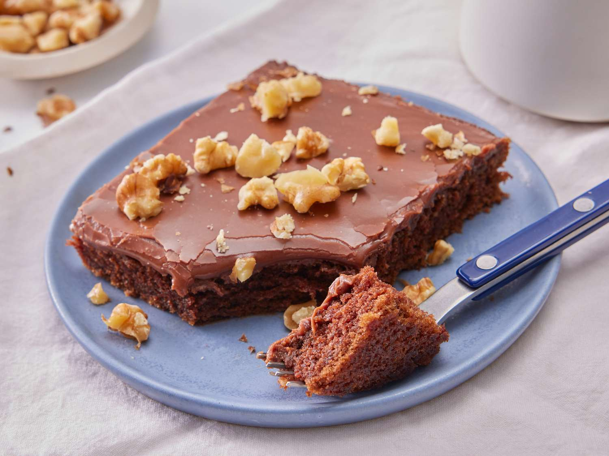

# Texas Sheet Cake

*Texas's chocolate-pecan sheet cake: a thin, fudgy, deeply chocolatey single-layer cake topped with a warm chocolate-pecan icing poured while both cake and icing are hot. The Texan church-potluck classic, the cake that defines Texas dessert culture - feeds a crowd, transports easily, tastes incredible.*

**Serves:** 24

**Prep Time:** 25 minutes

**Cook Time:** 25 minutes

## Overview
Texas sheet cake is the Lone Star State's iconic chocolate cake and one of America's great regional dessert classics: a thin, fudgy, deeply chocolatey single-layer cake (baked in a large rectangular sheet pan - about 33 cm × 23 cm) made with butter, oil, cocoa powder, flour, sugar, eggs and buttermilk, with a small amount of cinnamon for the Tex-Mex touch. Immediately after baking, while the cake is still hot, a warm chocolate-pecan icing (butter, cocoa, milk, vanilla, powdered sugar and chopped pecans) is poured over the hot cake - the warm icing meets the warm cake, soaks in slightly, and sets into a fudgy chocolate top with pecans throughout. The cake feeds a crowd (24+ portions from one tray), travels well (no fragile layers to collapse), and is the canonical Texan offering at church potlucks, family reunions and Friday night football games. Three details define proper Texas sheet cake. First, pour the icing while both are hot. The hot-on-hot is essential for the fudgy texture and soaking effect. Second, chopped pecans in the icing. Texan; not optional. Third, the cake is thin (about 2.5 cm thick). It's a sheet cake, not a layer cake; the proportions matter.

## Ingredients

### Cake
- 400 g plain flour
- 400 g caster sugar
- 1 teaspoon baking soda
- 1 teaspoon fine sea salt
- 1 teaspoon ground cinnamon (the Texan touch)
- 200 g unsalted butter
- 250 ml water
- 4 tablespoons cocoa powder (unsweetened)
- 200 ml buttermilk
- 2 large eggs
- 2 teaspoons vanilla extract

### Hot chocolate-pecan icing
- 150 g unsalted butter
- 100 ml whole milk
- 4 tablespoons cocoa powder
- 500 g icing sugar (sifted)
- 1 teaspoon vanilla extract
- 200 g pecans (toasted and chopped)

## Method

### Stage 1 - Prepare the pan
1. Preheat the oven to 180°C (350°F).
2. Grease a 33 cm × 23 cm rectangular baking tin (or similar size); line with parchment paper.

### Stage 2 - Mix dry ingredients
1. In a wide bowl, whisk together flour, sugar, baking soda, salt and cinnamon.

### Stage 3 - Boil butter-water-cocoa
1. In a saucepan, combine butter, water and cocoa.
2. Bring to a boil; stir till smooth.

### Stage 4 - Combine
1. Pour the hot cocoa mixture over the dry ingredients; whisk to combine.
2. Whisk in the buttermilk, eggs and vanilla.

### Stage 5 - Bake
1. Pour the batter into the prepared tin; smooth the top.
2. Bake at 180°C for 22-25 minutes till a skewer inserted into the centre comes out with a few moist crumbs.
3. Don't overbake; the cake should stay fudgy.

### Stage 6 - Make the icing (start during the last 10 minutes of baking)
1. In a saucepan, combine butter, milk and cocoa.
2. Bring to a boil; stir till smooth.
3. Take off the heat.
4. Whisk in the icing sugar gradually till smooth.
5. Stir in the vanilla and chopped pecans.

### Stage 7 - Pour icing on hot cake
1. As soon as the cake comes out of the oven, pour the warm icing over the hot cake.
2. Spread quickly to the edges with a spatula.
3. The icing should soak slightly into the cake top.

### Stage 8 - Cool and slice
1. Let cool in the pan; the icing sets to a fudgy top.
2. Cut into 24 squares.
3. Serve at room temperature with cold milk or strong coffee.

## Notes
- **Hot on hot:** icing must be warm; cake must be hot.
- **Pecans in icing:** the Texan signature.
- **Don't overbake:** stay fudgy.
- **Sheet pan thinness:** about 2.5 cm thick.
- **Cinnamon is Tex-Mex touch:** not optional.

## Variations
**With buttermilk glaze:** less common; replace cocoa in icing with extra butter for a vanilla-buttermilk glaze.
**With walnuts:** swap pecans for walnuts; less canonical Texan.
**Without nuts:** for nut-allergy households; gives a smooth chocolate-frosted version.
**With coffee:** add 1 tablespoon instant coffee to the cocoa-butter-water boil; deepens chocolate flavour.

## Serving
At room temperature in squares. With cold milk, strong coffee, or as is. At church potlucks, family reunions, school events.

## Storage
- Keeps in a sealed container at room temperature 4 days.
- Refrigerated 1 week; better at room temperature.
- Freezes 3 months in slices.
