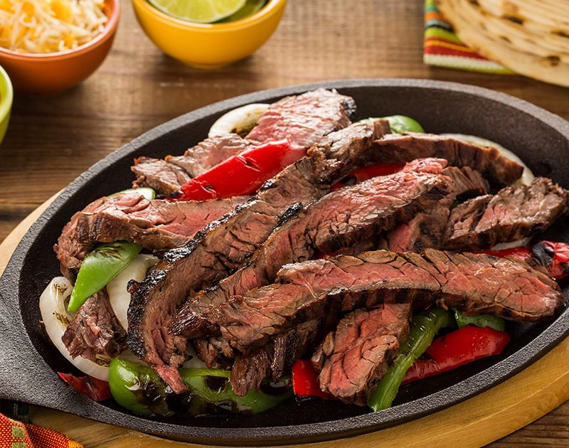

# Texas Fajitas

*Texas's grilled skirt steak: marinated skirt steak (the canonical "fajita" cut) grilled over hot charcoal till charred, sliced thin against the grain and served sizzling on a hot cast-iron plate with grilled onions and peppers, warm flour tortillas, guacamole, pico de gallo, sour cream and cheese. The Tex-Mex border classic that defined American Mexican food in the 80s.*

**Serves:** 4-6

**Prep Time:** 25 minutes (plus 4 hours marinating)

**Cook Time:** 20 minutes

## Overview
Texas fajitas, the iconic Tex-Mex dish that defines a particular Texas-Mexican border tradition: marinated skirt steak (faja means belt or sash in Spanish, referring to the long thin strip of beef from below the ribs) marinated in lime juice, soy sauce, garlic, cumin and Mexican beer, grilled hot and fast over charcoal till charred outside and pink inside, sliced thin against the grain. Served on a sizzling-hot cast-iron plate with grilled sliced onions and peppers, warm flour tortillas, guacamole, pico de gallo, sour cream, grated cheese and lime wedges. The dish became wildly popular in American Tex-Mex restaurants in the 1980s after originating in South Texas (the Rio Grande valley); today it's the canonical American Tex-Mex order. Skirt steak is the canonical cut; flank substitutes. Slice thin against the grain since the skirt has prominent muscle fibres; perpendicular cuts give tender bites. The sizzling cast-iron plate is the canonical Tex-Mex restaurant presentation; it keeps everything hot and dramatic.

## Ingredients

### Beef and marinade
- 800 g skirt steak (or flank steak)

### Marinade
- Juice of 6 limes (about 120 ml)
- 60 ml soy sauce
- 60 ml vegetable oil
- 8 garlic cloves (crushed)
- 200 ml Mexican beer (Pacifico, Modelo, or Tecate)
- 2 tablespoons Worcestershire sauce
- 2 tablespoons ground cumin
- 2 tablespoons dried Mexican oregano
- 1 tablespoon ground coriander seed
- 1 tablespoon paprika
- 1 tablespoon brown sugar
- 1 ½ teaspoons fine sea salt
- 1 teaspoon ground black pepper

### Vegetables
- 2 large red bell peppers (sliced into 1 cm strips)
- 2 large green bell peppers (sliced into 1 cm strips)
- 1 large yellow bell pepper (sliced)
- 2 large white onions (sliced into thick rings)
- 4 tablespoons vegetable oil
- 1 teaspoon fine sea salt
- 1 teaspoon ground black pepper

### To serve
- 12 warm flour tortillas
- Guacamole
- Pico de gallo
- Sour cream
- Grated Monterey Jack or pepper jack cheese
- Sliced fresh jalapeños
- Lime wedges
- Hot sauce
- Mexican rice
- Refried beans

## Method

### Stage 1 - Marinate the beef (4+ hours)
1. Combine all marinade ingredients in a wide container.
2. Add the skirt steak; toss to coat.
3. Refrigerate 4-12 hours.

### Stage 2 - Bring to room temperature
1. Take out 30 minutes before grilling.

### Stage 3 - Grill peppers and onions
1. Heat a heavy ridged grill pan (or charcoal grill) over high heat.
2. Toss peppers and onions with oil, salt and pepper.
3. Grill 8-10 minutes till charred and softened; toss occasionally.
4. Set aside on a hot plate.

### Stage 4 - Grill the steak
1. Lift steak from marinade; let drip.
2. Grill on screaming-hot grill (or in cast-iron pan) for 3-4 minutes per side for medium-rare.
3. The steak should be deeply charred outside, pink inside.
4. Rest 5 minutes.

### Stage 5 - Slice
1. Slice the rested steak thin (5 mm) against the grain.

### Stage 6 - Plate dramatically
1. Heat a cast-iron skillet or heavy plate till smoking-hot.
2. Pile the sliced steak and grilled vegetables on the hot plate.
3. The plate sizzles dramatically.

### Stage 7 - Serve family-style
1. Bring the sizzling plate to the table.
2. Warm tortillas (wrapped in foil and warmed briefly).
3. All the canonical accompaniments in small bowls.
4. Diners assemble their own fajita rolls.

## Notes
- **Skirt steak canonical:** "faja" cut.
- **Slice against the grain:** essential.
- **Hot cast-iron plate:** the Tex-Mex presentation.
- **Don't overcook:** medium-rare best.
- **Warm tortillas:** wrap and warm.

## Variations
**Chicken fajitas:** swap beef for thin chicken thigh; cook 4 minutes per side.
**Shrimp fajitas:** large shrimp grilled 90 seconds per side.
**Vegetarian fajitas:** grilled portobello mushrooms + extra peppers.
**Carne asada style:** swap soy for orange juice; closer to Mexican.

## Serving
Family-style with all accompaniments. Margaritas, Mexican beer, sweet tea.

## Storage
- Best eaten fresh.
- Leftover steak refrigerates 3 days; reheat briefly in pan or use cold in salads.
