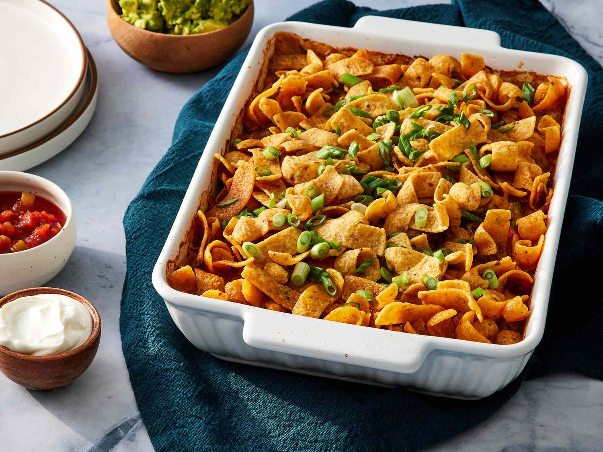

# Frito Pie

*Texas's bag-of-chips chili: a bag of Fritos corn chips opened down the side, filled with hot Texas chili, topped with grated cheese, chopped onion, sour cream and pickled jalapeños - eaten directly from the bag with a fork. The Texan stadium-and-state-fair classic, the dish that defined working-class American Tex-Mex.*

**Serves:** 4

**Prep Time:** 15 minutes (assumes pre-made chili)

**Cook Time:** 5 minutes

## Overview
Frito pie is one of Texas's most iconic working-class foods and a fixture of state fairs, Friday-night football games, school cafeterias and 7-Elevens across the Southwest: a small bag of Fritos corn chips opened down the long side, filled with hot Texas chili (the no-beans version is most canonical), topped with grated sharp cheddar, chopped raw onion, sour cream, pickled jalapeños and hot sauce, eaten directly from the bag with a plastic fork. The canonical "walking food" at Texas football games and state fairs (also called Frito Boat); made at home in a baking dish for family-style serving. A famous regional rivalry between New Mexicans and Texans over who invented it (both claim it); the New Mexico version uses red or green chile in place of Texas chili. Real branded Fritos give the proper texture and salt; generic corn chips don't taste right. The proper experience is eating directly from the chip bag.

## Ingredients

### Chili
- 4 cups Texas chili (see texas-chili.md; about 1 litre total)

### Per serving (assemble each individually)
- 1 small bag (40-60 g) Fritos corn chips ("Original" yellow corn)
- 50 g grated sharp cheddar cheese
- 1 small onion (finely chopped; or red onion)
- 2 tablespoons sour cream
- 6 slices pickled jalapeño
- 1 tablespoon hot sauce
- 1 tablespoon sliced spring onion (optional)
- Fresh chopped coriander (optional)

### For family-style serving (alternative)
- 1 large bag Fritos (200 g)
- 1.5 litres Texas chili
- 300 g grated cheese
- 2 onions chopped
- All toppings doubled

## Method

### Bag-style serving (canonical)

### Stage 1 - Heat the chili
1. Bring the chili to a hot simmer in a saucepan.

### Stage 2 - Open the bag
1. Take a small bag of Fritos.
2. Cut along the long side (sideways) with scissors to create a wide opening.
3. The bag is now an edible bowl.

### Stage 3 - Fill
1. Ladle hot chili directly into the bag (about 200 ml per serving).
2. Top with grated cheese (the chili melts it).
3. Add chopped onion, sour cream, pickled jalapeños, hot sauce.
4. Optional: chopped coriander, sliced spring onion.

### Stage 4 - Serve
1. Provide a plastic fork.
2. Eat directly from the bag.
3. The chips break up into the chili as you eat - that's the point.

### Family-style serving (alternative)

### Stage 5 - Layer in a baking dish
1. Spread a layer of Fritos in a wide baking dish.
2. Ladle chili over.
3. Sprinkle generously with cheese.
4. Top with more Fritos.

### Stage 6 - Briefly heat
1. Place in a 200°C oven for 5 minutes till cheese melts.

### Stage 7 - Add toppings
1. Scatter chopped onion, dollops of sour cream, sliced jalapeños, hot sauce, coriander.
2. Serve in deep bowls.

## Notes
- **Real Fritos:** branded; the texture and salt level are essential.
- **Real Texas chili (no beans):** the canonical Texan filling.
- **Eat from the bag:** the canonical experience.
- **Don't sit too long:** the chips go soggy in the hot chili within minutes.
- **Serve immediately:** part of the appeal is the texture contrast.

## Variations
**New Mexico Frito Pie:** swap Texas chili for red or green New Mexico chile; the rival regional version.
**Bean version:** use Texas chili with beans (Texans will be cross, but it's still good).
**Chicken/pulled-pork version:** swap chili for pulled pork in BBQ sauce or shredded chicken in green chile.
**Spicy version:** add Cayenne and chopped fresh habanero; properly fierce Texan.

## Serving
At state fairs, football games, school cafeterias - anywhere Texan working-class food is celebrated. Cold soda, beer, or sweet tea.

## Storage
- Best eaten immediately.
- The chili keeps refrigerated 1 week.
- Assemble fresh each time.
- Don't refrigerate assembled frito pie; the chips go soggy.
