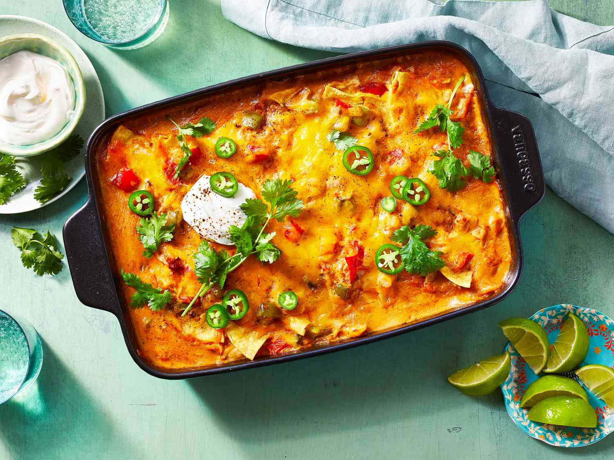

# King Ranch Chicken Casserole

*Texas's iconic chicken-tortilla casserole: layers of shredded chicken, corn tortillas, mushroom-cream-of-chicken sauce, Rotel tomatoes with green chillies, Monterey Jack cheese and a generous topping of grated cheddar, baked till bubbly. The Texas potluck queen, the casserole that defines suburban Texan home cooking.*

**Serves:** 8

**Prep Time:** 30 minutes

**Cook Time:** 50 minutes

## Overview
King Ranch chicken casserole is one of Texas's most beloved home-cook casseroles and a fixture of every Texas church potluck, family reunion, neighbour's housewarming and weeknight dinner: layers of shredded cooked chicken, torn corn tortillas, a creamy mushroom-cream-of-chicken-soup-based sauce (the canonical mid-century American shortcut; modern versions often use a from-scratch white sauce), Rotel diced tomatoes with green chillies (the canonical Texan canned product; substitute with diced tomatoes + chopped jalapeños), sautéed onion and bell pepper, Monterey Jack and Pepper Jack cheese, and a generous topping of grated sharp cheddar, all baked together till bubbly and golden. Despite the name, the dish has no historical connection to the actual King Ranch (the massive Texas cattle ranch); the name was applied later, likely for marketing. The dish exemplifies mid-century Texan-American comfort cooking. Three details define proper King Ranch chicken. First, Rotel tomatoes. The canonical canned tomato-with-green-chillies product (or substitute with diced tomatoes + canned mild green chillies). Second, multiple cheeses. Monterey Jack + Pepper Jack + sharp Cheddar gives the proper Tex-Mex melt-and-flavour profile. Third, layer properly. The casserole is built in layers - tortillas, sauce, chicken, cheese - repeated 2-3 times.

## Ingredients

### Chicken (cook in advance)
- 1.2 kg cooked shredded chicken (poached, roasted, or rotisserie); about 4 cups shredded

### Sauce
- 1 large onion (finely chopped)
- 1 large green bell pepper (finely chopped)
- 1 fresh jalapeño (deseeded; finely chopped)
- 6 garlic cloves (crushed)
- 4 tablespoons butter
- 4 tablespoons plain flour
- 400 ml chicken stock
- 200 ml whole milk
- 200 ml sour cream
- 1 tin (400 g) Rotel diced tomatoes with green chillies (or substitute: 400 g diced tomatoes + 1 small tin chopped green chillies, drained)
- 1 tablespoon ground cumin
- 1 tablespoon dried Mexican oregano
- 1 teaspoon chili powder
- 1 ½ teaspoons fine sea salt
- 1 teaspoon ground black pepper

### Tortillas
- 12 corn tortillas (torn into 4-5 cm pieces)

### Cheese
- 300 g grated Monterey Jack cheese
- 200 g grated Pepper Jack cheese (or extra Monterey Jack + sliced jalapeños)
- 200 g grated sharp cheddar (for topping)

### To finish
- 1 small bunch fresh coriander (chopped)
- 4 spring onions (sliced)

### To serve
- Mexican rice
- Refried beans
- Pico de gallo
- Sliced avocado
- Sour cream
- Hot sauce

## Method

### Stage 1 - Make the sauce
1. Melt butter in a saucepan over medium heat.
2. Add chopped onion, bell pepper and jalapeño; cook 8 minutes till soft.
3. Add crushed garlic; cook 30 seconds.
4. Sprinkle flour; whisk 1 minute (light roux).
5. Whisk in chicken stock gradually; cook 3 minutes till smooth.
6. Add milk; cook 2 more minutes till the sauce thickens.
7. Add Rotel tomatoes (with juice).
8. Stir in cumin, oregano, chili powder, salt and pepper.
9. Take off heat; stir in sour cream.

### Stage 2 - Layer the casserole
1. Preheat oven to 180°C (350°F).
2. Grease a wide deep baking dish (25 cm × 35 cm).
3. Spread a thin layer of sauce in the bottom.
4. Layer 1: tortilla pieces (half the total).
5. Layer 2: half the shredded chicken.
6. Layer 3: half the remaining sauce.
7. Layer 4: half the Monterey Jack + Pepper Jack cheese.
8. Repeat layers 1-4 with the remaining tortillas, chicken, sauce and cheese.
9. Top with the grated cheddar.

### Stage 3 - Bake
1. Bake at 180°C for 35-40 minutes till bubbly and the top is deeply golden.
2. If browning too fast, cover with foil; if not browned enough, finish under the grill briefly.

### Stage 4 - Rest and serve
1. Let rest 10 minutes (the layers firm up).
2. Scatter chopped coriander and spring onions.
3. Serve with sides - Mexican rice, refried beans, pico, avocado, sour cream, hot sauce.

## Notes
- **Rotel canonical:** the Texan canned product.
- **Multiple cheeses:** Monterey Jack + Pepper Jack + Cheddar.
- **Layer properly:** tortilla-chicken-sauce-cheese, repeat.
- **Rest before serving:** layers firm up.
- **Better the next day:** flavours deepen.

## Variations
**With from-scratch white sauce:** the modern version skips the cream-of-mushroom shortcut; uses a béchamel base.
**Spicier:** add 2 chopped fresh habaneros; double the jalapeños.
**With cream cheese:** add 200 g of cream cheese to the sauce; gives extra richness.
**With chorizo:** crumble 200 g of cooked chorizo into the layers.

## Serving
On warm plates with sides. Drink: sweet iced tea, Mexican beer.

## Storage
- Keeps refrigerated 5 days; flavour deepens.
- Reheat covered in oven at 180°C for 20 minutes.
- Freezes 3 months in portions.
- Day-after King Ranch is even better.
