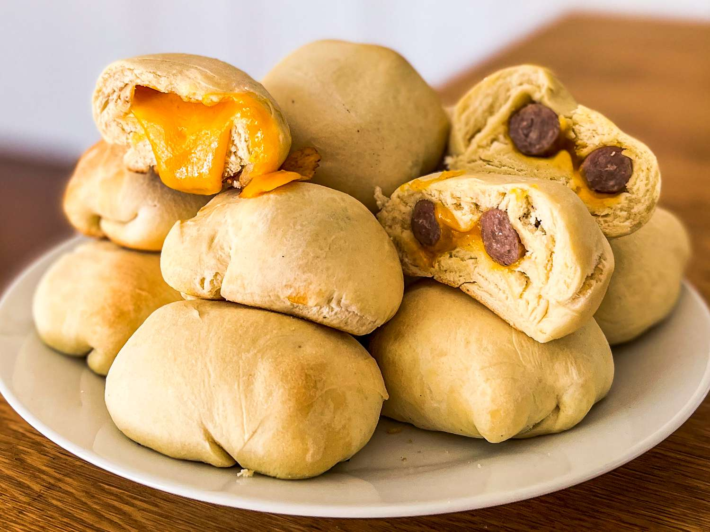

# Czech-Texan Kolaches

*Texas's Czech-immigrant filled pastry: soft yeasted sweet dough rolled into small rounds with a thumb-pressed well in the centre, filled with fruit (apricot, prune, poppy seed, cherry) or sausage-and-cheese (the savoury Czech-Texan klobasniky variant), baked till the dough is pale gold. The Central Texas Czech heritage celebrated in pastry - West, Texas's claim to culinary fame.*

**Serves:** Makes 16 kolaches

**Prep Time:** 1 hour (plus 2 hours dough rising)

**Cook Time:** 18 minutes

## Overview
Kolaches (Czech: koláč; Texan: "kolache" - the singular borrowed without the č) are the iconic Czech-Texan pastry of Central Texas, brought to the state by Czech immigrants who settled in towns like West, Schulenburg, La Grange and Caldwell in the 19th century: soft yeasted slightly-sweet enriched bread dough rolled into small palm-sized rounds, a deep well pressed into the centre with a thumb, the well filled with one of the canonical sweet fillings (apricot/prune butter, poppy seed paste, cream cheese, or sweet cheese), and baked till the dough is just pale gold and the filling is set. The savoury sausage-filled variant (called "klobasniky" or "pigs in a blanket" in some Texan use - though that name is wrong for the kolache shape) is a Texas innovation where the dough wraps around a smoked sausage. Three details define proper kolaches. First, soft enriched yeasted dough. Eggs, butter, milk for richness - not a regular bread dough. Second, traditional sweet fillings. Apricot, prune, poppy seed, sweet cheese - these are the canonical Czech fillings. Third, the well in the centre. Pressed into the dough after the first shaping; holds the filling without leaking.

## Ingredients

### Dough
- 500 g plain bread flour
- 10 g instant dried yeast
- 80 g caster sugar
- 1 teaspoon fine sea salt
- 80 g unsalted butter (softened)
- 2 large eggs
- 1 large egg yolk
- 200 ml warm whole milk
- 1 teaspoon vanilla extract

### Egg wash
- 1 large egg (beaten with 1 tablespoon milk)

### Fillings (choose 1-3)

#### Apricot filling
- 300 g dried apricots
- 150 ml water
- 80 g caster sugar
- Pinch of salt

#### Prune filling
- 300 g pitted prunes
- 200 ml water
- 80 g caster sugar
- 1 teaspoon ground cinnamon

#### Poppy seed filling
- 200 g ground poppy seeds (or grind whole seeds)
- 150 ml whole milk
- 80 g caster sugar
- 30 g butter
- 1 teaspoon vanilla extract

#### Sweet cheese filling
- 300 g cream cheese (room temperature)
- 80 g caster sugar
- 1 large egg yolk
- 1 teaspoon vanilla extract
- 2 tablespoons plain flour
- Zest of 1 lemon

### Topping (posypka - the canonical Czech streusel)
- 80 g plain flour
- 60 g caster sugar
- 50 g cold butter

## Method

### Stage 1 - Make the dough
1. In a wide bowl, whisk together flour, yeast, sugar and salt.
2. Rub in the softened butter.
3. Whisk together eggs, egg yolk, warm milk and vanilla.
4. Add to the flour mixture; stir to combine.
5. Knead 8-10 minutes till smooth and elastic.
6. Place in an oiled bowl; cover; rise 1.5 hours till doubled.

### Stage 2 - Make a filling (choose one)
1. **Apricot/Prune:** simmer the dried fruit in water with sugar (and cinnamon for prune) for 15-20 minutes till the fruit is soft and the mixture is jammy. Blitz or finely chop to a thick paste.
2. **Poppy seed:** combine ground poppy seeds, milk, sugar and butter in a saucepan; cook 8 minutes till thickened. Stir in vanilla.
3. **Sweet cheese:** beat cream cheese with sugar, egg yolk, vanilla, flour and lemon zest till smooth.

### Stage 3 - Make the posypka (streusel topping)
1. Combine flour, sugar and cold butter in a bowl.
2. Rub together with fingertips till the mixture looks like coarse crumbs.

### Stage 4 - Shape the kolaches
1. Knock back the dough; divide into 16 equal pieces.
2. Roll each into a smooth ball.
3. Place on parchment-lined baking sheets, leaving 4 cm between.
4. Cover loosely; rest 20 minutes.
5. Press a deep well into the centre of each ball with your thumb (or the bottom of a small glass).

### Stage 5 - Fill and finish
1. Spoon 1 tablespoon of filling into each well.
2. Brush the dough (not the filling) with egg wash.
3. Sprinkle the posypka generously over the dough surrounding the well.

### Stage 6 - Final prove
1. Cover loosely; prove 20 minutes.

### Stage 7 - Bake
1. Preheat oven to 180°C (350°F).
2. Bake 15-18 minutes till the dough is pale gold (not deeply browned).

### Stage 8 - Cool slightly and serve
1. Cool on the tray 5 minutes.
2. Transfer to a wire rack; cool slightly.
3. Serve warm or at room temperature.

## Notes
- **Soft enriched dough:** eggs, butter, milk.
- **Don't overbake:** pale gold; deep brown is wrong.
- **Posypka is canonical:** the streusel topping.
- **Multiple fillings:** the proper Czech-Texan kolache spread has 3-4 types.

## Variations
**Klobasniky (savoury):** wrap the dough around a small smoked sausage; serve as a hearty Texan breakfast.
**Cream cheese and jam combo:** half well of cream cheese, half well of apricot jam; common variation.
**Spiced:** add cinnamon and nutmeg to the dough; gives autumnal version.
**With nuts:** add chopped walnuts or pecans to the dough; gives crunch.

## Serving
Warm with strong coffee. At Czech-Texan bakeries (West, Caldwell, La Grange - the canonical Texas-Czech towns). At Texas breakfast spreads.

## Storage
- Keeps in a sealed container at room temperature 3 days.
- Refrigerated 1 week; reheat briefly in oven.
- Freezes 2 months wrapped tightly; defrost at room temperature.
