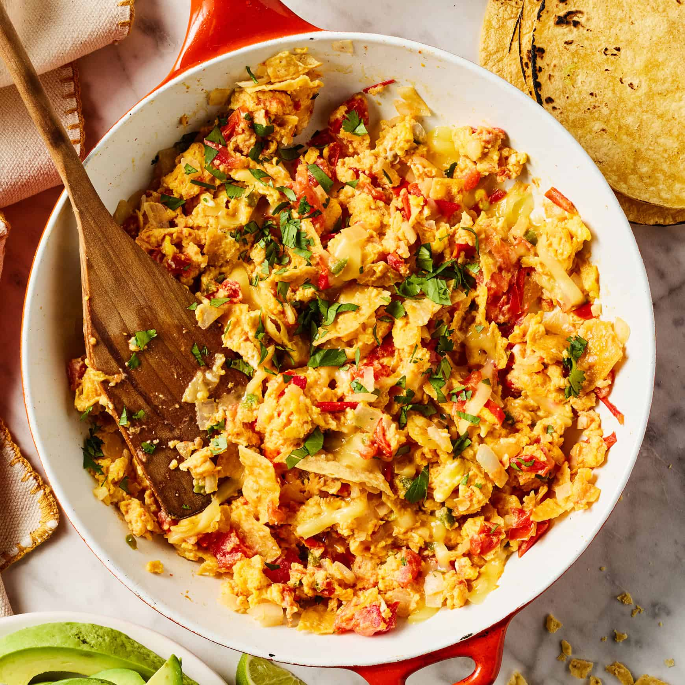

# Migas

*Texas's tortilla-and-egg breakfast: fried tortilla strips sautéed with onion, jalapeño and tomato, then scrambled with eggs and melted cheese into a crunchy-soft Tex-Mex breakfast hash. Served with warm flour tortillas, salsa, refried beans and avocado. The Austin breakfast standard, the canonical Tex-Mex morning meal.*

**Serves:** 4

**Prep Time:** 15 minutes

**Cook Time:** 15 minutes

## Overview
Migas (literally "crumbs", from the Spanish-Mexican tradition of using up stale bread and tortillas) is Texas's iconic Tex-Mex breakfast and a fixture of every Austin diner and Mexican-American family kitchen: thin strips of corn tortilla fried in oil till crispy, then sautéed with finely chopped onion, fresh jalapeño and chopped tomato, scrambled with beaten eggs over medium-low heat till just set, with grated cheese melted through at the last minute. Served with warm flour tortillas, salsa, refried beans, sliced avocado and Mexican hot sauce on the side. Distinct from Mexican chilaquiles (which uses sauced tortillas) and Tex-Mex breakfast tacos (which use migas as a filling). Use stale or day-old corn tortillas; fresh tortillas don't crisp properly. The tortilla strips must be crisp when the eggs go in; they lose some crunch as they cook but should still have texture. Eggs cooked low-and-slow; don't scramble dry, the proper migas has just-set eggs with creamy texture.

## Ingredients

### Tortillas
- 6 corn tortillas (day-old; cut into 3 cm × 1 cm strips)
- 4 tablespoons vegetable oil

### Sauté base
- 1 medium onion (finely chopped)
- 1 fresh jalapeño (deseeded; finely chopped)
- 1 medium tomato (chopped)
- 4 garlic cloves (crushed)
- 1 teaspoon ground cumin
- 1 teaspoon dried Mexican oregano
- 1 ½ teaspoons fine sea salt
- 1 teaspoon ground black pepper

### Eggs
- 8 large eggs (lightly beaten with a pinch of salt and pepper)
- 2 tablespoons butter (for cooking the eggs)

### Cheese
- 200 g grated Monterey Jack or sharp cheddar (mix is best)

### To finish
- Small bunch fresh coriander (chopped)
- Spring onions (sliced)

### To serve
- Warm flour tortillas
- Salsa roja (or salsa verde)
- Refried beans
- Sliced avocado
- Sour cream
- Mexican hot sauce
- Lime wedges
- Fresh coriander

## Method

### Stage 1 - Crisp the tortilla strips
1. Heat vegetable oil in a wide heavy pan over medium-high heat.
2. Add tortilla strips; fry 3-4 minutes, stirring, till deeply golden and crisp.
3. Lift out with a slotted spoon; drain on kitchen paper.
4. Pour off excess oil (keep 1 tablespoon in the pan).

### Stage 2 - Sauté vegetables
1. Add the chopped onion and jalapeño to the pan; cook 4 minutes till soft.
2. Add crushed garlic; cook 30 seconds.
3. Add chopped tomato; cook 2-3 minutes till it breaks down.
4. Stir in cumin, oregano, salt and pepper.

### Stage 3 - Add crispy tortillas
1. Return the fried tortilla strips to the pan.
2. Toss with the vegetables; cook 1 minute.

### Stage 4 - Scramble the eggs
1. Add the butter to the pan; let it melt.
2. Pour in the beaten eggs.
3. Let stand 20 seconds.
4. Gently fold the eggs with the tortillas-and-vegetables using a wooden spoon.
5. Cook 2-3 minutes total over low heat; the eggs should be just set with a creamy texture (don't overcook).

### Stage 5 - Add cheese
1. Sprinkle the grated cheese over.
2. Fold through gently; the cheese melts from residual heat.

### Stage 6 - Serve
1. Tip onto warm plates.
2. Scatter chopped coriander and spring onions.
3. Serve with warm flour tortillas, salsa, refried beans, sliced avocado, sour cream, hot sauce and lime.
4. Diners can wrap the migas in tortillas as breakfast tacos, or eat plain.

## Notes
- **Stale/day-old tortillas:** essential for crispness.
- **Crisp before sautéing:** the strips should be crunchy when the eggs go in.
- **Low heat for eggs:** creamy, not dry.
- **Add cheese at the end:** melts from residual heat.
- **Eat immediately:** the crispness fades.

## Variations
**Migas tacos:** assemble the migas into warm flour tortillas; the canonical Austin breakfast taco.
**With chorizo:** crumble 200 g of Mexican chorizo into the pan after the onion; gives a richer fattier version.
**Without cheese:** vegetarian-friendly variation.
**Spicier:** double the jalapeños and add 1 chopped serrano.

## Serving
On warm plates or in tacos. Drink: strong Mexican coffee, fresh orange juice. As Texan-American breakfast.

## Storage
- Best eaten immediately; eggs don't reheat well.
- Don't refrigerate.
