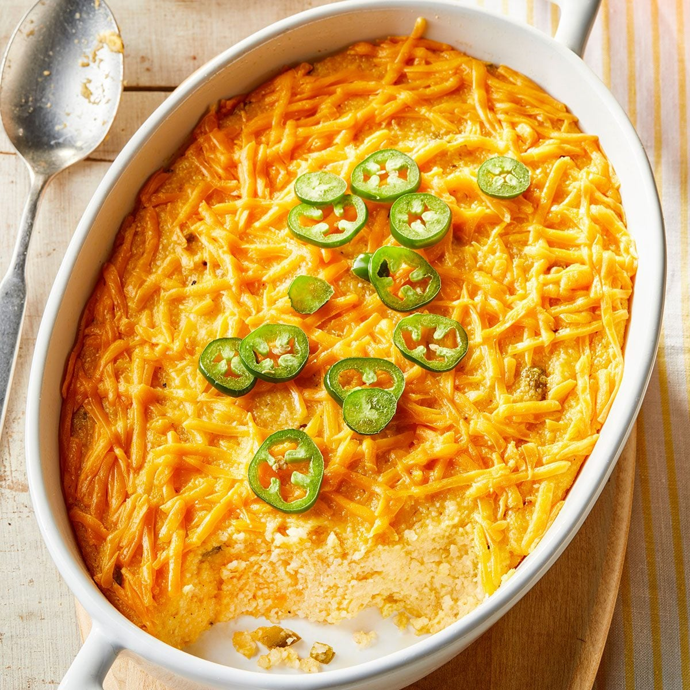

# Jalapeño Cheese Grits

*Texas's spicy creamy corn grits: coarse-ground stone-milled grits simmered slowly in milk and chicken stock till creamy, finished with butter, cream cheese, sharp cheddar, Monterey Jack and chopped fresh jalapeños. The Texan breakfast side, the traditional bowl that arrives alongside chicken-fried steak, fried eggs, or BBQ.*

**Serves:** 6

**Prep Time:** 10 minutes

**Cook Time:** 45 minutes

## Overview
Jalapeño cheese grits is one of Texas's most beloved side dishes and a Texan-Southern breakfast and BBQ staple: coarse-ground stone-milled grits simmered slowly in a mix of milk and chicken stock till tender and creamy, finished with plenty of butter, cream cheese (the secret Texan touch, which gives velvety richness), sharp cheddar, Monterey Jack, freshly chopped jalapeños, salt, pepper and a touch of garlic powder. Served alongside chicken-fried steak, fried eggs, shrimp-and-grits Tex-Mex style, or as part of a BBQ plate. Similar to but distinct from Italian polenta, Southern Carolina grits and Northern American grits. Use stone-milled coarse grits; instant doesn't give the proper texture. The 50/50 milk-and-stock combo is right: pure water gives bland grits, pure milk too rich. The cheese trio (cream cheese, sharp cheddar, Monterey Jack) gives creamy melt, sharp flavour and Tex-Mex character together.

## Ingredients

- 250 g coarse stone-milled white or yellow grits (Anson Mills, Bob's Red Mill, or Quaker stone-ground)
- 500 ml whole milk
- 500 ml hot chicken stock
- 80 g unsalted butter
- 100 g cream cheese (cubed; room temperature)
- 200 g grated sharp cheddar
- 150 g grated Monterey Jack
- 2-3 fresh jalapeños (deseeded; finely chopped; or with seeds for fiery)
- 1 teaspoon garlic powder
- 1 ½ teaspoons fine sea salt
- 1 teaspoon ground black pepper
- ½ teaspoon ground white pepper
- ½ teaspoon cayenne pepper (optional)

### To finish
- 2 tablespoons chopped fresh chives
- 1 tablespoon sliced spring onion green
- Extra grated cheddar
- Sliced pickled jalapeños

### Optional additions
- 4 strips cooked crispy bacon (crumbled)
- 200 g cooked shrimp (for shrimp-and-grits)

## Method

### Stage 1 - Heat the liquids
1. In a heavy saucepan, combine the milk and chicken stock.
2. Bring to a low simmer.
3. Add 1 teaspoon of salt.

### Stage 2 - Whisk in the grits
1. Slowly pour the grits in a thin stream into the simmering liquid, whisking constantly.
2. Add gradually over 1-2 minutes to prevent lumps.

### Stage 3 - Cook slowly
1. Reduce heat to lowest.
2. Cook 30-40 minutes, stirring frequently with a wooden spoon, till the grits are very tender and the mixture has thickened to a creamy porridge.
3. If too thick, add more hot milk or stock; if too thin, cook longer.

### Stage 4 - Add cream cheese and seasonings
1. Stir in the cream cheese; whisk till melted and smooth.
2. Add the butter; stir to melt.
3. Add garlic powder, salt, pepper, white pepper, cayenne (if using).

### Stage 5 - Add cheeses and jalapeños
1. Add the grated cheddar and Monterey Jack in two batches, stirring after each.
2. Stir till smooth and silky.
3. Add the chopped jalapeños; stir to combine.

### Stage 6 - Finish
1. Taste; adjust salt and pepper.
2. The grits should be thick but pourable, like very thick porridge.

### Stage 7 - Serve
1. Ladle into bowls or onto plates.
2. Scatter chopped chives, spring onion greens, extra cheddar, pickled jalapeños.
3. Add bacon crumbles and/or shrimp if using.

## Notes
- **Stone-milled grits traditional:** instant doesn't work.
- **Slow-cook properly:** 30-40 minutes.
- **Cheese trio essential:** cream cheese + cheddar + Monterey Jack.
- **Stir frequently:** prevents sticking.
- **Eat immediately:** grits firm up quickly.

## Variations
- **Shrimp and grits:** top with sautéed shrimp in butter-garlic-lemon sauce; the traditional Southern combination.
- **Smoked gouda:** swap Monterey Jack for smoked gouda; gives a smokier richer version.
- **With chorizo:** add 200 g of cooked crumbled chorizo; gives spice depth.
- **With sun-dried tomato:** add 50 g of chopped sun-dried tomato; Texan-Italian touch.

## Serving
- Alongside chicken-fried steak, fried eggs, shrimp, BBQ. As breakfast, lunch or dinner side. With sweet tea or cold beer.

## Storage
- Best eaten fresh; firms up on standing.
- Keeps refrigerated 3 days; reheat with extra milk to loosen.
- Don't freeze; texture suffers.
