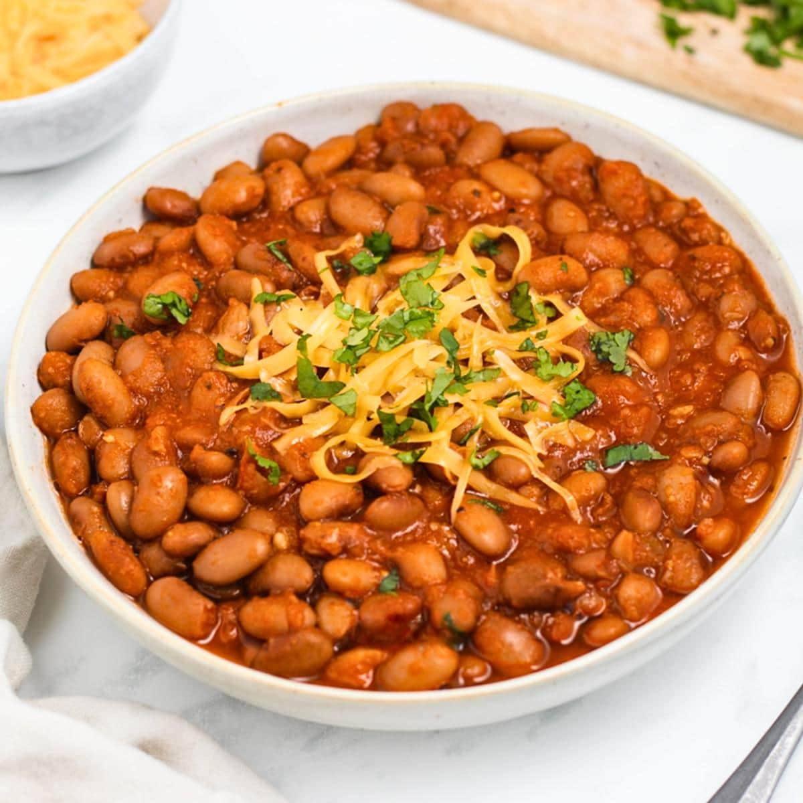

# Texas Ranch Beans

*Texas's pinto bean stew: dried pinto beans slow-cooked with bacon, onion, garlic, jalapeños, tomato, and a touch of chili powder into a deeply savoury brown bean stew. The traditional Texas barbecue side, the bean that goes alongside every brisket plate.*

**Serves:** 6-8

**Prep Time:** 15 minutes (plus overnight bean soaking)

**Cook Time:** 2 hours

## Overview
Ranch beans (also called "Texas pinto beans" or "borracho beans" when made with beer) is Texas's iconic side for barbecue: dried pinto beans slow-cooked with bacon, onion, garlic, fresh jalapeños, chopped tomato, chili powder, cumin, oregano and beer (the "borracho" or "drunken bean" version) or beef stock, till the beans are tender and the broth thickens to a savoury brown stew. The dish is the everyday Texan accompaniment to brisket, ribs, sausage - anywhere Texas BBQ goes, ranch beans go alongside.

## Ingredients

- 500 g dried pinto beans (soaked overnight, drained)
- 200 g smoked bacon (diced)
- 2 large onions (chopped)
- 6 garlic cloves (crushed)
- 2 fresh jalapeños (chopped; deseed for milder)
- 3 medium tomatoes (chopped); or 1 tin chopped tomatoes
- 1 bottle (350 ml) Mexican lager beer (optional; for borracho beans)
- 1.2 litres hot beef stock
- 2 tablespoons chili powder
- 1 tablespoon ground cumin
- 1 tablespoon dried Mexican oregano
- 1 tablespoon smoked paprika
- 2 bay leaves
- 1 ½ teaspoons fine sea salt
- 1 teaspoon ground black pepper
- 1 small bunch fresh coriander (chopped)

## Method

### Stage 1 - Render the bacon
1. Cook the diced bacon in a heavy pot over medium heat 5-6 minutes till crispy and the fat is rendered.
2. Don't drain - keep all the fat.

### Stage 2 - Sauté aromatics
1. Add chopped onions to the bacon and fat; cook 8 minutes till soft.
2. Add garlic and jalapeños; cook 30 seconds.

### Stage 3 - Add tomatoes and spices
1. Add chopped tomatoes; cook 5 minutes.
2. Stir in chili powder, cumin, oregano, smoked paprika, salt and pepper.

### Stage 4 - Add beans and liquid
1. Add the soaked-and-drained pinto beans.
2. Pour in the beer (if using) and hot stock.
3. Add bay leaves.

### Stage 5 - Simmer
1. Bring to a low simmer; cover with the lid slightly ajar.
2. Cook 90-120 minutes till the beans are tender and the broth thickens.

### Stage 6 - Finish
1. Taste; adjust salt.
2. Stir in chopped coriander.

### Stage 7 - Serve
1. Ladle into bowls or alongside Texas barbecue.

## Notes
- **Pinto beans traditional:** Texas standard.
- **Bacon and fat:** essential for proper flavour.
- **Beer makes it "borracho":** drunken beans.
- **Slow-cook properly:** 2 hours.

## Variations
**With smoked brisket:** add chunks of leftover smoked brisket; gives a meaty depth.
**Spicier:** double the jalapeños; add 1 chopped habanero.
**Vegetarian:** skip the bacon; use vegetable stock; add 2 tablespoons of smoked paprika.

## Serving
Alongside any Texas BBQ. Cornbread, pickled jalapeños on the side. Cold beer.

## Storage
- Keeps refrigerated 5 days; flavour deepens.
- Freezes 3 months.
- Day-after beans are even better.
