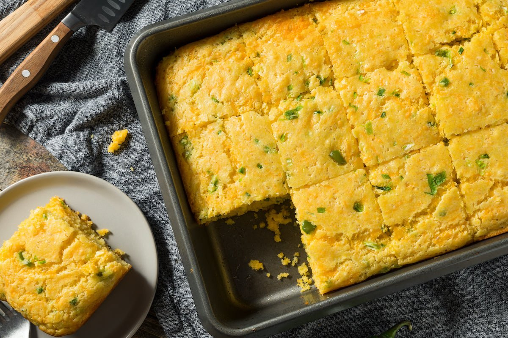

# Texas Cornbread

*Texas's skillet-baked cornbread: a cornmeal-flour batter (Texas style is less sweet than Northern American) with buttermilk, eggs, melted butter and chopped jalapeños and cheese, baked in a screaming-hot cast-iron skillet till the bottom and edges crust deeply golden. The Texan side that turns up at every BBQ plate, every bowl of chili, every Texan family meal.*

**Serves:** 8

**Prep Time:** 15 minutes

**Cook Time:** 25 minutes

## Overview
Texas cornbread is the Lone Star State's signature cornbread: a batter made from yellow cornmeal, plain flour (Texas style uses some flour for a slightly tenderer crumb), buttermilk, eggs, melted butter (or bacon fat for proper Texan), with chopped fresh jalapeños and grated sharp cheddar folded in. The batter is poured into a screaming-hot, well-oiled cast-iron skillet (the traditional Texan vessel) and baked at 200°C till the bottom and edges crust deeply golden and the centre is just set. The Texan version distinguishes itself from Northern American sweet cornbread (which has more sugar and flour) by the savory direction, Texas cornbread is mostly cornmeal, mostly savory, with jalapeños and cheese as the Texan touch.

## Ingredients

- 300 g yellow cornmeal (medium grind)
- 150 g plain flour
- 2 tablespoons caster sugar (just a touch; the Texan version)
- 2 teaspoons baking powder
- 1 teaspoon baking soda
- 1 teaspoon fine sea salt
- 1 teaspoon ground black pepper
- 2 large eggs
- 500 ml buttermilk
- 100 g unsalted butter (melted; or 80 g bacon fat for the proper Texan)
- 200 g grated sharp cheddar
- 2 fresh jalapeños (deseeded; finely chopped)
- 100 g sweet corn kernels (fresh or frozen; optional)
- 2 tablespoons bacon fat or butter (for greasing the skillet)

## Method

### Stage 1 - Heat the skillet
1. Place a 25 cm cast-iron skillet in the oven.
2. Preheat to 220°C (425°F) with the skillet inside.

### Stage 2 - Mix dry ingredients
1. In a wide bowl, whisk together cornmeal, flour, sugar, baking powder, baking soda, salt and pepper.

### Stage 3 - Mix wet ingredients
1. In another bowl, whisk together eggs, buttermilk and melted butter.

### Stage 4 - Combine
1. Pour the wet into the dry; stir till just combined (don't over-mix).
2. Fold in grated cheddar, chopped jalapeños and corn kernels (if using).

### Stage 5 - Pour into the hot skillet
1. Carefully take the hot skillet out of the oven.
2. Add 2 tablespoons of bacon fat or butter; swirl to coat.
3. Pour the batter into the hot skillet (it should sizzle, that's the point).

### Stage 6 - Bake
1. Bake at 220°C for 22-25 minutes till the top is deep golden and a skewer comes out clean.

### Stage 7 - Cool and serve
1. Let cool 5 minutes in the skillet.
2. Cut into wedges.
3. Serve warm with butter.

## Notes
- **Hot skillet:** essential for the proper crispy bottom.
- **Bacon fat for greasing:** the traditional Texan touch.
- **Jalapeños and cheese:** the Texan signature.
- **Less sugar than Northern cornbread:** the Texan way.

## Variations
- **Spicier:** double the jalapeños and add 1 chopped habanero.
- **With sausage:** add 200 g of crumbled cooked chorizo or breakfast sausage.
- **Sweet variation:** double the sugar; gives a more Northern-American sweet cornbread.
- **Without cheese (vegan-ish):** skip cheese; use vegan butter and a plant-milk-lemon-juice mix for buttermilk substitute.

## Serving
- Warm with butter, honey, or just plain. Alongside any Texas BBQ, chili, or as the side at any Texan meal. With cold beer or sweet tea.

## Storage
- Keeps 2 days at room temperature in a sealed container.
- Refrigerated 5 days; reheat in oven.
- Day-old cornbread is the traditional base for cornbread dressing (the Texan-Southern stuffing).
