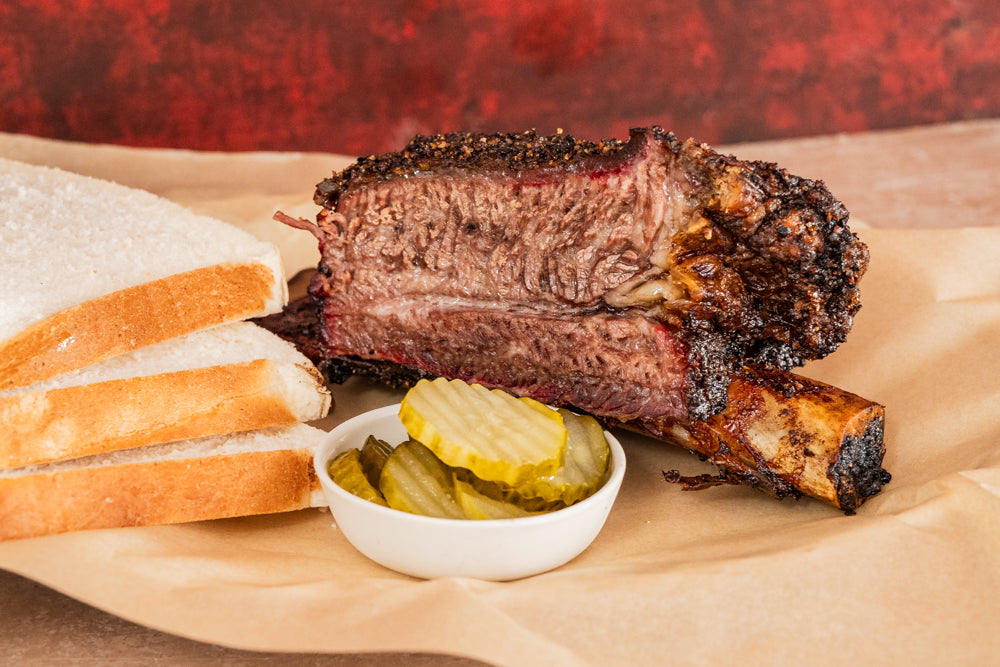

# Texas Smoked Beef Ribs

*Texas's mammoth beef ribs: full beef plate ribs (the rack the dinosaur looked at and walked away from) rubbed with salt and coarse pepper, smoked over post-oak wood for 6-8 hours till the meat falls off the bone and the bark crusts deep mahogany. The Central Texas barbecue trophy, bigger than pork ribs, beefier than brisket, the show-off cut of the Texas pit.*

**Serves:** 4

**Prep Time:** 20 minutes

**Cook Time:** 7 hours

## Overview
Texas smoked beef ribs (specifically plate ribs or dino ribs, the giant three-rib bones from the short plate of the steer, each rack weighing about 1 kg with meat) are Central Texas barbecue's show-off cut: a rack of three giant bones, each topped with a thick mound of beef, rubbed only with coarse salt and coarse black pepper (the Dalmatian rub, same as brisket), smoked low-and-slow at 110-120 °C over post-oak wood for six to eight hours till the meat shrinks back from the bone, the bark crusts deep mahogany, and the meat pulls easily from the bone. Proper ribs don't actually fall off; they have just a slight tug. Plate ribs, not short ribs or back ribs; the dino ribs are specifically the plate cut. Simple salt-and-pepper rub, same as brisket; no sweet rub. Low-and-slow till the meat shrinks one or two centimetres back from the bone and the internal temperature reaches 95 °C.

## Ingredients

- 1 rack beef plate ribs (4-rib slab; about 3-4 kg total)

### Rub
- 4 tablespoons coarse kosher salt
- 4 tablespoons coarsely ground black pepper

### Smoking wood
- Post-oak chunks (traditional); or oak; or hickory

### Equipment
- Smoker capable of 120°C for 7+ hours

### To serve
- White bread (Wonder Bread for the traditional Texas style)
- Pickles
- Sliced raw white onion
- Pickled jalapeños
- Texas BBQ sauce (optional)
- Pinto beans
- Potato salad
- Coleslaw
- Cold beer (Lone Star, Shiner Bock)

## Method

### Stage 1 - Trim and rub (the night before)
1. Trim any silver skin from the meat side; leave fat cap.
2. Mix salt and pepper.
3. Rub generously all over.
4. Refrigerate overnight uncovered.

### Stage 2 - Smoke
1. Bring ribs out 1 hour before; let warm.
2. Heat smoker to 120°C (250°F).
3. Add post-oak chunks.
4. Place ribs meat-side-up.
5. Smoke 6-7 hours.

### Stage 3 - Spritz periodically (optional)
1. Every 90 minutes, spritz the ribs with a 50/50 mixture of apple cider vinegar and water.
2. This keeps the surface moist and helps bark formation.

### Stage 4 - Check doneness
1. Internal temperature should reach 95°C (203°F) in the thickest part.
2. The meat should be pulled back 1-2 cm from the bone.
3. A thermometer should "probe like butter".

### Stage 5 - Rest
1. Lift from smoker.
2. Wrap loosely in butcher paper.
3. Rest 30-45 minutes in a cooler.

### Stage 6 - Cut and serve
1. Cut between the bones into individual ribs.
2. Serve on butcher paper with sides.
3. White bread on the side (traditional Texas).
4. Sliced raw onion, pickles, jalapeños, BBQ sauce (optional).

## Notes
- **Plate ribs, not back ribs:** different cut.
- **Salt-and-pepper rub:** same as brisket.
- **Probe like butter at 95°C internal:** doneness test.
- **Meat pulled back from bone:** visual cue.
- **Rest 30 min minimum.**

## Variations
**With BBQ sauce glaze:** brush with thin Texas BBQ sauce in the last 30 minutes of smoking. Less traditional Central Texas.
**Higher temp faster:** smoke at 135°C; cooks in 5 hours; less smoke flavour.
**Oven-finish:** start in smoker for smoke flavour; finish wrapped in oven.

## Serving
On butcher paper at the centre of the table. White bread, pickles, onion, jalapeños. Sides: beans, potato salad, slaw. Cold beer.

## Storage
- Keeps refrigerated 5 days.
- Reheat wrapped in foil with stock at 110°C for 25 minutes.
- Day-after ribs are still excellent.
