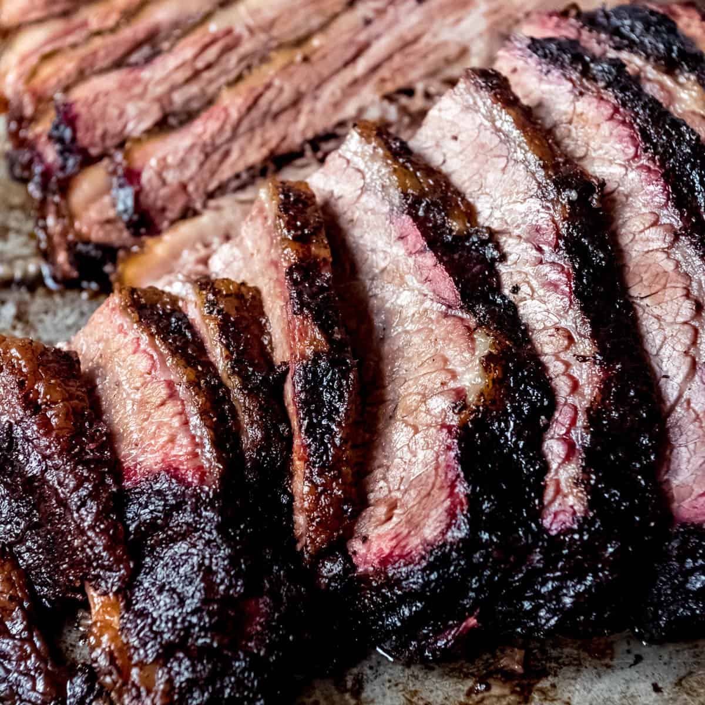

# Texas Smoked Brisket

*Texas's national dish: a whole beef brisket rubbed with salt and coarse pepper, smoked over post-oak (or oak) wood at 110°C / 225°F for 12-14 hours till the fat renders, the bark crusts deep mahogany, and the meat falls apart at the touch of a fork. The Lone Star State's signature dish - the bar against which all other barbecue is judged.*

**Serves:** 12-15

**Prep Time:** 30 minutes (plus overnight resting after smoking)

**Cook Time:** 12-14 hours

## Overview
Texas smoked brisket is the most iconic dish of Lone Star State barbecue and arguably America's greatest contribution to slow-cooked meat: a whole "packer cut" beef brisket (containing both the flat and point cuts, 6-8 kg total weight; trimmed of excess fat but with a 5-mm fat cap left on top) rubbed with the canonical Central Texas "Dalmatian rub" of equal parts coarse salt and coarse-ground black pepper, then smoked low-and-slow (110°C / 225°F) over post-oak wood (the Central Texas canonical wood; substitute with oak or hickory) for 12-14 hours till the internal temperature reaches 95°C / 203°F, the fat has fully rendered, and the bark on the outside has crusted deep mahogany. Rested for at least 1 hour wrapped in butcher paper, then sliced across the grain into pencil-thick slices. The dish defines Texas barbecue - the Central Texas tradition (Lockhart, Austin, the Hill Country) emphasises simplicity (just salt-and-pepper rub, post-oak smoke, time) over the more complex sauces of Kansas City or Carolina BBQ. Three details define proper Texas brisket. First, simple rub - just salt and coarse-ground pepper. Adding sugar, paprika, or chile powder turns it into something else. Second, low-and-slow at 110°C. Don't rush; the magic is in the long cook. Third, the stall and the wrap. Around 70°C internal, the brisket "stalls" (stops climbing in temperature for hours as moisture evaporates); wrap in butcher paper at this point to push through the stall faster and protect the bark. Fourth (bonus): rest properly. 1-2 hours wrapped after the cook is essential.

## Ingredients

### Brisket
- 1 whole "packer cut" beef brisket (6-8 kg; with point and flat; 5 mm fat cap)

### Dalmatian rub (the Central Texas canonical)
- 4 tablespoons coarse kosher salt (or sea salt)
- 4 tablespoons coarsely ground black pepper (about 16-mesh; coarse)
- 1 tablespoon garlic powder (optional; some Texan pitmasters add)
- 1 tablespoon paprika (optional; some add for colour)

### Smoking wood
- Post-oak wood chunks (canonical Central Texas); or oak, hickory, mesquite, pecan

### Equipment
- Smoker (offset, kettle, pellet, or electric); capable of holding 110°C / 225°F steady
- Butcher paper (pink unwaxed; for the wrap)
- Meat thermometer

## Method

### Stage 1 - Trim the brisket (the night before)
1. Trim excess fat from the top to leave a 5 mm fat cap.
2. Trim hard fat from between the point and the flat.
3. Round any sharp edges (prevents burning).
4. Pat dry.

### Stage 2 - Apply the rub
1. Mix the salt and pepper (and optional garlic powder and paprika).
2. Rub generously over the entire brisket - top, bottom, sides.
3. Refrigerate overnight (uncovered for proper bark formation; this is the "dry brine").

### Stage 3 - Set up the smoker
1. Bring the brisket out of the fridge 1 hour before smoking; let warm to room temperature.
2. Set the smoker to 110°C (225°F).
3. Add post-oak wood chunks (3-4 chunks for the start; replenish hourly).

### Stage 4 - Smoke (the long part)
1. Place the brisket fat-side-up on the smoker grate.
2. Insert a meat thermometer into the thickest part of the flat (not the point).
3. Smoke at 110°C till the internal temperature reaches 70°C (about 6-8 hours).
4. Don't open the smoker more than necessary; every open loses heat.

### Stage 5 - The Wrap (the "Texas crutch")
1. When the brisket hits 70°C (it will "stall" around here for several hours otherwise), it's time to wrap.
2. Lay 2-3 large sheets of butcher paper on a work surface.
3. Transfer the brisket onto the paper.
4. Wrap tightly, sealing the edges.
5. Return to the smoker.

### Stage 6 - Continue smoking
1. Continue smoking at 110°C.
2. The internal temperature will now climb steadily.
3. Pull when the internal temperature reaches 95°C (203°F) - about 4-6 more hours.
4. The brisket should "probe like butter" - a thermometer or skewer slides in with no resistance.

### Stage 7 - Rest
1. Don't slice immediately.
2. Wrap the brisket (still in butcher paper) loosely in a towel.
3. Place in a cooler (chilly bin) or covered pot.
4. Rest at least 1 hour; ideally 2-3 hours.
5. The resting is essential - the juices redistribute and the meat tenderises further.

### Stage 8 - Slice
1. Place on a cutting board.
2. Separate the point from the flat (the grain runs in different directions).
3. Slice the flat across the grain into pencil-thick slices (5-7 mm).
4. Slice the point across its grain (perpendicular to the flat) into thicker slices (1-1.5 cm).

### Stage 9 - Serve
1. Arrange slices on a wooden board or paper-lined platter.
2. Serve with white bread (for sandwiches), pickles, sliced raw onion, jalapeños, and Texas BBQ sauce (optional - Central Texas purists eat brisket without sauce).
3. Sides: pinto beans, coleslaw, potato salad, cornbread.

## Notes
- **Simple rub:** just salt and pepper for Central Texas style.
- **Low-and-slow at 110°C:** the magic.
- **Post-oak wood:** Central Texas signature; oak/hickory substitute.
- **The wrap pushes through the stall:** at 70°C internal.
- **Probe like butter at 95°C:** the doneness test.
- **REST is essential:** don't skip.
- **Slice across the grain:** thin for the flat; thicker for the point.

## Variations
**Burnt ends:** trim the point into 2 cm cubes; toss with BBQ sauce; smoke 1 more hour. The famous Kansas City "burnt ends" preparation.
**With BBQ sauce:** serve with thin Texas-style BBQ sauce (tomato + vinegar + brown sugar + chili). Less canonical in Central Texas where purists go sauce-free.
**Faster cook at higher temperature:** smoke at 135°C / 275°F instead of 110°C; cooks in 8-10 hours; less smoke flavour but more practical.
**Oven-finish:** if you can't keep the smoker going, finish wrapped brisket in a 110°C oven; less smoky but still tender.

## Serving
On a paper-lined platter or wooden board. White bread, pickles, raw onion, jalapeños, BBQ sauce. Pinto beans, coleslaw, potato salad. Drink: cold Lone Star beer, Shiner Bock, or sweet tea.

## Storage
- Keeps refrigerated 5 days; reheat wrapped in foil with a splash of stock at 120°C oven for 30 minutes.
- Freezes 3 months in slices or whole.
- Day-after brisket is excellent in sandwiches, tacos, queso.
