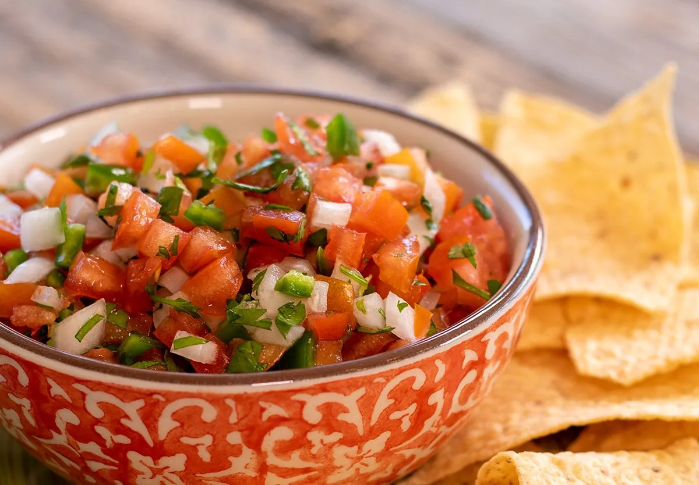

# Texas Pico de Gallo

*Texas's fresh salsa: finely diced tomato, white onion, fresh jalapeño, fresh coriander, lime juice and salt - chunky, fresh, made in 5 minutes. The Texan everyday salsa, on tacos, on eggs, on chips, on grilled meat, on everything.*

**Serves:** Makes about 500 ml

**Prep Time:** 15 minutes

**Cook Time:** 0 minutes

## Overview
Pico de gallo (or "salsa fresca" or simply "pico") is the canonical Tex-Mex fresh salsa and a fixture of every Texas restaurant table: finely diced ripe tomatoes, finely chopped white onion, finely chopped fresh jalapeño, finely chopped fresh coriander, fresh lime juice and salt - mixed and rested briefly. Distinct from blended salsa roja (which is cooked), pico de gallo is raw and chunky. Three details: ripe tomatoes (the salsa depends on quality), fine even dice (3-4 mm), fresh.

## Ingredients

- 6 medium ripe tomatoes (deseeded; finely diced)
- 1 medium white onion (very finely chopped)
- 2 fresh jalapeños (deseeded for milder; finely chopped)
- 1 large bunch fresh coriander (about 40 g; finely chopped)
- Juice of 2 limes
- 1 ½ teaspoons fine sea salt
- ½ teaspoon ground black pepper
- 1 teaspoon ground cumin (optional)
- 1 garlic clove (very finely crushed; optional)

## Method

### Stage 1 - Chop the vegetables
1. Deseed the tomatoes (remove the watery seed area).
2. Finely dice tomatoes into 3-4 mm pieces.
3. Very finely chop onion.
4. Finely chop jalapeños.
5. Finely chop coriander.

### Stage 2 - Combine
1. In a wide bowl, combine all chopped vegetables.
2. Add lime juice, salt, pepper, cumin (if using), garlic (if using).
3. Toss thoroughly.

### Stage 3 - Rest
1. Let stand 15-30 minutes for the flavours to marry.

### Stage 4 - Serve
1. Stir before serving (juice settles at the bottom).
2. Tip into a serving bowl.

## Notes
- **Ripe tomatoes:** the dish depends on quality.
- **Deseed tomatoes:** prevents wateriness.
- **Fine even dice:** Texas standard.
- **Eat fresh:** day-of best.

## Variations
**Spicier:** double the jalapeños; add chopped serrano.
**With mango:** add 1 finely diced mango; gives a sweet-spicy version.
**With pineapple:** add diced pineapple.
**Charred pico:** char the tomatoes and jalapeños briefly under a grill; gives smoky depth.

## Serving
With tortilla chips, on tacos, on eggs, on grilled meats. At Texas restaurants table-side.

## Storage
- Best eaten the day made; tomato breaks down after that.
- Keeps refrigerated 2 days; gets watery.
- Don't freeze.
