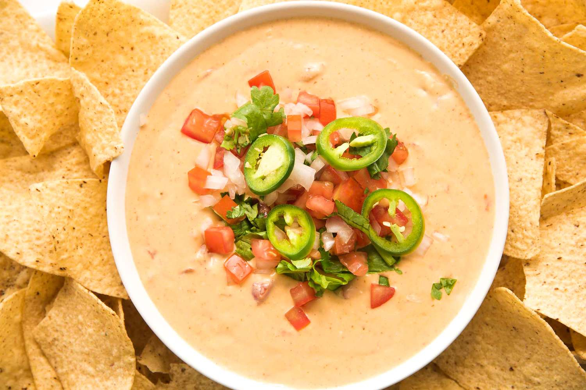

# Texas Queso (Chile con Queso)

*Texas's molten cheese dip: melted American cheese (or a cheddar-Monterey Jack blend) with Rotel diced tomatoes and green chillies, onion, garlic and a splash of milk, served warm with tortilla chips. The Tex-Mex appetiser standard, the traditional "queso" of every Texas restaurant.*

**Serves:** 6-8

**Prep Time:** 10 minutes

**Cook Time:** 15 minutes

## Overview
Queso (or "chile con queso") is Texas's iconic Tex-Mex cheese dip and one of the most beloved appetisers in American cooking: melted American cheese (the traditional Velveeta gives the proper smooth molten texture; or a blend of cheddar and Monterey Jack with cream cheese for a from-scratch version) combined with Rotel diced tomatoes and green chillies, sautéed onion, fresh jalapeño, garlic and a splash of milk to keep it smooth. Served warm in a deep bowl with a generous pile of yellow corn tortilla chips for dipping. The dish appears as the starter at every Texas Tex-Mex restaurant, every Super Bowl party in Texas, every Friday-night gathering.

## Ingredients

### Cheese version (traditional Tex-Mex)
- 500 g Velveeta cheese (cubed); OR 400 g mild cheddar + 200 g Monterey Jack + 150 g cream cheese (for from-scratch)
- 200 ml whole milk

### Aromatics
- 2 tablespoons butter
- 1 medium onion (finely chopped)
- 6 garlic cloves (crushed)
- 2 fresh jalapeños (deseeded; finely chopped)
- 1 tin (400 g) Rotel diced tomatoes with green chillies
- 1 teaspoon ground cumin
- 1 teaspoon chili powder

### Optional additions
- 200 g cooked chorizo (crumbled); for queso fundido style
- 200 g cooked ground beef (seasoned with chili powder); for "beef queso"
- 1 ripe avocado (cubed); for fancy version

### To finish
- 2 tablespoons fresh coriander (chopped)
- 1 sliced spring onion
- Pickled jalapeños

### To serve
- Yellow corn tortilla chips
- Pico de gallo
- Sour cream
- Cold beer

## Method

### Stage 1 - Sauté aromatics
1. Melt butter in a heavy saucepan over medium heat.
2. Add chopped onion and jalapeños; cook 6 minutes till soft.
3. Add crushed garlic; cook 30 seconds.

### Stage 2 - Add Rotel
1. Add the Rotel diced tomatoes (with juice).
2. Stir in cumin and chili powder.
3. Cook 3-4 minutes till heated through.

### Stage 3 - Melt the cheese (slowly)
1. Reduce heat to lowest.
2. Add the cheese (cubed Velveeta, or the cheddar/Monterey/cream cheese mix).
3. Add the milk gradually.
4. Stir constantly till the cheese is fully melted and smooth.
5. Don't let it boil, boiling makes the cheese seize.
6. Cook 5-7 minutes till silky.

### Stage 4 - Finish
1. Add cooked chorizo or beef (if using).
2. Taste; adjust seasoning.

### Stage 5 - Serve
1. Tip into a wide bowl (or a small slow cooker on warm for parties).
2. Scatter coriander, spring onion, pickled jalapeños.
3. Add cubed avocado if using.
4. Serve immediately with chips.

## Notes
- **Velveeta traditional:** gives smooth molten texture; the from-scratch version with cream cheese is the substitute.
- **Rotel essential:** the canned tomato-and-green-chile.
- **Low heat:** boiling causes seizing.
- **Stir constantly while melting.**
- **Eat warm:** firms up as it cools.

## Variations
- **Queso fundido (Mexican-Texan):** add chorizo and serve over corn tortillas; broiled briefly.
- **Spicier:** double the jalapeños and add 1 chopped habanero.
- **Fancier:** make a from-scratch version with cheddar, Monterey Jack, cream cheese; ditch the Velveeta. Better flavour but harder to keep smooth.
- **Bean queso:** add 1 tin of drained black beans; gives extra body.

## Serving
- With yellow corn chips at the centre of a Texan party. Drink: cold beer (Tecate, Modelo, Shiner Bock) or margarita.

## Storage
- Keeps refrigerated 4 days; reheat slowly with extra milk to restore texture.
- Don't freeze; the cheese splits.
- Use a slow cooker on warm for parties, keeps the dip silky.
