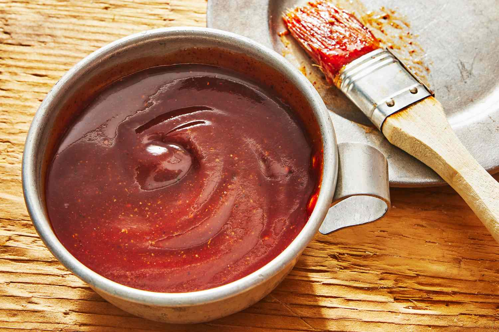

# Texas BBQ Sauce

*Texas's vinegar-tomato BBQ sauce: ketchup, beef stock, vinegar, brown sugar, Worcestershire, mustard, chili powder, cumin and butter slow-simmered into a thin glossy red BBQ sauce. The Central Texas counterpoint to Kansas City sweet-and-thick sauces - Texas BBQ sauce is thinner, more vinegar-forward, more savoury.*

**Serves:** Makes about 600 ml

**Prep Time:** 10 minutes

**Cook Time:** 25 minutes

## Overview
Texas BBQ sauce is the Lone Star State's regional take on tomato-based BBQ sauce, distinct from the thicker sweeter Kansas City and Memphis styles: a thin glossy red sauce made from ketchup, beef stock (the canonical Texan addition - gives savory depth), white vinegar, dark brown sugar, Worcestershire sauce, yellow mustard, chili powder, cumin, garlic powder, onion powder, smoked paprika, salt and a small amount of butter for shine. Slow-simmered for 20 minutes to meld. Central Texas BBQ purists actually serve their brisket without sauce; it's a Northern-Texas (Dallas-Fort Worth) tradition to use sauce more freely. The dish is what's drizzled on Texas BBQ when sauce is wanted, brushed on ribs in the final stages of smoking, or served as a dipping sauce alongside.

## Ingredients

- 400 g tomato ketchup (good quality)
- 250 ml beef stock
- 100 ml apple cider vinegar (or white vinegar)
- 80 g dark brown sugar
- 4 tablespoons yellow mustard
- 4 tablespoons Worcestershire sauce
- 2 tablespoons hot sauce (Tabasco or Frank's)
- 2 tablespoons chili powder
- 1 tablespoon ground cumin
- 1 tablespoon smoked paprika
- 2 teaspoons garlic powder
- 2 teaspoons onion powder
- 1 teaspoon ground black pepper
- 1 teaspoon fine sea salt
- 2 tablespoons butter (for finishing)
- 1 teaspoon liquid smoke (optional; for smoky depth)

## Method

### Stage 1 - Combine in saucepan
1. In a heavy saucepan, combine the ketchup, beef stock, vinegar, brown sugar, mustard, Worcestershire, hot sauce, chili powder, cumin, smoked paprika, garlic powder, onion powder, pepper and salt.
2. Whisk till smooth.

### Stage 2 - Simmer
1. Bring to a simmer over medium-low heat.
2. Cook 20-25 minutes, stirring occasionally, till the sauce thickens slightly to a thin pourable consistency.

### Stage 3 - Finish
1. Whisk in the butter for shine.
2. Add liquid smoke if using.
3. Taste; adjust seasoning.

### Stage 4 - Cool
1. Let cool to room temperature.
2. Transfer to a clean jar.

## Notes
- **Thinner than Kansas City BBQ sauce:** Texas signature.
- **Beef stock gives savory depth:** Texan touch.
- **Vinegar-forward:** more brightness than sweetness.
- **Slow-simmer for proper meld.**

## Variations
**Spicier:** double the hot sauce; add 1 tablespoon cayenne pepper.
**With coffee:** add 100 ml of strong black coffee; gives bitter depth.
**With bourbon:** add 50 ml of bourbon; gives sweet smoky depth.
**East Texas (sweeter):** double the brown sugar; closer to Kansas City style.

## Serving
With Texas BBQ - brisket, ribs, sausage, chicken. As a dipping sauce. Brushed on grilled meats in the last 5 minutes. Drink: cold beer.

## Storage
- Keeps refrigerated 1 month in a sealed jar.
- Don't freeze; the sauce separates.
- Flavour deepens after 24 hours.
