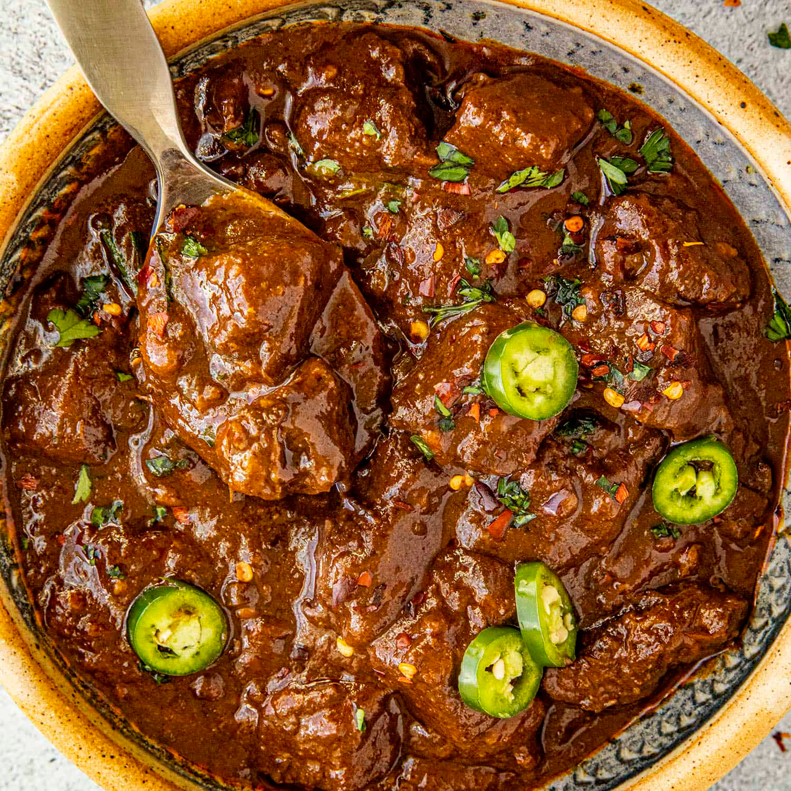

# Texas Chili (No Beans)

*Texas's purist chili: cubed beef chuck slow-cooked with dried ancho and guajillo chillies, garlic, cumin, oregano and Mexican spices into a rich smoky red stew. No beans. No tomatoes. No filler. The Lone Star State's "chili con carne" - beef and chillies and nothing else. The dish that defines Texan stubbornness about food.*

**Serves:** 6-8

**Prep Time:** 30 minutes

**Cook Time:** 2 hours 30 minutes

## Overview
Texas chili (also called chili con carne or "bowl o' red") is the official state dish of Texas and one of America's most fiercely defended regional foods: cubed beef chuck slow-simmered in a thick rich sauce made from dried ancho and guajillo chillies, dried chipotle (for smoke), garlic, cumin, Mexican oregano, beef stock and a small amount of masa harina (corn flour for thickening, the Texan-Mexican touch). No beans, no tomatoes, no macaroni, no filler. Texan chili purists will write angry letters to magazines that publish chili recipes with beans; the "Texas chili wars" are a real cultural phenomenon. Use cubed beef chuck, not ground; the canonical Texan cut is meat in 1.5 cm cubes that hold their shape after long cooking. Dried chillies blitzed into a paste, not chili powder; rehydrate the whole pods and blend them fresh. The dish is beef and chillies; if you want beans, eat them on the side.

## Ingredients

### Beef
- 1.2 kg beef chuck (cut into 1.5 cm cubes; some fat is good)
- 1 ½ teaspoons fine sea salt
- 1 teaspoon ground black pepper
- 3 tablespoons vegetable oil

### Dried chillies (the canonical Texas base)
- 6 dried ancho chillies (stems and seeds removed)
- 4 dried guajillo chillies (stems and seeds removed)
- 2 dried chipotle peppers (or 2 chipotles in adobo)
- 2 dried chiles de árbol (for heat; optional)
- 600 ml hot water (for soaking)

### Cooking base
- 4 tablespoons vegetable oil (for cooking the paste)
- 2 large onions (finely chopped)
- 8 garlic cloves (crushed)
- 1 tablespoon ground cumin
- 1 tablespoon dried Mexican oregano
- 1 teaspoon ground coriander seed
- 1 tablespoon paprika (smoked or sweet)
- 1 teaspoon ground cinnamon
- 600 ml beef stock
- 1 bottle (350 ml) lager beer (Mexican; Modelo or Pacifico)
- 1 tablespoon Worcestershire sauce
- 1 tablespoon dark cocoa powder (the secret Texan touch)
- 3 tablespoons masa harina (for thickening; or substitute with cornmeal)
- 2 bay leaves
- 1 ½ teaspoons fine sea salt
- 1 teaspoon ground black pepper

### To finish
- 1 small bunch fresh coriander (chopped)
- 1 fresh jalapeño (sliced)
- Lime wedges
- Optional: small splash of vinegar (brightens)

### To serve (Texas style)
- Cornbread
- Sliced raw white onion
- Pickled jalapeños
- Grated cheddar cheese
- Sour cream
- Hot sauce
- Tortilla chips or crackers
- Cold beer (Lone Star, Shiner Bock)

## Method

### Stage 1 - Toast and rehydrate the chillies
1. Toast all dried chillies briefly in a dry pan over medium heat (30 seconds per side; don't burn).
2. Place in a bowl with the hot water.
3. Soak 30 minutes till softened.
4. Reserve the soaking liquid.

### Stage 2 - Brown the beef
1. Pat beef dry; season with salt and pepper.
2. Heat 3 tablespoons oil in a heavy pot over high heat.
3. Brown beef in batches 3 minutes per side; don't overcrowd.
4. Set aside.

### Stage 3 - Blend the chilli paste
1. Place soaked chillies in a blender with about 300 ml of the soaking liquid.
2. Add 4 garlic cloves, the cumin, oregano, ground coriander, paprika, cinnamon.
3. Blitz to a smooth thick paste.

### Stage 4 - Build the base
1. Reduce heat to medium; add the additional 4 tablespoons oil.
2. Add chopped onions; cook 8 minutes till deeply soft.
3. Add the remaining 4 crushed garlic cloves; cook 30 seconds.
4. Add the chilli paste; cook 5 minutes, stirring, till the colour deepens.

### Stage 5 - Return beef and add liquid
1. Return the browned beef to the pot.
2. Pour in the beer; let bubble 2 minutes.
3. Add the beef stock.
4. Add Worcestershire sauce, cocoa powder, bay leaves, salt and pepper.
5. Bring to a low simmer.

### Stage 6 - Slow-cook
1. Cover with the lid slightly ajar.
2. Cook 90 minutes till the beef is tender.

### Stage 7 - Thicken
1. Mix the masa harina with 4 tablespoons of cold water to a smooth slurry.
2. Stir into the simmering chili.
3. Cook 15-20 minutes uncovered till the chili has thickened to a rich gravy consistency.

### Stage 8 - Finish
1. Take off the heat.
2. Lift out the bay leaves.
3. Taste; adjust salt.
4. Add a small splash of vinegar to brighten (optional).
5. Stir in most of the chopped coriander.

### Stage 9 - Serve
1. Ladle into deep bowls.
2. Top with sliced raw onion, grated cheddar, jalapeños, sour cream, coriander.
3. Cornbread on the side.
4. Cold beer.

## Notes
- **Cubed beef, not ground:** canonical Texas.
- **Dried chillies blended fresh:** not chili powder.
- **No beans, no tomatoes:** Texas law.
- **Masa harina thickens:** Texan touch.
- **Cocoa powder is the secret:** deep umami without sweetness.

## Variations
**Spicier:** add more chiles de árbol and 2 fresh habaneros.
**With more smoke:** double the chipotles.
**With venison:** swap beef for venison; common Texas variation.
**Pressure-cooker version:** cook 75 minutes high pressure; finish on stovetop with masa.

## Serving
In deep bowls with cornbread, raw onion, cheese, jalapeños, sour cream. Cold beer.

## Storage
- Keeps refrigerated 1 week; flavour deepens.
- Freezes 6 months.
- Day-after Texas chili is famously better.
