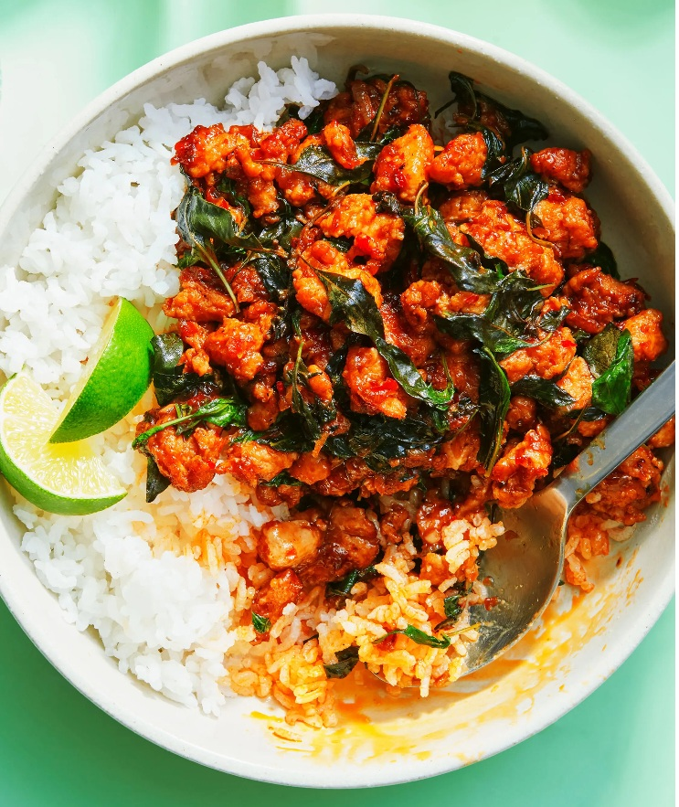

# Thai Holy Basil and Chilli Chicken Stir Fry

*Thailand's pad krapow gai: minced chicken stir-fried hot with garlic, bird's-eye chilli and a generous handful of holy basil.*

**Serves:** 4

**Prep Time:** 10 minutes

**Cook Time:** 10 minutes

## Overview
Pad krapow gai is the late-night quick dinner of every Thai household and street stall, ready ten minutes from when the wok hits the heat. The defining note is holy basil (krapow), peppery and faintly clove-like, distinct from the sweet Thai basil used in green curry; ordinary basil with a few mint leaves gets close but isn't quite the same dish. A mortar-pounded paste of garlic and red spur chillies carries the heat, oyster sauce and palm sugar balance the salt-sweet seasoning, and the basil goes in off the heat so it wilts but stays green. The canonical serving is over steamed jasmine rice with a runny-yolked fried egg on top: found at every food cart in Bangkok and on the table at every Thai working lunch.

## Ingredients
### Aromatics
- 8 garlic cloves, smashed
- 5 red spur chillies, cut into thin rings
- 2 shallots, thinly sliced

### Fat
- 2 tbsp rapeseed (canola) oil

### Protein
- 600g (1lb 5oz) skinless chicken thigh fillets, cut into small pieces

### Seasonings
- 1 tbsp light soy sauce*
- 1 tsp palm sugar, finely chopped (more or less to taste)
- 1 tbsp oyster sauce*
- 1 ½ tsp dark soy sauce*

### Herbs
- Large handful of Thai holy basil leaves, finely (or roughly chopped)

## Method

### Stage 1 - Prepare aromatics
1. Place the garlic and chillies in a pestle and mortar and pound until chunky and small but not smooth (or use knife/food processor).
1. Set aside.

### Stage 2 - Fry aromatics
1. Heat the oil over a high heat in a large wok or frying pan.
1. When hot, add the shallots and fry for a couple of minutes until fragrant and softened.
1. Stir in the garlic and chilli mixture and fry for about 30 seconds, being careful not to burn the garlic.

### Stage 3 - Cook chicken
1. Stir in the chicken pieces and fry for about 4-5 minutes until cooked through.
1. Stir continuously so that the aromatic ingredients don’t burn.

### Stage 4 - Add seasonings
1. Stir in the light soy sauce, sugar, oyster sauce and dark soy sauce.
1. Taste and add more chillies, sugar or light soy sauce to taste.

### Stage 5 - Finish with basil
1. Turn off the heat and add the basil.
1. Stir to combine.

## Notes
* Many soy and oyster sauces contain gluten but gluten-free brands are available.

## Serving
- Serve hot with steamed jasmine rice.

## Storage
- Best served immediately; reheat gently if needed.
