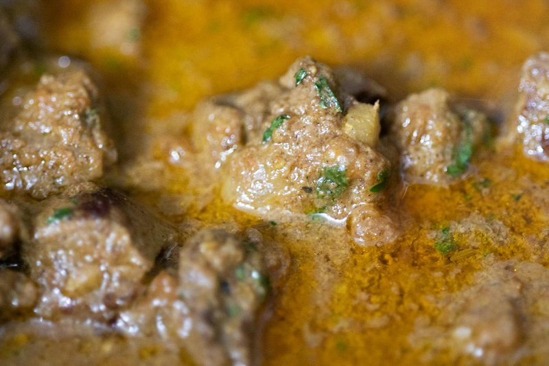

# Beef Panang Curry

*Thailand's beef panang: beef simmered slow in a thick panang curry paste with coconut milk, kaffir lime leaves and crushed peanuts.*

**Serves:** 4

**Prep Time:** 10 minutes

**Cook Time:** 20 minutes

## Overview
Beef panang is the thicker, sweeter, peanut-tinged cousin to red curry: beef simmered slow in a rust-coloured panang paste with coconut milk, finished with finely julienned kaffir lime leaves and crushed peanuts. The defining note is the paste: deeply roasted dried red chillies pounded with lemongrass, galangal, coriander root and a heavy hand of peanuts. If buying ready-made, a Thai-brand jar (Maesri, Mae Ploy) is solid. Slice rib-eye thin against the grain. The paste fries in oil till the red oil splits before the coconut milk goes in; that's how the colour stays vivid and the spices stay aromatic. Sweet-salty balance is what defines panang, so taste at the end and adjust both palm sugar and fish sauce. Served over hot jasmine rice with crushed peanuts and extra lime leaf on top.

## Ingredients
### Fat
- 2 tbsp rapeseed (canola) oil

### Protein
- 600 g (1 lb 5 oz) beef rib-eye, cut thinly against the grain

### Paste and sweeteners
- 1 batch [Panang curry paste](../../base-ingredients/curry-paste/panang-paste.md)
- 1-2 tbsp palm sugar

### Dairy
- 600 ml (2 ½ cups) thick coconut milk

### Vegetables
- 225 g (8 oz) vegetables, such as chopped baby sweetcorn, courgette (zucchini), mushrooms

### Aromatics and seasoning
- 3 lime leaves, stalks removed and leaves finely julienned
- 2 tbsp Thai fish sauce (more or less to taste)
- 3 tbsp roasted peanuts, roughly crushed (the defining panang finish)

## Method

### Stage 1 - Brown meat
1. Heat oil in wok or large frying pan over high heat.
1. Add beef; fry 2 mins to brown.

### Stage 2 - Add paste and sugar
1. Add curry paste and 1 tbsp sugar; fry 1-2 minutes until the paste smells fragrant and the oil starts to take on its colour.
1. Add coconut milk; simmer 5 mins to thicken.

### Stage 3 - Add vegetables and finish
1. Stir in vegetables; simmer until cooked but fresh.
1. Add lime leaves and fish sauce.
1. Taste; adjust sugar or fish sauce.
1. Scatter the crushed roasted peanuts over just before serving.

## Notes
- Many Thai fish sauces contain gluten; use gluten-free brands if needed.
- For thinner curry, add stock like red curry.
- Authentic Panang has no vegetables; omit for tradition.

## Serving
- Serve over hot jasmine rice.
- Garnish with extra lime leaves or peanuts.

## Storage
- Refrigerate 2-3 days in airtight container.
- Reheat gently on stovetop.
- Freeze up to 2 months; thaw before reheating.
