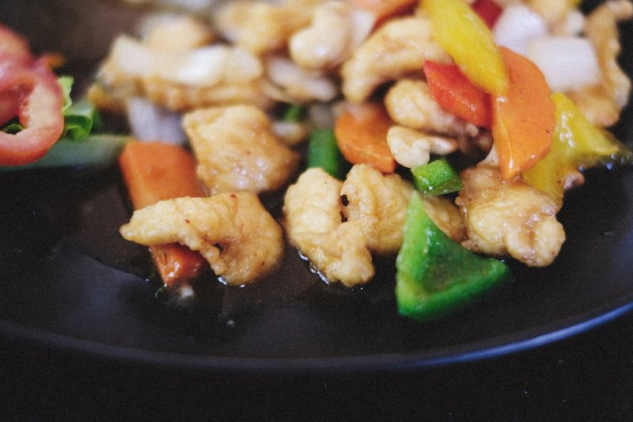

# Chicken with Cashews

*Thailand's chicken with cashews: chicken stir-fried hot with dried chillies, roasted cashews, spring onion and a glossy oyster-soy-sauce.*

**Serves:** 4

**Prep Time:** 20 minutes

**Cook Time:** 10 minutes

## Overview
Gai pad med mamuang is the takeaway-counter favourite that turned into a home-cook staple, chicken stir-fried hot with toasted cashews, fried dried chillies and a glossy oyster-soy-sauce. The two things to get right are the cut and the watchfulness: dice the chicken to cashew-size pieces (more for the look than anything, but they cook evenly that way), and keep one eye on the oil while the cashews and chillies go in. Both go from golden to scorched in seconds and a burnt batch ruins everything, so test the oil with a single nut first; it should sizzle on contact and turn light gold within about a minute. Mix the sauce ahead (light soy, dark soy, oyster sauce, a teaspoon of palm sugar, a splash of stock), then fry the cashews till just gold, fry the dried bird's-eye chillies just till they deepen a shade without browning, and shallow-fry cornflour-dusted chicken pieces till golden and crisp. Wipe the wok, soften garlic, sliced onion and fresh chillies in a tablespoon of oil for a minute, pour in the sauce to simmer briefly till glossy, then fold the chicken, cashews and fried dried chillies back through. The fried dried chillies aren't really meant to be eaten (they're aromatic theatre) but nothing's stopping you. Serve over jasmine rice with chopped spring onion scattered on top.

## Ingredients

### Protein
- 450g (1lb) skinless chicken thigh fillets, cut into small cashew-size pieces

### Sauce
- 2 tbsp light soy sauce
- 1 tbsp dark soy sauce
- 1 tbsp oyster sauce
- 1 tsp Thai seasoning sauce (optional)
- 70ml (¼ cup) water or chicken stock
- 1 tsp palm sugar, grated and finely chopped

### Aromatics
- 6 garlic cloves, roughly chopped
- 4 spring onions (scallions), sliced

### Vegetables
- 1 onion (large), thinly sliced
- 3 red spur chillies, thinly sliced
- 2 green bird’s eye chillies, cut into thin rings

### Other
- 20-30 cashews
- 20 dried red bird’s eye chillies
- 3 tbsp cornflour (cornstarch)

### Fat
- 250ml (1 cup) rapeseed (canola) oil, plus an extra 3 tbsp

## Method

### Stage 1 - Prepare Sauce
1. Whisk all of the sauce ingredients together and taste it.
2. Add more sugar if you like a sweeter flavour and then set aside.

### Stage 2 - Fry Cashews and Chillies
1. Heat 250ml (1 cup) of rapeseed (canola) oil in a wok or saucepan until shimmering hot.
2. Add one cashew. It should sizzle on contact but not brown too quickly.
3. If that cashew looks like it is happy in the oil, add the rest and cook for about a minute until light golden brown in colour.
4. Transfer to a paper towel to soak up any excess oil.
5. Do the same with the chillies, checking the oil temperature first.
6. You want them to still be a nice deep red colour. If the oil is too hot, they will quickly burn and turn brown.

### Stage 3 - Fry Chicken
1. Dust the chicken pieces with the cornflour (cornstarch) and add it in small batches to the hot oil.
2. Fry for 3-5 minutes until golden brown and crispy.
3. Transfer to a paper towel to soak up the excess oil.

### Stage 4 - Combine
1. Now heat a wok or large frying pan over a medium heat.
2. Add 3 tablespoons of oil to the wok and stir in the garlic, onion, spur chillies and green bird’s eye chillies.
3. Fry until the garlic is turning soft and a very light brown colour but be very careful not to burn it.
4. Stir in the sauce mixture and simmer for about 30-60 seconds to thicken and then add the chicken, cashews and dried and fried chillies, stirring well to combine.
5. Continue cooking for a minute or two until the sauce is sticking to the meat and cashews and then taste it, adjusting the seasoning if necessary.
6. Serve immediately sprinkled with the chopped spring onions (scallions) to garnish.

## Notes
- Don't burn the cashews and chillies.
- Dried chillies are not meant to be eaten.

## Serving
Serve with jasmine rice.

## Storage
- Best served immediately; can be refrigerated for 1 day.
