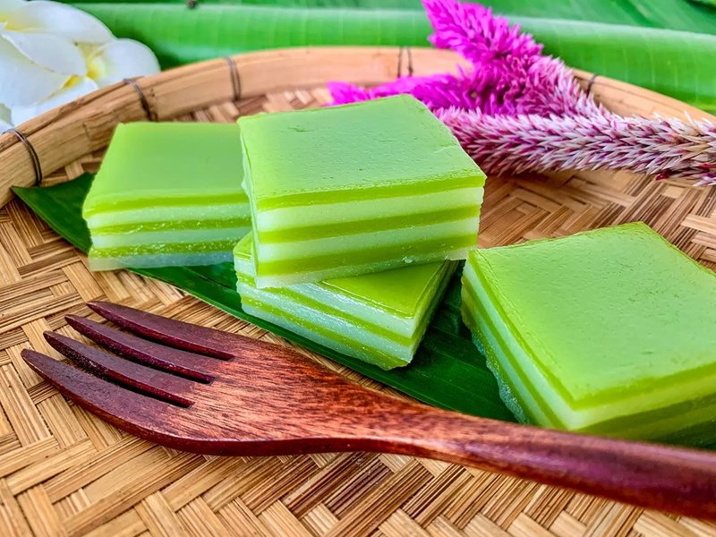

# Kanom Chan

*Thailand's auspicious layer cake: nine pandan-and-coconut-milk jelly layers, each set before the next is poured. Eat at weddings.*

**Serves:** 8 (makes a 20 cm square tray)

**Prep Time:** 20 minutes

**Cook Time:** 60 minutes (in steaming stages of 5-7 min per layer)

## Overview
Kanom chan is the Thai layer cake of wedding tables and auspicious occasions, vivid-green pandan and creamy-white coconut layers stacked into a stripy jelly that tears apart with the fingers. Nine layers is the lucky number (odd is preferred), and the work is the patience to let each layer set fully before pouring on top of it. Three starches together give the traditional texture: rice flour for body, tapioca for chew, mung-bean for the snap that lets the layers peel apart cleanly; substituting any of these out collapses the structure into a generic coconut pudding. Coconut milk and water bind the batter, sugar and salt season, pandan tints half. Layer thickness matters; 4 to 5 mm is the traditional depth, and thicker layers stay gummy in the centre. Patience between layers is non-negotiable; a soft surface still wet enough to take another pour will bleed colours together and the stripes go muddy. Cooled and chilled till firm, sliced with an oiled knife. Eat at room temperature, layers pulled apart one at a time.

## Ingredients

### Batter
- 200 g rice flour
- 200 g tapioca starch (sometimes labelled tapioca flour)
- 50 g mung-bean starch (or substitute cornflour if unavailable)
- 350 g caster sugar
- 1 teaspoon salt
- 900 ml coconut milk
- 200 ml water
- 1 teaspoon natural pandan extract (or 2 tablespoons fresh pandan juice - see Notes)
- A few drops of green food colour (only if the pandan is weak; pandan extract is usually enough)

### To prepare the tin
- 1 teaspoon vegetable oil (for greasing)

## Method

### Stage 1 - Set up steamer
1. Choose a 20 cm square tin (or a round dish 22 cm across) that fits inside your steamer.
1. Lightly grease the inside with vegetable oil.
1. Bring water to a boil in a wide pot underneath the steamer base.

### Stage 2 - Mix the batter
1. In a large bowl, whisk rice flour, tapioca starch, mung-bean starch, sugar and salt.
1. Slowly pour in the coconut milk, whisking continuously to avoid lumps.
1. Add the water.
1. Whisk to a smooth, lump-free batter - strain through a sieve into a measuring jug for total smoothness.

### Stage 3 - Divide
1. Divide the batter into two equal portions.
1. Leave one plain (this will be the white-cream layer).
1. Stir the pandan extract into the other (this will be the green layer).
1. If the green isn't vivid enough, add a few drops of green food colour.

### Stage 4 - First layer
1. Place the empty tin inside the steamer over boiling water.
1. Cover; pre-heat the empty tin 2 minutes.
1. Pour about 4-5 mm of green batter into the tin (roughly a 9th of the green batter - measure with a ladle and check with a ruler if needed).
1. Cover; steam 5-6 minutes until firmly set (poke with a clean finger; the surface should be matte and resilient, not wet).

### Stage 5 - Subsequent layers
1. Without lifting the tin out, pour 4-5 mm of white batter directly onto the set green layer.
1. Cover; steam another 5-6 minutes.
1. Continue alternating: green, white, green, white… until 9 layers total (or your batter is used up).
1. Don't pour wet batter onto a damp surface - each layer must be fully set before the next is added or they'll bleed together.

### Stage 6 - Final cook
1. After the final layer is poured, cover and steam an additional 10 minutes to ensure everything is fully set through.

### Stage 7 - Cool
1. Lift the tin out of the steamer.
1. Cool to room temperature, 1 hour minimum.
1. Cover and refrigerate at least 2 hours to firm fully.

### Stage 8 - Cut and serve
1. Run a clean oiled knife around the edges; invert onto a board or lift out using cling-film handles if you lined the tin.
1. Cut into 2 cm squares or 2 x 4 cm rectangles with an oiled knife (oil prevents sticking).
1. Optional traditional eating: pull the layers apart with the fingers, layer by layer.

## Notes
- **Pandan options:** Real pandan juice (from blending fresh or frozen pandan leaves with water and straining) gives the truest flavour and a softer green. Concentrated pandan extract (sold in bottles labeled "Pandan Essence" at Asian shops) is much more potent and gives a vivid colour - use sparingly. A few drops of green food colour can help if the pandan colour is weak.
- **Three starches, not one:** Rice flour gives the body, tapioca starch gives the chew, mung-bean starch gives the snap. Substituting all rice flour gives a softer, more porridge-like texture. Substituting cornflour for mung-bean works in a pinch.
- **Each layer fully set:** Pouring wet batter onto an unset layer mixes the colours into a marbled mess. Test with a finger before pouring the next layer.

## Storage
- Refrigerate 5 days in an airtight container. Each piece can be wrapped individually in cling film.
- Bring to room temperature 15 minutes before eating; chilled kanom chan is too firm.
- Doesn't freeze - the starch structure breaks down on thaw.
