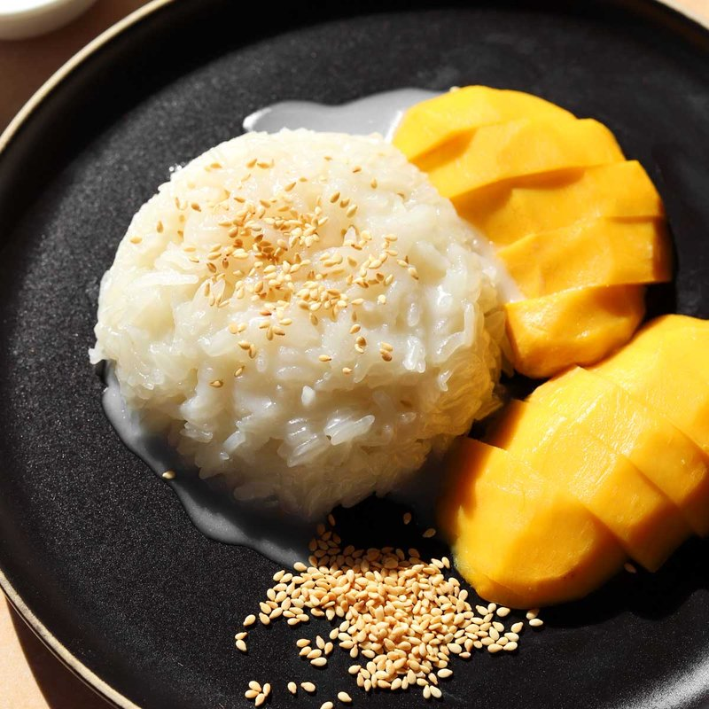

# Mango Sticky Rice

*Thailand's mango plate: sticky rice steeped in salted-sweet coconut sauce, served alongside cool slices of ripe honey mango.*

**Serves:** 4

**Prep Time:** 10 minutes (plus overnight rice soak)

**Cook Time:** 30 minutes

## Overview
Khao niao mamuang is Thailand's mango plate: sticky rice steeped in salty-sweet coconut sauce alongside cool slices of ripe honey mango. Temperature and texture contrast do as much work as flavour; warm-rice-cool-mango is the Thai pairing and serving the rice cold loses what makes it work. The rice must be real Thai glutinous rice (not jasmine, not basmati); only glutinous gives the cling-together stickiness, and other long-grains stay separate. The bold pinch of salt in the coconut sauce is non-negotiable; without it the dessert tips into one-dimensional sweetness, and the salty edge gives the dish its sophisticated Thai signature. A second small batch of coconut cream with extra salt and a teaspoon of rice flour goes on top of the rice as a final glossy topping; this second salty layer lifts the plate and the home-cook version that skips it tastes flat. Eat with a spoon while the rice is warm and the mango is cool.

## Ingredients

### Rice
- 300 g Thai glutinous (or sticky rice)
- Cold water (for soaking)

### Sweet coconut sauce (for soaking the rice)
- 400 ml coconut milk
- 100 g palm sugar (chopped fine; or 80 g caster sugar)
- ¾ teaspoon salt (not optional - the salt-sweet balance is the dish)
- 1 pandan leaf, tied in a knot (optional but traditional; sold frozen at Thai shops)

### Plain coconut cream (for drizzling at the end)
- 100 ml coconut cream (the thick layer from the top of a tin of coconut milk)
- ¼ teaspoon salt
- 2 teaspoons rice flour (helps it thicken slightly without sugar)

### To finish
- 2 ripe mangoes (large, Nam Dok Mai or any sweet ripe variety - Ataulfo / honey mangoes work well; about 600 g total)
- 2 tablespoons toasted sesame seeds (white, black, or a mix)
- 2 tablespoons toasted mung beans (optional but traditional - crispy / nutty)

## Method

### Stage 1 - Soak the rice
1. Place sticky rice in a deep bowl.
1. Cover with cold water by 5 cm.
1. Soak overnight (or at least 6 hours). The grains should be crushable between fingers.

### Stage 2 - Toast the mung beans (if using)
1. Place mung beans in a dry frying pan.
1. Toast over medium heat, shaking, for 3-4 minutes until golden brown and fragrant.
1. Tip onto a plate to cool.

### Stage 3 - Steam the rice
1. Drain the soaked rice.
1. Line a bamboo steamer or sieve with damp muslin (or banana leaves).
1. Mound the rice on the muslin.
1. Place over a pan of boiling water (water must not touch the rice).
1. Cover; steam over medium heat for 20-25 minutes. At the 15-minute mark, flip the rice (lift it as a single mass via the muslin) so the bottom layer steams from above.
1. The rice is done when fully tender, slightly translucent, and chewy.

### Stage 4 - Sweet coconut sauce
1. In a saucepan, combine coconut milk, palm sugar, salt and pandan leaf.
1. Heat over medium-low, stirring, until the sugar dissolves - about 4-5 minutes.
1. Don't boil hard; gentle warmth is enough. The sauce should be slightly thinner than double cream.
1. Discard the pandan leaf.

### Stage 5 - Combine rice and sauce
1. Transfer the freshly steamed rice to a wide bowl.
1. Pour about three-quarters of the warm sweet sauce over the rice.
1. Stir gently with a wooden spoon to coat every grain.
1. Cover the bowl; let rest 15 minutes - the rice absorbs the sauce and becomes glossy and pliable.

### Stage 6 - Plain coconut cream
1. While the rice rests, whisk the 100 ml coconut cream with ¼ teaspoon salt and 2 teaspoons rice flour in a small saucepan.
1. Heat over low heat, whisking, for 2-3 minutes until just slightly thickened. Don't boil.
1. Reserve.

### Stage 7 - Slice the mango
1. Stand the mango on its narrow side; with a sharp knife, cut down either side of the flat stone to release the two "cheeks".
1. Trim the skin off each cheek.
1. Slice each cheek into thin slabs (about 5 mm thick) or large dice.

### Stage 8 - Plate
1. Spoon a mound of coconut-soaked rice in the centre of each plate (about ½ cup per serving).
1. Fan mango slices alongside.
1. Drizzle the rice with the plain coconut cream - about 2 tablespoons per plate.
1. Drizzle the remaining sweet sauce over (it'll pool slightly around the rice - that's fine).
1. Scatter toasted sesame seeds and toasted mung beans.

### Stage 9 - Serve
1. Eat while the rice is still slightly warm and the mango is cool. The temperature contrast is part of the dish.

## Notes
- **Salt is the secret:** Coconut without salt tastes flat. The salt in both the sweet sauce and the topping cream is what makes mango sticky rice memorable - don't be shy with it.
- **Two layers of coconut:** The first (sweetened) goes into the rice; the second (salted, unsweetened) drizzles on top. Two layers, two flavours. Skipping the second leaves the dish too sweet.
- **Mango ripeness:** A ripe mango should yield slightly to gentle pressure, smell fragrant at the stem end. Underripe mango is fibrous and sour; overripe is mushy. If your mangoes aren't ready, leave them at room temperature 1-2 days.

## Storage
- Best within 2 hours of plating.
- The rice (with sweet sauce mixed in) refrigerates 24 hours; gently re-steam to soften. The mango should be sliced fresh.
- Don't freeze the assembled dish; freeze components if needed (rice and sauce separately).
