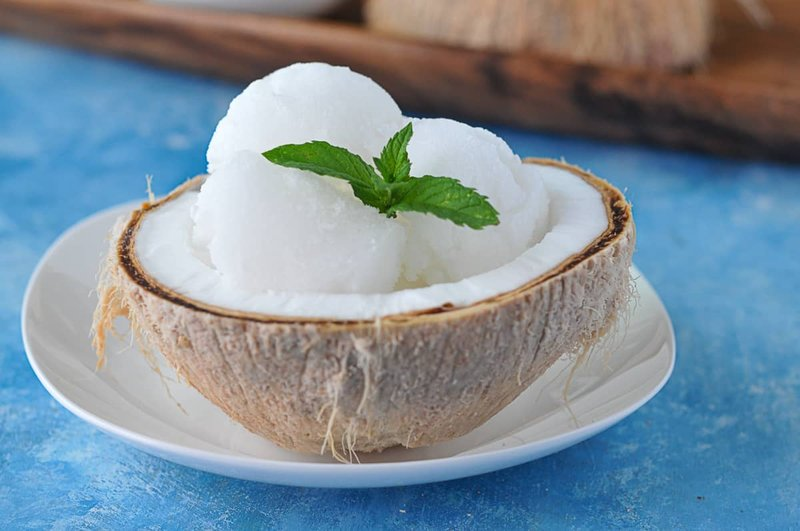

# Thai Coconut Ice Cream

*Bangkok's coconut ice cream: a churned ice cream of pure coconut milk and palm sugar, served with sticky rice, peanuts and palm-sugar syrup.*

**Serves:** 6 (makes about 1 litre)

**Prep Time:** 20 minutes (plus 6+ hour churning / freezing)

**Cook Time:** 8 minutes (for the custard base)

## Overview
A custard-free, fully coconut ice cream. Coconut milk (full-fat) and coconut cream combine with palm sugar, glucose syrup (or honey, keeps the texture smooth) and salt; warm together gently to dissolve the sugar. Cool fully (4 hours fridge or an ice bath). Churn in an ice-cream machine for 25-30 minutes until thick and creamy. Transfer to a container; freeze 2+ hours to firm. Serve in small bowls or, for the Bangkok cart presentation, in halved fresh coconut shells, topped with any combination of: small banana slices, sticky rice, roasted peanuts, sweet red beans, palm-sugar syrup, toasted coconut.

## Ingredients

### Ice cream
- 800 ml full-fat coconut milk
- 200 ml coconut cream (the thick top from a tin)
- 150 g palm sugar (chopped fine; or 130 g caster sugar)
- 2 tablespoons glucose syrup (or honey - keeps the texture smooth)
- ¾ teaspoon salt
- 1 pandan leaf, tied in a knot (optional)
- 1 teaspoon vanilla extract (optional)

### Topping bar (per serving - set out for everyone to mix)
- 2 bananas (small, sliced)
- 200 g sweet sticky rice (cooked, with coconut sauce - see [khao-niao.md](../side-dishes/khao-niao.md))
- 80 g salted roasted peanuts (crushed)
- 200 g sweet red bean paste OR cooked azuki beans in syrup (sold tinned at Asian shops)
- 50 g toasted shredded coconut
- 6 maraschino cherries (optional, the street-cart finish)

### Palm-sugar syrup
- 80 g palm sugar
- 80 ml water
- 1 small pinch salt

## Method

### Stage 1 - Make the base
1. In a saucepan, combine coconut milk, coconut cream, palm sugar, glucose syrup, salt and the pandan leaf if using.
1. Heat over medium-low, stirring, just until the palm sugar dissolves and the mixture is smooth. Don't boil.
1. Off heat; stir in vanilla extract.
1. Cool: pour into a bowl over an ice bath, OR refrigerate 4 hours to chill to fridge temperature.
1. Discard the pandan leaf.

### Stage 2 - Churn
1. Pour the cold base into the bowl of an ice-cream maker.
1. Churn 25-30 minutes (or per your machine's instructions) until the mixture is thick and creamy - like soft-serve ice cream.

### Stage 3 - Firm
1. Scrape into a freezer container; press cling film directly onto the surface to prevent ice crystals.
1. Cover; freeze 2-4 hours to firm to scoopable texture.

### Stage 4 - Palm sugar syrup
1. In a small pan, combine palm sugar, water and a pinch of salt.
1. Heat over medium, stirring, until the sugar dissolves and the syrup is thinly coats a spoon - about 4 minutes.
1. Cool.

### Stage 5 - Assemble
1. Take the ice cream out of the freezer 5 minutes before serving (so it scoops easily).
1. Scoop 2 small scoops per bowl (or per coconut half).
1. Set out toppings buffet-style: bananas, sticky rice, peanuts, red beans, toasted coconut, palm syrup, cherries.
1. Each diner picks their toppings; you spoon them on or they do.

### Stage 6 - Eat
1. The Bangkok build: a layer of warm sticky rice in the bottom, ice cream on top, banana to one side, beans to another, peanuts scattered, palm syrup drizzled, cherry on top.

## Notes
- **Salt the coconut:** Thai sweet dishes get a more pronounced salt level than Western desserts. The ¾ teaspoon salt isn't a typo - it makes the coconut taste of coconut rather than of sugar.
- **No-churn option:** Whip 300 ml double cream to soft peaks; fold into the cooled coconut base; freeze 4 hours, stirring every 30 minutes for the first 2 hours to break up ice crystals. The texture is slightly less smooth than churned but very close.
- **Coconut shell presentation:** If you can find young coconuts, cracking them in half and serving the ice cream in the shells is the full street-cart experience. Otherwise use small bowls.

## Storage
- Freezes 2 months in an airtight container.
- After 1 week the texture firms slightly; let stand at room temperature 10 minutes before scooping.
- Palm syrup keeps refrigerated 1 month.
