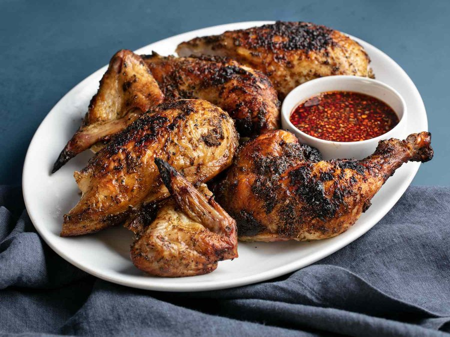

# Gai Yang

*Isaan's grilled chicken: butterflied bird pounded with coriander root, garlic, white pepper and fish sauce, slow-charred over coals till mahogany-dark.*

**Serves:** 4

**Prep Time:** 25 minutes (plus 4 hours marinating)

**Cook Time:** 35 minutes

## Overview
Gai yang ("grilled chicken") is a cornerstone of Isaan cooking, the cuisine of north-eastern Thailand that has spread across the whole country and into Thai restaurants worldwide. The defining flavour is coriander root, barely used in Western cooking but central to Thai marinades; pounded in a granite mortar with garlic, white peppercorns and salt, it forms an aromatic paste loosened with fish sauce, oyster sauce and a touch of sugar. The chicken is butterflied so it lies flat on the grill, marinated four hours, then cooked slowly over moderate charcoal for thirty minutes or more, sometimes pressed flat between bamboo splints, till the skin crisps and the meat takes on smoke without burning. The flavour is savoury-funky from fish sauce, peppery-warm from white pepper, deeply garlic-and-herb from the paste, with no chilli in the marinade itself; heat comes from the dipping sauce. Eat by hand with balls of sticky rice and dipped into nam jim jaew, the toasted-rice-and-tamarind dipping sauce.

## Ingredients

### Chicken
- 1 whole chicken (1.6-1.8 kg, butterflied)

### Marinade paste
- 8 coriander roots (or 30 g coriander stems with the lower leaves)
- 8 garlic cloves
- 5 g white peppercorns
- 5 g salt
- 60 ml fish sauce
- 30 ml oyster sauce
- 30 ml light soy sauce
- 15 ml dark soy sauce
- 25 g palm sugar (or light brown sugar)
- 30 ml vegetable oil
- 5 g ground turmeric (optional, for colour)

### Nam jim jaew (dipping sauce)
- 30 g uncooked sticky rice (or jasmine rice)
- 60 ml fish sauce
- 60 ml lime juice
- 30 g palm sugar
- 30 ml tamarind concentrate (or extra lime juice)
- 10 g dried Thai chilli flakes
- 3 spring onions (finely sliced)
- 15 g coriander leaves (chopped)
- 2 shallots (finely sliced)

## Method

### Stage 1 - Marinade
1. Wash and trim the coriander roots; chop roughly.
1. In a large mortar (or small food processor), pound the coriander roots, garlic, white peppercorns and salt to a coarse paste.
1. Stir in fish sauce, oyster sauce, both soy sauces, palm sugar, oil and turmeric.
1. Butterfly the chicken: with kitchen shears, cut down each side of the backbone, remove it, then press the bird flat breast-up.
1. Rub the paste over and under the skin, into the cavity, and on the underside.
1. Refrigerate 4-12 hours.

### Stage 2 - Toasted rice powder
1. Toast the rice in a dry pan over medium heat, stirring constantly, 6-8 minutes, until deep golden and very fragrant.
1. Cool, then grind to a coarse powder in a mortar or spice grinder.

### Stage 3 - Grill
1. Build a medium charcoal fire and set it up for indirect heat (coals on one side, or banked around the edges).
1. Oil the grates.
1. Place the chicken skin-side up on the cool side; close the lid.
1. Cook 15 minutes; turn skin-side down for 5 minutes; turn back and cook another 10-15 minutes, until breast reads 72°C and thigh 75°C.
1. In the final 3-4 minutes, move briefly over direct heat to crisp the skin, watching carefully so the marinade doesn't blacken.

### Stage 4 - Sauce and serve
1. While the chicken cooks, mix fish sauce, lime juice, palm sugar and tamarind in a bowl until the sugar dissolves.
1. Stir in chilli flakes, spring onion, coriander, shallots and 15 g of the toasted rice powder.
1. Rest the chicken 8 minutes; chop with a heavy knife through the bones into 4-5 cm pieces, or carve normally.
1. Serve with sticky rice, the nam jim jaew, and lime wedges.

## Notes
- **Coriander root is the soul:** if you can't find coriander roots, use a generous amount of the lower stems with the cleaned bases attached. The flavour is in the root and lower stem, not the leaves.
- **White pepper, not black:** the peppery warmth of gai yang is white pepper, which is cleaner and more aromatic against fish sauce.
- **Indirect cooking matters:** the marinade has plenty of sugar and soy and will burn over direct flame before the chicken cooks. Slow it down.
- **Khao niao (sticky rice):** soak overnight and steam in a bamboo basket for the proper accompaniment.

## Storage
- Refrigerate chicken up to 3 days in a sealed container.
- Nam jim jaew is best fresh but keeps overnight; the herbs will wilt.
- Toasted rice powder keeps a month sealed in a jar; use in laab and other Isaan dishes.
