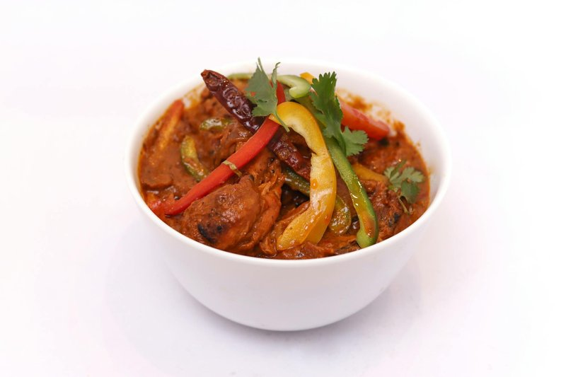

# Chicken Jungle Curry

*Thailand's jungle curry: a brothy, fierce, coconut-free curry of chicken with bamboo shoots, green peppercorns and a fresh chilli paste.*

**Serves:** 4

**Prep Time:** 15 minutes

**Cook Time:** 15-20 minutes

## Overview
Jungle curry (gaeng pa) is the northern Thai curry that shows what Thai food tasted like before coconut palms moved south, a fierce, clear, brothy curry of game meat and foraged vegetables thickened only by its own intensity. The Chiang Mai original used wild boar or venison and whatever the jungle floor offered; this version subs chicken for the meat but keeps the no-coconut-milk discipline that defines the dish. The broth is meant to be thin and bright with green peppercorns popping between your teeth, not creamy or rich. Pan-fry chicken breasts for five minutes a side till just cooked through, slice into bite-sized pieces and set aside. In the same hot pan, stir red curry paste into oil and fry for thirty seconds till aromatic, then pour in chicken stock or water and bring to a rolling simmer. Return the chicken with green beans cut into short lengths, drained bamboo shoots, baby corn and a generous tablespoon or two of fresh green peppercorns; simmer three minutes so the vegetables stay crisp. Season off the heat with fish sauce, finely sliced kaffir lime leaves, lime juice and an optional teaspoon of palm sugar (jungle curry can take a touch of sweetness against the fierce chilli heat), taste and adjust. Garnish with fresh coriander and Thai sweet basil and serve with sticky rice for tearing and dipping into the broth.

## Ingredients
### Protein
- 4 chicken breasts

### Fat
- 2 tbsp rapeseed (canola), peanut or coconut oil

### Paste
- 6 tbsp [Thai Red Curry Paste](pastes/thai-red-curry-paste.md)

### Liquid
- 500 ml (2 cups) Thai chicken stock or water

### Vegetables
- 10 green (string) beans, cut into 2 ½ cm (1 in) pieces
- 227 g (8 oz) tin (can) bamboo shoots, drained and cut into matchsticks
- 5 baby sweetcorn, cut into small pieces
- 3 tbsp fresh green peppercorns

### Seasoning
- 2-3 tbsp Thai fish sauce
- 6 lime leaves, stalks removed and leaves thinly sliced
- ½ lime (juice)
- 1 tsp palm sugar (optional)

### Garnish
- Coriander (fresh coriander) leaves
- Thai sweet basil leaves

## Method

### Stage 1 - Cook chicken
1. Heat frying pan over medium-high heat.
1. Fry chicken breasts skin-side down 5 mins; flip and cook another 5 mins.
1. Slice into bite-size pieces; set aside.

### Stage 2 - Fry paste and add stock
1. Heat oil in large pan or wok over medium-high heat.
1. Stir in curry paste; fry 30 seconds until fragrant.
1. Add stock or water; bring to rolling simmer.

### Stage 3 - Add chicken and veggies
1. Add sliced chicken; cook 5 mins until done.
1. Stir in veggies and green peppercorns; simmer 3 mins.

### Stage 4 - Season and finish
1. Add fish sauce, lime leaves, lime juice, and sugar if using.
1. Taste and adjust flavors.
1. Garnish with coriander and basil.

## Notes
- Many Thai fish sauces contain gluten; use gluten-free brands.
- Adjust spice with more curry paste or chilli powder.
- Traditionally no coconut milk for thin broth.

## Serving
- Serve with sticky rice.
- Garnish as desired.

## Storage
- Refrigerate 2-3 days in airtight container.
- Reheat gently; add water if too thick.
- Freeze up to 2 months.
