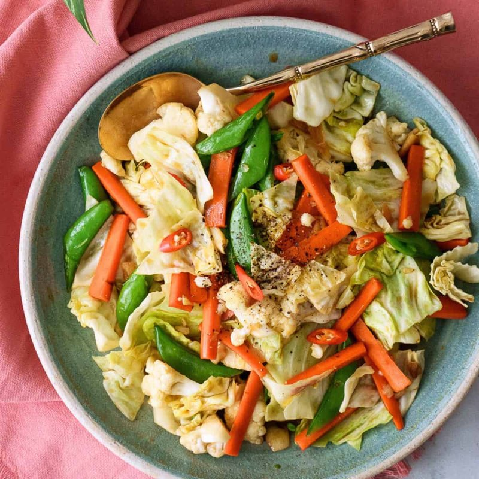

# Pad Pak Ruam

*A Thai mixed-vegetable stir-fry: a hot wok of garlic and soy, with whatever's crisp and fresh, the vegetables just-tender and the sauce barely coating.*

**Serves:** 4

**Prep Time:** 15 minutes

**Cook Time:** 8 minutes

## Overview
Pad pak ruam is the Thai mixed-vegetable stir-fry, a hot wok of garlic and soy with whatever's crisp and fresh in the fridge that morning, vegetables tender but still snappy and the sauce barely coating. The whole dish runs on heat and timing, so prep everything before you light the wok: once you start, you can't stop to chop. Lay out garlic, vegetables grouped by cook time (firmest first: broccoli, carrot, baby corn; then mushrooms and snow peas; then leafy bok choy and beansprouts last), and the sauce mix premixed in a small bowl (vegetarian oyster sauce, light soy, Shaoxing wine, sugar, white pepper). Heat the wok till it just smokes, swirl in oil, flash the garlic for 15 seconds without burning it, then in go the firm vegetables for two minutes with a splash of stock under a quick cover to steam them through. Add mushrooms and snow peas for another minute, then the pak choi and beansprouts that wilt in 30 seconds, pour the sauce mix around the edge so it hits hot metal and toss for a minute till everything is glossy. Off the heat with a drizzle of toasted sesame oil and a final toss. Serve immediately over hot jasmine rice; this isn't a dish that reheats well, the textures soften too far.

## Ingredients

- 3 tablespoons vegetable oil
- 6 garlic cloves (crushed)
- 1 head broccoli (around 300 g; cut into small florets)
- 1 carrot (sliced thin on the diagonal)
- 100 g baby corn (halved lengthwise)
- 200 g mixed mushrooms (oyster mushroom, shiitake; sliced)
- 100 g snow peas
- 200 g pak choi (or bok choy, separated into leaves)
- 100 g beansprouts
- 4 tablespoons vegetable stock (or water)
- 3 tablespoons vegetarian oyster sauce (or 2 tablespoons soy + 1 tablespoon hoisin)
- 2 tablespoons light soy sauce
- 1 tablespoon Shaoxing rice wine (or dry sherry)
- 1 teaspoon sugar
- ½ teaspoon white pepper
- 1 long red chilli (sliced; optional)
- 1 teaspoon toasted sesame oil
- Cooked jasmine rice (to serve)

## Method

### Stage 1 - Prep everything before lighting the wok
1. The wok cooks fast; once you start, you don't stop. Lay everything in order: garlic, then broccoli/carrot/baby corn, then mushroom/snow peas, then leafy/beansprouts, then sauce ingredients.
1. Mix the oyster sauce, soy, rice wine, sugar and white pepper in a small bowl.

### Stage 2 - Aromatics
1. Heat the wok over high heat until smoking.
1. Add the oil; swirl. Add the garlic; flash 15 seconds until just starting to colour.

### Stage 3 - Firm vegetables
1. Add the broccoli, carrot and baby corn; toss for 2 minutes.
1. Add the stock; cover for 1 minute (the steam softens them slightly).

### Stage 4 - Soft vegetables
1. Uncover; add the mushrooms and snow peas; toss for 1 minute.

### Stage 5 - Leafy and sauce
1. Add the pak choi and beansprouts; toss for 30 seconds (they'll wilt fast).
1. Pour in the sauce mixture; toss for 1 minute until everything is glossy.
1. Add the chilli if using.

### Stage 6 - Finish
1. Off the heat, drizzle the sesame oil; toss once.
1. Serve immediately over hot jasmine rice.

## Notes
- **Vegetarian oyster sauce:** Sold in Asian grocers as "mushroom oyster sauce" or "vegetarian oyster sauce" - uses shiitake instead of oysters. Skip the regular oyster sauce; it isn't vegetarian.
- **High heat:** Stir-fry is heat. A flat-bottomed pan over the highest gas flame; or a domestic wok preheated 3 minutes. Without it, you steam-fry; the dish goes flabby.
- **Vegetable swap-ins:** Asparagus, mange-tout, water spinach, mustard greens, Chinese broccoli - anything that's crisp and fresh works. Keep firm-then-soft order.

## Storage
- Best fresh; reheats poorly because the textures soften. Don't refrigerate or freeze.
