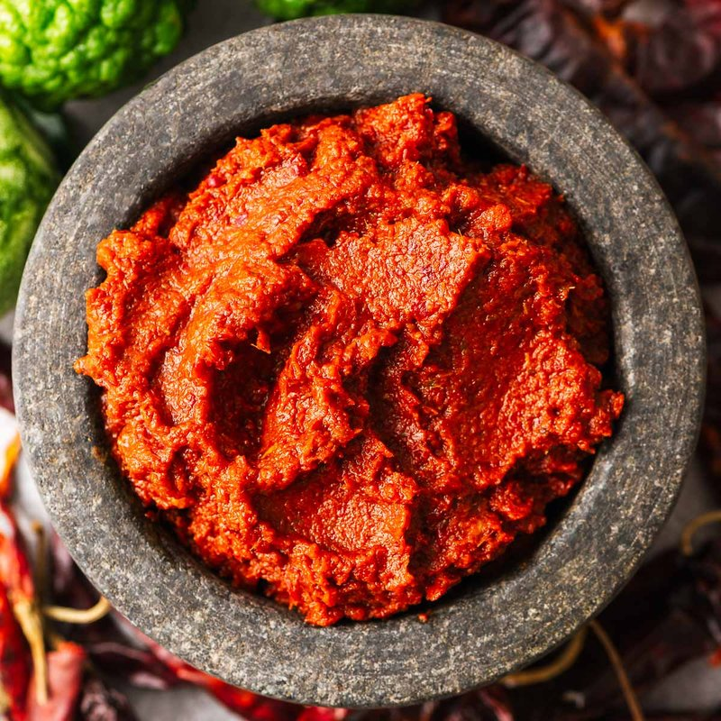

# Thai Red Curry Paste

*Thailand's red curry paste: dried red chillies, lemongrass, galangal, kaffir lime, garlic and shrimp paste pounded into a deep.*

**Makes:** Approx. 250 ml (1 cup)

**Prep Time:** 40-60 minutes

**Cook Time:** 5 minutes

## Overview
Thai red curry paste (prik gaeng phed) is the foundation of the most common Thai curries, built around dried red bird's-eye chillies, lemongrass, galangal, garlic, shallots, coriander root and shrimp paste pounded to a deep brick-red paste that stains the oil red the moment it hits a hot pan. The colour and heat come from the chillies, so adjust the number to taste (twelve gives a moderate heat; deseed more for milder, leave more seeds for fiercer); a couple of fresh red spur chillies pounded through brighten the colour without adding much heat. Toast cumin and coriander seeds in a dry pan over medium till fragrant, grind to a powder with white pepper in a mortar. Add the soaked dried chillies and pound to a paste, then in go roughly chopped garlic, finely chopped shallots, sliced galangal and lemongrass, the fresh red spur chillies, chopped coriander stalks and lime zest. Pound 40 to 60 minutes till smooth (or pulse in a small processor with a splash of water if you're short on time, though the texture suffers slightly). Add a teaspoon of shrimp paste and pound another 5 minutes till fully incorporated. Stores 2 weeks refrigerated in an airtight jar, or freezes 2 months in small portions. Use in red curry, jungle curry, prik king, or any time you want the most versatile Thai curry base.

## Ingredients
### Whole spices
- 1 generous tbsp cumin seeds
- 1 generous tbsp coriander seeds
- 1 ½ tsp white pepper

### Chillies and aromatics
- 12 dried red bird’s eye chillies, soaked in water for 30 minutes and cut into small pieces
- 12 garlic cloves, roughly chopped
- 2 shallots (medium), finely chopped
- 1 thumb-sized piece galangal, thinly sliced
- 2 red spur chillies, thinly sliced
- 1 lemongrass stalk, tough outer part removed and thinly sliced
- 10 thick coriander stalks (about 1 generous tbsp)
- ½ lime (zest)

### Paste
- 1 tsp shrimp paste

## Method

### Stage 1 - Toast and grind spices
1. Heat frying pan over medium heat; toast cumin and coriander until fragrant but not smoking.
1. Transfer to pestle and mortar; cool and pound to powder with white pepper.

### Stage 2 - Pound to paste
1. Add dried bird’s eye chillies; pound to paste.
1. Add garlic, shallots, galangal, spur chillies, lemongrass, coriander stalks, and lime zest.
1. Pound 40-60 mins until smooth.

### Stage 3 - Add shrimp paste
1. Add shrimp paste; pound 5 mins to incorporate.

## Notes
- Adjust chillies for desired heat.
- Use mortar and pestle for best flavor; add water if blending.
- Keeps 2 weeks refrigerated; freezes 2 months.

## Serving
- Not served directly; used in red curries.

## Storage
- Refrigerate 2 weeks in airtight container.
- Freeze up to 2 months; thaw before use.
