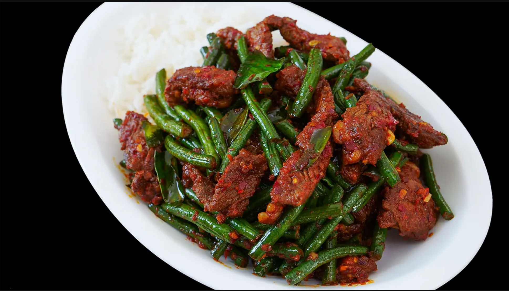

# Prik King

*A dry Thai curry: prik king paste fried hard with pork or chicken, green beans and kaffir lime leaves. No coconut milk, no broth. Eaten with jasmine rice.*

**Serves:** 4

**Prep Time:** 15 minutes

**Cook Time:** 18 minutes

## Overview
Prik king is the dry Thai curry, all of the perfume of a curry paste with none of the broth, pork or chicken glazed in red paste with snake beans and torn kaffir lime leaves. The whole identity of the dish is the dryness; don't be tempted to add stock or coconut milk, the paste itself does all the work as it fries hard in oil and clings to the meat in a thick coating. Pound the paste from scratch if you can (soaked dried Thai chillies, garlic, shallot, lemongrass, galangal, shrimp paste, kaffir lime leaves, ground coriander and white pepper) for the freshest version, or four tablespoons of a good Maesri or Mae Ploy prik king paste does the job for a weeknight. Heat oil in a wide wok, add the paste and fry hard for four or five minutes till the oil splits red around the edges and the kitchen smells of toasted spice. Toss in thinly sliced pork shoulder for four minutes till just cooked, then green beans cut into 4 cm lengths for another four or five minutes till tender-crisp (snake beans are traditional and worth seeking out at a Thai grocer; French beans or fine green beans both work fine). Season with fish sauce, palm sugar and torn kaffir lime leaves with a final toss to glaze, finish with sliced red chillies if you want more heat. Plate over jasmine rice with Thai basil scattered across and a lime wedge on the side.

## Ingredients

### Prik king paste (or use 4 tbsp store-bought)
- 8 dried Thai red chillies (de-stemmed, soaked 15 min in hot water, drained)
- 4 garlic cloves
- 4 shallots (small)
- 1 stalk lemongrass (white part only, sliced)
- 1 thumb galangal (sliced)
- 1 teaspoon shrimp paste (kapi)
- 4 kaffir lime leaves (de-stemmed)
- 1 teaspoon ground coriander
- ½ teaspoon ground white pepper

### Stir-fry
- 500 g pork shoulder (or chicken thigh, sliced very thin)
- 300 g green beans (snake beans if you can find them - cut into 4 cm pieces)
- 4 tablespoons vegetable oil
- 3 tablespoons fish sauce
- 2 tablespoons palm sugar (or soft brown sugar)
- 4 kaffir lime leaves (extra, torn)
- 2 long red chillies (sliced, optional)

### To serve
- 4 servings jasmine rice
- Thai basil leaves
- Lime wedges

## Method

### Stage 1 - Paste
1. If making from scratch: pound soaked chillies, garlic, shallots, lemongrass, galangal, shrimp paste, kaffir lime leaves, coriander and pepper to a thick paste in a mortar (or pulse in a small processor).

### Stage 2 - Fry paste
1. Heat oil in a wide wok or pan over medium-high heat.
1. Add the paste (or 4 tablespoons store-bought); fry 4-5 minutes, stirring, until the oil splits and the paste is deeply aromatic.

### Stage 3 - Meat
1. Add the sliced pork; toss in the paste 4 minutes until just cooked.

### Stage 4 - Beans
1. Add green beans; toss; cook 4-5 minutes until tender-crisp.

### Stage 5 - Season
1. Add fish sauce, palm sugar, torn kaffir lime leaves and red chillies (if using).
1. Toss for 1 minute to glaze.

### Stage 6 - Serve
1. Plate over jasmine rice; scatter Thai basil.
1. Lime wedges alongside.

## Notes
- **Dry curry, no liquid:** Prik king is NOT a wet curry. Don't add stock or coconut milk. The paste glazes the meat.
- **Beans tender-crisp:** Overcooked beans go limp. 4-5 minutes is right.
- **Paste source:** Authentic homemade paste vs store-bought: home-made is fresher and more vibrant, but a good Thai brand (Maesri, Mae Ploy) works well.

## Storage
- Refrigerate 3 days; reheat in a hot pan.
- Freezes 2 months.
