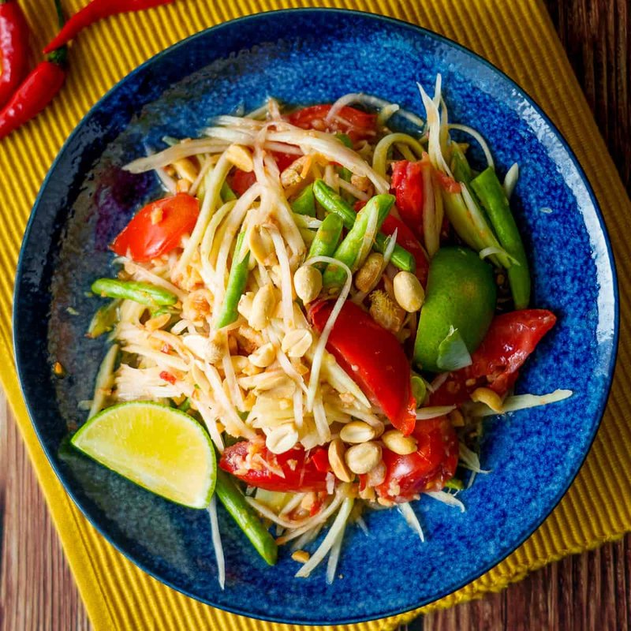

# Green Papaya Salad

*Thailand's som tam: shredded green papaya pounded with garlic, chilli, lime, fish sauce, palm sugar, peanuts and dried shrimp.*

**Serves:** 4

**Prep Time:** 15 minutes

**Cook Time:** 5 minutes

## Overview
Som tam is the most famous of all Thai salads, shredded green (unripe) papaya pounded in a tall clay mortar with garlic, fresh chilli, lime, fish sauce, palm sugar, peanuts and dried shrimp into a fiery sweet-sour-salty-spicy mouthful that defines the four Thai flavour notes in one bowl. The pounding is the technique; it's not done to break the papaya down but to bruise it just enough that the dressing penetrates each shred while the texture stays crisp. Lightly pound peanuts in a mortar, then toast them in a dry frying pan over medium-high till light brown and set aside (skip this if using already-roasted peanuts). In the same mortar, pound dried baby shrimp to a coarse paste, add garlic and bird's-eye chillies and pound into the shrimp, then add the green beans cut into short lengths and pound just to bruise them. Stir in palm sugar, tamarind paste, fish sauce and lime juice and taste, balancing the four notes till the dressing hits hot, sweet, sour and salty all at once. Tip grated green papaya and grated carrot into a wide salad bowl, pour the dressing over and toss thoroughly so every shred is coated, then add halved baby plum tomatoes, the toasted peanuts, chopped coriander and torn Thai basil. Toss again, taste, chill briefly and serve as a fierce starter alongside grilled meats, sticky rice and a cold beer.

## Ingredients
### Nuts and shrimp
- 2 tbsp peanuts (raw or roasted)

### Dressing
- 1 ½ tbsp dried baby shrimp
- 3 garlic cloves
- 2-3 red bird’s eye chillies
- 12 green (string) beans, cut into 2 ½ cm (1 in) pieces
- 1 tbsp palm sugar, grated and finely chopped
- 1 tbsp tamarind paste
- 2 tbsp Thai fish sauce
- 1 lime (large, juice)

### Vegetables and fruit
- 400 g (14 oz) green papaya, grated
- 1 carrot (medium), peeled and grated
- 6 baby plum tomatoes, halved

### Herbs
- 2 tbsp finely chopped coriander (fresh coriander)
- 2 tbsp Thai sweet basil (or any basil), roughly chopped

## Method

### Stage 1 - Roast peanuts
1. Pound peanuts lightly in pestle and mortar.
1. Roast in frying pan over medium-high heat until light brown.
1. Set aside (skip if using roasted peanuts).

### Stage 2 - Make dressing
1. Pound dried shrimp in pestle and mortar to coarse paste.
1. Add garlic and chillies; pound into shrimp.
1. Add green beans; pound to bruise but keep pieces.
1. Add sugar, tamarind, fish sauce, and lime juice; stir to dissolve sugar.
1. Taste and adjust flavors.

### Stage 3 - Assemble salad
1. Place grated papaya and carrot in salad bowl.
1. Pour dressing over; stir to coat.
1. Add tomatoes, peanuts, coriander, and basil; stir well.
1. Chill in fridge before serving.

## Notes
- Many Thai fish sauces contain gluten; use gluten-free.
- Use pestle and mortar for authentic texture; food processor alternative.
- Adjust dressing for balance.

## Serving
- Serve chilled as side or starter.
- Garnish with extra herbs.

## Storage
- Refrigerate 2-3 days in airtight container.
- Flavors develop; best after chilling.
