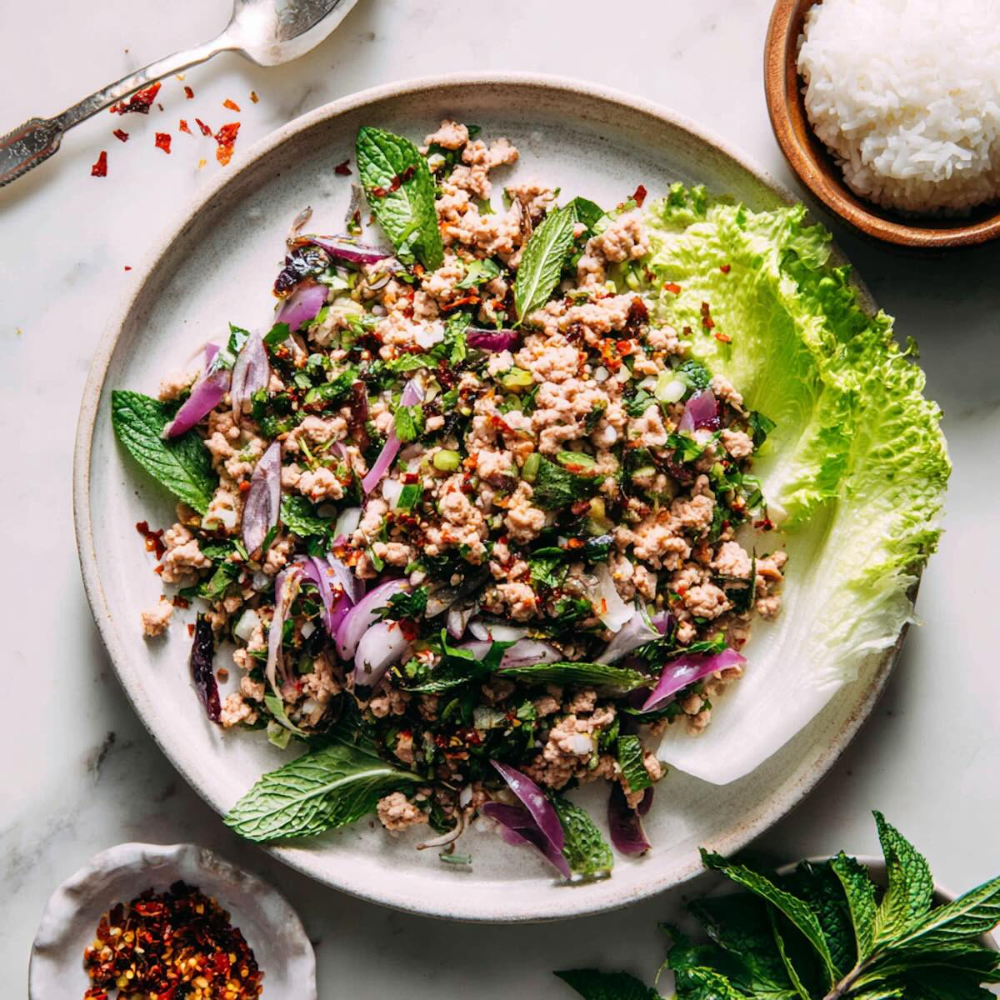

# Larb

*Thailand's Isaan minced-meat salad: hot-fried pork tossed with toasted rice powder, fish sauce, lime, dried chilli, shallot, mint and coriander.*

**Serves:** 4

**Prep Time:** 15 minutes

**Cook Time:** 12 minutes

## Overview
Larb is the Isaan minced-meat salad from north-eastern Thailand, hot-fried pork (or chicken, duck, beef) tossed with toasted rice powder, fish sauce, lime, dried chilli, shallot and an unreasonable amount of fresh mint and coriander. The signature is khao khua, the toasted rice powder that gives larb its nutty character and a slight thickening grit: uncooked glutinous rice toasted in a dry pan till deep gold and popcorn-nutty, then ground coarse. The mince cooks in its own fat with a splash of stock to keep it saucy; off the heat the dressing of fish sauce, lime, chilli flakes and a pinch of sugar gets tossed through with sliced shallots, spring onion and the rice powder. The mint and coriander fold in at the very end so they stay green. Eaten with sticky rice and a plate of raw vegetables (long beans, cucumber, cabbage wedges, lettuce leaves) for scooping, by hand: pinch a ball of rice, scoop the larb, eat, repeat.

## Ingredients

### Rice powder
- 3 tablespoons uncooked glutinous (sticky) rice (or jasmine rice)

### Larb
- 500 g pork mince (or chicken / duck / beef)
- 4 tablespoons stock (or water)
- 3 tablespoons fish sauce
- 2 limes (about 5 tablespoons, juice)
- 1-2 teaspoons Thai dried chilli flakes (or 2 fresh bird's-eye chillies, finely chopped)
- 4 shallots (small, sliced thin)
- 4 spring onions (sliced thin)
- ½ teaspoon sugar (optional)
- 1 large handful fresh mint leaves
- 1 large handful fresh coriander (leaves and tender stems)
- 1 small handful Thai basil leaves (optional)

### To serve
- Sticky rice (or jasmine rice)
- Raw vegetables: long beans, cucumber, cabbage wedges, lettuce leaves, Thai basil

## Method

### Stage 1 - Rice powder
1. Heat a dry pan over medium heat.
1. Add the uncooked rice; toast 4-5 minutes, stirring, until deep gold and aromatic (smells popcorn-nutty).
1. Cool. Grind to a coarse powder in a mortar or spice grinder.

### Stage 2 - Cook mince
1. Heat a wide pan over high heat (no oil - mince renders its own fat).
1. Add the mince; break up with a wooden spoon. Pour in 4 tablespoons stock.
1. Cook 4-5 minutes, stirring, until just cooked through (no pink). Don't dry it out - it should be saucy.

### Stage 3 - Dress
1. Off heat. Pour in fish sauce, lime juice, chilli flakes, sugar (if using).
1. Add sliced shallot and spring onion.
1. Stir in the toasted rice powder.
1. Toss thoroughly.

### Stage 4 - Herbs
1. Just before serving, fold in mint, coriander and Thai basil.
1. Taste; adjust fish sauce (salt) and lime (sour).

### Stage 5 - Serve
1. Tip into a wide shallow bowl.
1. Serve with sticky rice and a plate of raw vegetables for scooping.

## Notes
- **Rice powder is essential:** Adds the signature nutty toasted note plus a thickening effect. Skipping it gives larb that tastes incomplete.
- **Hot pan, no oil:** The fat renders from the meat. Adding oil makes it greasy.
- **Eat with hands:** Pinch sticky rice into a ball, scoop larb, eat. Or use lettuce/cabbage leaves as wraps.

## Storage
- Best fresh. Refrigerate 1 day; the herbs wilt.
