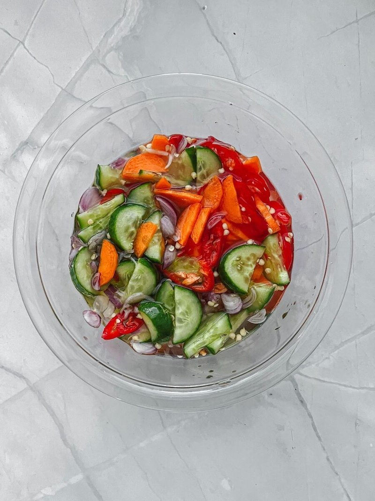

# Ajad

*Thailand's quick cucumber relish: sliced cucumber, shallot and chilli macerated in a sweet-sour rice vinegar and palm-sugar syrup. The fried-snack foil.*

**Serves:** 4 (as a dipping side)

**Prep Time:** 10 minutes

**Cook Time:** 5 minutes (just for the syrup)

## Overview
A simple syrup of rice vinegar, palm sugar, water and salt is brought to a gentle simmer to dissolve the sugar, then cooled. Cucumber, shallot and chilli are sliced thin and combined in a small bowl. The cooled syrup is poured over. Rested for 10-15 minutes for the vegetables to wilt slightly into the dressing. Served in small individual ramekins as a dip, OR in a larger bowl as a side, with peanuts sprinkled on top.

## Ingredients

### Syrup
- 120 ml rice vinegar (Thai or Japanese - NOT distilled white vinegar)
- 60 g palm sugar (chopped fine; or 50 g caster sugar)
- 60 ml water
- ½ teaspoon salt

### Vegetables
- 1 cucumber (medium, about 250 g - peel partially in stripes, halve lengthwise, deseed with a teaspoon, slice 3 mm thick)
- 2 shallots (small, sliced very thinly)
- 1-2 red Thai bird's-eye chillies (small, sliced thin - deseed for less heat)
- 2 spring onions (finely sliced, white and green parts, optional)

### To finish
- 2 tablespoons roasted peanuts (lightly crushed)
- A few fresh coriander leaves
- A pinch of toasted sesame seeds (optional)

## Method

### Stage 1 - Make the syrup
1. In a small saucepan, combine rice vinegar, palm sugar, water and salt.
1. Heat over medium, stirring, until the sugar is fully dissolved - about 2-3 minutes. Don't boil hard; just gentle warmth.
1. Off heat; cool completely to room temperature (5-10 minutes - speed it up by pouring into a wide bowl).

### Stage 2 - Slice the vegetables
1. Halve the cucumber lengthwise; scoop seeds with a teaspoon; slice 3 mm thick.
1. Slice the shallots as thinly as you can manage.
1. Slice the chillies; deseed if you want less heat.

### Stage 3 - Combine
1. Place cucumber, shallot and chilli in a wide bowl.
1. Pour the cooled syrup over.
1. Toss gently.

### Stage 4 - Rest
1. Let stand 10-15 minutes - the cucumber wilts slightly into the syrup, the shallot mellows.

### Stage 5 - Serve
1. Transfer to small individual ramekins (1-2 tablespoons per dipping bowl per person) OR to a larger serving bowl.
1. Scatter crushed peanuts, coriander leaves and sesame seeds.
1. Serve alongside any of: chicken satay, fish cakes, prawn toast, curry puffs, spring rolls, fried tofu.

## Notes
- **Cool the syrup before pouring:** Hot syrup wilts the cucumber too aggressively, giving a soft mushy relish. Cool to room temperature first.
- **Rice vinegar, not distilled vinegar:** Rice vinegar is milder, slightly sweet. Distilled white vinegar is too sharp and harsh. If you only have white vinegar, dilute with extra water and add more sugar.
- **Eat fresh:** Ajad is a quick-pickle, not a preserve. After 24 hours the cucumber goes limp and watery. Make and eat the same day.

## Storage
- Best within 4 hours.
- Refrigerate 24 hours maximum; the cucumber softens unappetisingly beyond that.
- The syrup alone keeps 2 weeks in the fridge if made in bulk.
