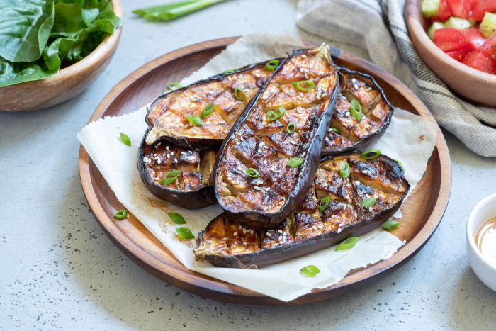

# Green Curry BBQ Aubergine

*Thai grilled aubergine: thick wedges marinated overnight in reduced green curry, then grilled over coals till the coconut paste glazes into sticky char.*

**Serves:** 4 (as a side) or 2 (as a main with rice)

**Prep Time:** 25 minutes (plus overnight marinating)

**Cook Time:** 12 minutes on the grill

## Overview
This is a BBQ side built on the flavour profile of Thai green curry rather than a Thai curry itself. The marinade is essentially a small batch of green curry sauce reduced down until thick and clinging, then cooled and rubbed into wedges of aubergine that sit in it overnight. By morning the cut surfaces have drunk in coconut, paste, fish sauce, palm sugar, lime leaf and basil; by the time they hit the grill, the flesh has half-pickled and the surface is coated in a paste that caramelises beautifully over hot coals. The grill does the rest. Direct high heat blackens the marinade into sticky-black patches while the inside steams under its own glaze and softens to spoon-tender. Difficulty is low. The only patience involved is overnight in the fridge. Serve as a centrepiece on a BBQ platter alongside grilled meats, or as a vegetarian main with sticky rice, a wedge of lime and a scatter of Thai basil. It is rich, smoky, gently sweet, salty and herbaceous all at once, with the unmistakable green-curry note running through every bite.

## Ingredients

### Aubergines
- 2 long Asian purple aubergines (about 600 g), cut into 3 cm thick wedges, or 1 large European aubergine cut into 2 ½ cm slabs
- 1 tsp fine salt (to draw moisture before marinating)

### Marinade
- 200 ml full-fat coconut cream (the thick layer skimmed from a tin of coconut milk)
- 3 to 4 tbsp Thai green curry paste (see cuisine/thai/pastes/thai-green-curry-paste.md, or a quality shop-bought paste)
- 1 tbsp coconut oil (or neutral oil)
- 2 tbsp fish sauce (or light soy sauce for a vegetarian version)
- 1 tbsp palm sugar, shaved, or soft light brown sugar
- 4 makrut (kaffir) lime leaves, central stems removed, torn
- 1 tbsp lime juice
- 1 small handful Thai basil leaves (bai horapa), roughly torn

### To finish
- Extra Thai basil leaves
- 1 long red chilli, sliced on the diagonal
- Lime wedges
- Sticky rice (or jasmine rice, if serving as a main)

## Method

### Stage 1 - Salt the aubergines
1. Lay the aubergine pieces on a tray and sprinkle the salt over the cut surfaces.
2. Leave 15 to 20 minutes. Beads of moisture will rise to the surface.
3. Blot dry thoroughly with kitchen paper. This step keeps the aubergines from going waterlogged in the marinade.

### Stage 2 - Make the curry marinade
1. Heat a wide pan or wok over medium. Add the coconut cream and the oil.
2. Bring to a steady bubble and cook 3 to 4 minutes until the cream splits, with little pools of oil rising to the surface. This is the cracked-cream stage that builds the curry flavour.
3. Add the green curry paste. Stir constantly for 2 to 3 minutes until the paste turns deep green and smells intensely fragrant, the oil running clear and bright at the edges.
4. Stir in the fish sauce, palm sugar and torn lime leaves. Cook another 1 minute.
5. Take off the heat. Stir in the lime juice and torn Thai basil. The marinade should be a thick, glossy paste, not a soup; if it looks runny, return to the heat for another minute or two to reduce. Cool completely.

### Stage 3 - Marinate
1. Lay the aubergine pieces in a wide, shallow dish or zip-lock bag.
2. Pour over the cooled marinade and turn the pieces until every surface is coated. Press the marinade into the cut faces where you can.
3. Cover and refrigerate at least 8 hours, ideally overnight. The aubergine flesh will turn dull green and almost pickled-looking; this is correct.

### Stage 4 - Bring to room temperature and prep the grill
1. Lift the aubergines out of the fridge 30 minutes before cooking. Scrape off any pooled marinade back into the dish but keep a generous coating clinging to the flesh, you want it on the aubergine, not the grate.
2. Set up a hot direct-heat fire on the BBQ, around 220 to 250 C at the grate. A two-zone setup is ideal so you have a cooler side to park anything that catches.
3. Reserve a small bowl of the leftover marinade for basting.

### Stage 5 - Grill
1. Lay the aubergines cut-side down on the hot grate. Do not move them for 3 to 4 minutes; the surface needs time to caramelise and release cleanly.
2. Flip and brush the cooked face with reserved marinade. Grill another 3 to 4 minutes.
3. Flip once more, brush again, and finish 2 minutes. By now the surface should be glossy with black caramelised patches and the centres yielding when pressed with the back of a spoon. If any pieces are catching, move them to the cool side of the grill to finish through.
4. Total grill time around 10 to 12 minutes depending on thickness.

### Stage 6 - Serve
1. Arrange the grilled aubergines on a platter, cut-side up to show the char.
2. Scatter Thai basil leaves and sliced red chilli over the top.
3. Squeeze a lime wedge across just before serving, or set wedges on the side. Eat hot.

## Notes
- **Long aubergines work best:** the long, slim Asian purple aubergines have less seed cavity and a denser flesh, which holds up on the grill far better than the spongy European globe variety. Both work, but cut the European one slightly thicker.
- **Don't skip the salt step:** unsalted aubergines turn watery in the marinade and refuse to caramelise on the grill.
- **Cracked cream is essential:** if you skip the splitting stage and just stir the paste into the coconut cream cold, the marinade tastes raw and the curry flavour stays one-dimensional. The whole point of overnight marinating is that the paste has been properly developed.
- **No BBQ?** A ridged cast-iron griddle pan on the hob over the highest heat gives proper char marks. Run a window fan; this gets smoky. Aubergines under the grill (oven broiler) on the top shelf also work, 3 minutes per side.
- **Make-ahead:** marinade keeps 5 days in the fridge or 2 months in the freezer. Marinated aubergines can sit 48 hours; beyond that they soften too much.
- **Curry paste:** the recipe at cuisine/thai/pastes/thai-green-curry-paste.md gives the most depth. A shop-bought paste (Mae Ploy, Maesri) is a respectable shortcut. Start with 3 tbsp and taste, since strengths vary wildly.
- **Vegetarian or vegan:** swap fish sauce for light soy sauce or mushroom seasoning sauce, and check the curry paste is shrimp-paste free.

## Storage
- Grilled aubergines keep 2 days refrigerated. Reheat in a hot pan or under the grill rather than the microwave, which turns them soggy.
- Leftovers chopped roughly through warm coconut rice make excellent next-day lunch.
