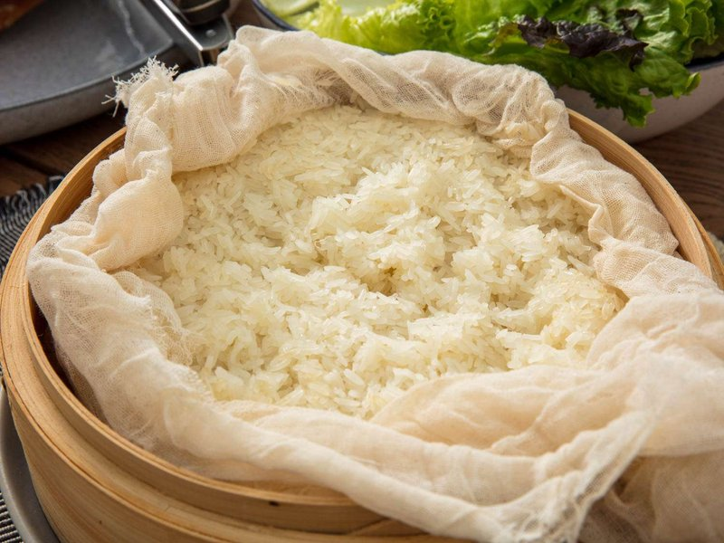

# Khao Niao

*Thailand's sticky rice: glutinous grains steamed in a bamboo cone until they cling together. Pinched into balls and dipped in everything.*

**Serves:** 4 (with mains)

**Prep Time:** 5 minutes (plus 4-12 hour soak)

**Cook Time:** 25 minutes

## Overview
Khao niao is the sticky rice of northern and north-eastern Thailand and Laos, glutinous grains steamed in a bamboo cone till they cling together in a single pliable mass that you pinch off and dip into curry, larb or grilled meats by hand. The variety matters; Thai glutinous rice (sometimes labelled "sweet rice" or in Thai script ข้าวเหนียว at Asian shops) looks like ordinary white rice raw but is opaque white rather than translucent, and the starch makeup is completely different from jasmine or basmati. Soak the rice in cold water at least four hours and ideally six to twelve (overnight is convenient) till the grains crush easily between your fingertips; unsoaked rice steamed from the bag gives chalky, hard, unevenly cooked grains every time. Drain and rinse briefly. Line a bamboo cone, a bamboo or metal steamer, or a sieve with damp muslin (or banana leaves, the traditional liner), mound the rice in the centre and place over a pan of boiling water that mustn't touch the rice. Cover and steam over medium heat for 20 to 25 minutes, flipping the rice cake as a single mass via the muslin at the 15-minute mark so the bottom layer steams from above for even cooking. Taste a grain; fully cooked sticky rice is tender, chewy and slightly translucent. Transfer to a wooden bowl or bamboo serving basket (kratip), cover with a damp cloth or the basket lid, rest five minutes so the rice firms slightly. Eat by hand: pinch off a small ball, press into a loose ball with your fingers, dip into curry or chilli sauce and eat whole.

## Ingredients

- 400 g Thai glutinous (or sticky rice, sold as "Thai sweet rice", "sticky rice" or labeled "ข้าวเหนียว" at Asian shops)
- Cold water (enough to cover by 5 cm for soaking)
- Boiling water (in the steamer base)

### Optional: for dessert version (khao niao mamuang)
- 400 ml coconut milk
- 100 g caster sugar
- 1 teaspoon salt
- 2 ripe mangoes (peeled, sliced)
- 2 tablespoons toasted sesame seeds
- 1 tablespoon mung beans (toasted, optional)

## Method

### Stage 1 - Soak
1. Place the rice in a deep bowl.
1. Cover with cold water by 5 cm.
1. Soak at least 4 hours, ideally 6-12 hours (overnight is convenient). The grains should be opaque white and crushable between fingertips.

### Stage 2 - Drain
1. Drain the rice through a sieve.
1. Rinse briefly under cold water until the water runs almost clear.

### Stage 3 - Set up steamer
1. **Traditional bamboo cone**: line the inside with a damp muslin if it has wide gaps; fill with rice; cover with the lid.
1. **Bamboo or metal steamer**: line with a single layer of damp muslin or banana leaves; mound the rice in the centre, leaving steam channels at the edges.
1. **Improvised**: line a sieve with muslin and set over a pan of simmering water - works fine.

### Stage 4 - Steam
1. Bring water to a boil in the steamer base - don't let the water touch the rice.
1. Place the rice-loaded steamer on top.
1. Cover.
1. Steam 20-25 minutes over medium heat.
1. At the 15-minute mark, gently flip the rice cake over (lift it as a single mass with the muslin) so the bottom layer steams from above. This ensures even cooking.
1. Taste a grain - fully cooked rice is fully tender with a slightly translucent quality; if still chalky at the centre, steam another 5 minutes.

### Stage 5 - Rest and serve
1. Transfer to a wooden bowl or bamboo serving basket (kratip).
1. Cover with a damp cloth or the basket lid.
1. Rest 5 minutes - the rice firms up slightly.

### Stage 6 - Eat
1. Pinch off a small ball with the right hand fingers; press into a small loose ball.
1. Dip into curry, larb, grilled meats, or chilli sauce.
1. Eat the ball whole; repeat.

### Optional - Khao Niao Mamuang (mango sticky rice)
1. In a saucepan, combine 350 ml of the coconut milk, the sugar and salt.
1. Heat gently over low heat, stirring, until the sugar dissolves and the mixture is just warm (do not boil).
1. Pour the warm coconut sauce over the freshly steamed rice; toss gently with a spoon to coat.
1. Cover; rest 15 minutes - the rice absorbs the coconut and becomes glossy.
1. Plate: a mound of coconut-rice; sliced mango fanned alongside.
1. Drizzle with the remaining 50 ml of plain coconut milk; sprinkle with toasted sesame seeds and (if using) toasted mung beans.

## Notes
- **Sticky rice is a different variety:** Regular jasmine or basmati rice will not work - the starch makeup is wrong. Look for "Thai glutinous rice" or "sweet rice" or "kao niao" (sometimes labeled in Lao or Thai script).
- **Soak first, always:** Unsoaked sticky rice steamed straight from the bag gives chalky, hard, unevenly cooked rice. The 6-12 hour soak is the difference between a fail and a success.
- **Steam, never boil:** Boiling water touching the rice gives porridge. Steam is what produces the distinctive chewy-pearly texture.

## Storage
- Best eaten the same day, while still warm.
- Refrigerate 3 days in an airtight container. To reheat, place in a steamer for 5 minutes (microwaving dries it out badly; if you must, sprinkle with water first).
- Sticky rice freezes 2 months in portion-sized packs.
