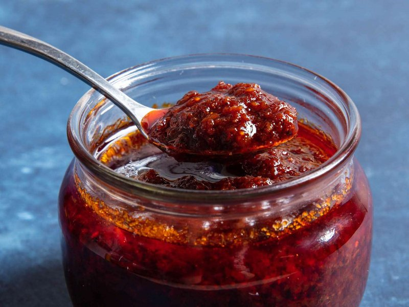

# Nam Prik Pao

*Thailand's roasted chilli jam: dried chillies, shallots, garlic and dried shrimp pounded with palm sugar and tamarind into a smoky paste.*

**Serves:** 8 (makes ~250 ml)

**Prep Time:** 15 minutes

**Cook Time:** 30 minutes

## Overview
Dried red chillies are deseeded (most of them), garlic is sliced, shallots are sliced thin. All three fry separately in oil over medium heat until each is deep golden and crispy, sequence matters because they cook at different rates. Dried shrimp toasts briefly in the same oil. Everything pulses in a food processor (or pounds in a mortar, the traditional method) to a coarse paste. Returned to the pan with the residual oil; palm sugar, fish sauce, tamarind paste and a splash of water cook for 10 minutes more, stirring, until the colour deepens to mahogany and the paste is thick and glossy. Once cooled and stored in oil, it lasts weeks.

## Ingredients

### Aromatics (each fried separately)
- 200 ml sunflower oil (or vegetable oil, most stays in the finished jam as a sealing layer)
- 30 g dried red chillies (large mild - like Thai dried red chillies or Kashmiri; about 12-15 chillies)
- 80 g shallots (thinly sliced - about 4 small shallots)
- 80 g garlic (thinly sliced - about 2 whole bulbs)
- 30 g dried shrimp (sold at Asian shops)

### Seasoning
- 70 g palm sugar (chopped fine, or 60 g brown sugar as a substitute)
- 4 tablespoons fish sauce
- 4 tablespoons tamarind paste (Thai tamarind concentrate, NOT Indian which is much more concentrated)
- 60 ml water

### To finish
- 1 teaspoon salt (to taste)
- Extra-virgin olive oil OR extra sunflower oil for sealing

## Method

### Stage 1 - Prep the chillies
1. Snap the stems off the dried chillies.
1. Shake out most of the seeds (keep some for heat).
1. Soak in a bowl of warm water 10 minutes to soften slightly; drain; pat dry.

### Stage 2 - Fry the shallots
1. Heat 200 ml oil in a wide pan over medium-low heat (low enough that frying is gentle, not aggressive).
1. Add the sliced shallots; fry 8-10 minutes, stirring often, until deep golden and crisp.
1. Lift out with a slotted spoon onto kitchen paper. Reserve the oil in the pan.

### Stage 3 - Fry the garlic
1. To the same oil, add the sliced garlic; fry 4-6 minutes until pale-gold (watch closely; it goes from gold to burnt in 30 seconds).
1. Lift onto kitchen paper.

### Stage 4 - Fry the chillies
1. Add the softened chillies; fry 2-3 minutes until they darken and release a smoky aroma.
1. Lift onto kitchen paper.

### Stage 5 - Toast the shrimp
1. Add the dried shrimp to the same oil; fry 1-2 minutes until lightly puffed and aromatic.
1. Lift onto kitchen paper.

### Stage 6 - Pound or pulse
1. Reserve all the cooking oil in the pan.
1. In a mortar or food processor, combine the fried shallots, garlic, chillies and shrimp.
1. **Mortar**: pound vigorously for 5-7 minutes to a coarse paste - traditional method, gives the best texture.
1. **Processor**: pulse 8-12 times until you have a textured paste (NOT smooth - small chunks are good).

### Stage 7 - Combine and cook
1. Return the paste to the pan with the reserved oil over medium-low heat.
1. Add palm sugar, fish sauce, tamarind paste and 60 ml water.
1. Cook 8-10 minutes, stirring constantly, until the mixture darkens to a deep mahogany red-brown, thickens to a jam-like consistency, and the oil rises to the surface.
1. Taste; balance with extra sugar (for sweetness), fish sauce (for saltiness), tamarind (for sourness) or chilli (for heat) - nam prik pao should hit all four notes.

### Stage 8 - Cool and store
1. Cool fully to room temperature.
1. Transfer to a sterilised glass jar.
1. Pour a thin layer of extra oil over the top to seal (helps preservation).
1. Seal tightly.

## Uses
- **Stir 1 tablespoon into tom yum soup** for a richer, redder, smokier version.
- **Spread on toast** as the Thai equivalent of a savoury jam at breakfast.
- **Stir 1-2 tablespoons into the wok at the end of a stir-fry** for instant complexity.
- **Mix with mayonnaise** for a Thai-style dipping sauce.
- **Eat with sticky rice** for a basic, fiery snack.

## Notes
- **Fry each ingredient separately:** They cook at different rates. Shallots take longer (high water content); garlic burns fastest. Frying them together gives a mix of burnt and undercooked.
- **Tamarind matters:** Use Thai tamarind paste / concentrate, NOT Indian (Indian is darker and more intense; you'll need much less or you'll throw off the balance). If you can only find Indian tamarind, use half the amount and add water.
- **Palm sugar is the right sugar:** Has caramel and coconut notes that brown sugar doesn't have. If unavailable, brown sugar + a pinch of vanilla extract is a close substitute.

## Storage
- Refrigerated in a sealed jar with an oil seal on top: 3 months.
- At room temperature in an oil-sealed jar (Thai kitchen style): 1 month.
- The oil layer slows oxidation; keep the paste below the oil line.
