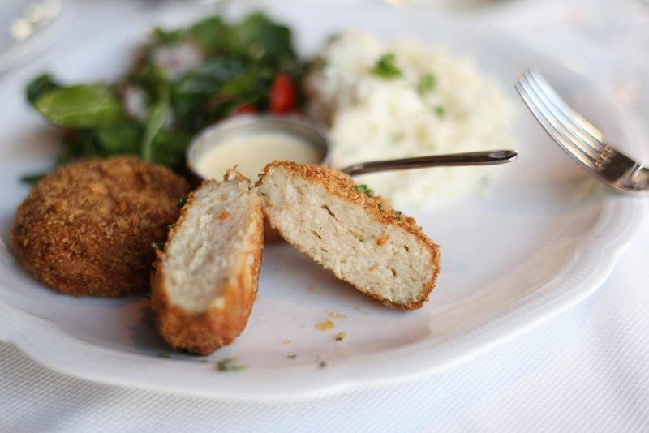

# Fishcakes

*Thailand's tod mun pla: minced fish blended with red curry paste, kaffir lime leaf and green beans.*

**Makes:** 12

**Prep Time:** 15 minutes

**Cook Time:** 10 minutes

## Overview
Tod mun pla is Thailand's small chilli-tinted fish cake, minced fish blended with red curry paste, kaffir lime leaves and finely sliced green beans, formed into flat patties and fried golden. The cakes are usually deep-fried at street stalls but shallow-frying at home is much easier and gives nearly identical results. The signature spongy bite that you find at Thai restaurants comes from added egg; leave it out for a denser, more fish-forward texture, or include it if you prefer the classic spring. Strip the skin off meaty fish fillets (lemon sole, cod or salmon all work; oily fish gives a richer cake), and tip into a food processor with chopped coriander, finely julienned kaffir lime leaves, sliced spring onion and sliced green beans, plus red curry paste, fish sauce, lime juice and an optional teaspoon of sugar. Blend for a couple of minutes till you have a fine paste; the heat from the processor blade actually helps the proteins set and the texture thicken. Tip into a bowl and fold in tapioca starch (which helps the cakes hold their shape during frying), then divide into twelve flat patties. Fry a teaspoon's worth first to check the seasoning, adjust with extra fish sauce or lime if needed, then shallow-fry the cakes in rapeseed oil over medium heat for two minutes a side till deep golden and cooked through. Serve hot with sweet chilli sauce, Thai seafood dipping sauce, or ajad (the cucumber-chilli relish).

## Ingredients

### Protein
- 500g (1lb 2oz) meaty fish fillets, such as lemon sole, cod or salmon, skinned

### Aromatics
- 1 tbsp finely chopped coriander (fresh coriander) (optional)
- 3 lime leaves, stalks removed and finely julienned
- 2 spring onions (scallions), thinly sliced
- 8 green (string) beans, thinly sliced

### Seasoning
- 3-4 tbsp [Thai Red Curry Paste](../pastes/thai-red-curry-paste.md)
- 1 tbsp Thai fish sauce (gluten-free brands are available)
- 1 tbsp lime juice

### Sweeteners
- 1 tsp sugar (optional)

### Other
- 1 egg (medium, optional)
- 1 tbsp tapioca starch

### Fat
- 5 tbsp rapeseed (canola) oil

## Method

### Stage 1 - Prepare Paste
1. Place the fish in a food processor.
2. Add the rest of the ingredients up to and including the lime juice. If you are using egg for a spongier fishcake, add it at this point too.
3. Blend until you have a fine fish paste. It is worth blending for a few minutes as the heat from your blender will help thicken the paste.

### Stage 2 - Mix
1. Transfer to a bowl and add the tapioca starch, lime leaves, spring onions (scallions) and beans and mix well with your hand.
2. Divide into twelve patties.
3. I often fry a spoonful of the paste to test for seasoning, then adjust if necessary.

### Stage 3 - Cook
1. Heat the oil in a large, non-stick frying pan over a medium heat.
2. Fry the fishcakes, in batches of about three or four, for about 2 minutes on one side, then flip over to cook the other side until they are nicely browned and cooked through.
3. Each batch should only take about 4 minutes.
4. Serve hot.

## Notes
- Egg is optional for sponginess.

## Serving
Serve hot with sweet chilli sauce, Thai seafood dipping sauce and/or cucumber and chilli relish.

## Storage
- Best served immediately; can be kept warm for 10 mins. Refrigerate leftovers for 1 day.
