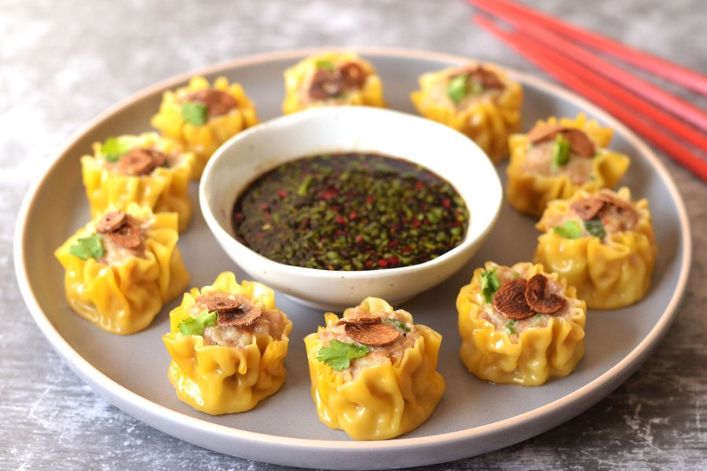

# Kanom Jeeb

*Thailand's open-topped dumplings: wonton wrappers cupped around a coriander-and-garlic pork-and-prawn filling, steamed and dipped in black soy.*

**Serves:** 4 (makes 20 dumplings)

**Prep Time:** 30 minutes

**Cook Time:** 10 minutes

## Overview
A filling of minced pork and chopped prawn binds with coriander root (pounded with garlic and white pepper into the traditional Thai "rak pak chee" paste), oyster sauce, soy sauce, sugar, sesame oil, and a beaten egg. The mixture chills for 20 minutes to firm. Square wonton wrappers go around the filling cupcake-style: filling in the centre, edges pulled up and pleated open around the meat, top brushed with a tiny smear of beaten egg and topped with a thin slice of carrot. Steamed in a bamboo basket over boiling water for 8 minutes. Dip is black soy sauce with sliced chilli and rice vinegar.

## Ingredients

### Filling
- 250 g pork mince (20% fat)
- 150 g raw prawns (peeled, deveined, finely chopped)
- 3 coriander roots (or 2 tablespoons coriander stems, very finely chopped)
- 4 garlic cloves
- 1 teaspoon white peppercorns
- 2 tablespoons oyster sauce
- 1 tablespoon light soy sauce
- 1 teaspoon dark soy sauce (for colour)
- 2 teaspoons caster sugar
- 1 teaspoon sesame oil
- 1 egg (large, beaten, half for the filling, half for brushing)
- 1 tablespoon cornstarch
- 2 dried shiitake mushrooms (soaked, finely chopped - optional, traditional)
- 2 spring onions (finely chopped)

### Assembly
- 20 square wonton wrappers (the thin yellow kind, sold at Asian shops in the chilled section)
- 1 carrot (small, peeled; thinly sliced into 20 small discs or julienne for topping)

### Dipping sauce
- 4 tablespoons black soy sauce (or 3 tablespoons regular soy + 1 tablespoon dark soy)
- 2 tablespoons rice vinegar
- 1 teaspoon caster sugar
- 1-2 red Thai bird's-eye chillies (sliced thin)
- 1 garlic clove (small, very finely chopped)

### Equipment
- 1 bamboo steamer basket + matching lid (or any steamer setup)
- Baking paper (or a damp tea towel to line the basket)

## Method

### Stage 1 - Pak chee paste
1. In a mortar, pound coriander roots, garlic and white peppercorns to a coarse paste (or use a mini food processor).

### Stage 2 - Filling
1. In a wide bowl, combine pork mince, chopped prawn, coriander root paste, oyster sauce, both soy sauces, sugar, sesame oil, half the beaten egg (save the rest for brushing), cornstarch, chopped shiitake (if using) and spring onions.
1. Mix vigorously with your hand or a spoon for 2 minutes - the mixture should become slightly sticky and elastic.
1. Cover; refrigerate 20 minutes to firm.

### Stage 3 - Make the dipping sauce
1. Whisk all sauce ingredients in a small bowl.
1. Rest 10 minutes - the chilli and garlic infuse the soy.

### Stage 4 - Form
1. Place a wonton wrapper on your palm.
1. Spoon a heaped teaspoon of filling (about 15 g) into the centre.
1. Bring the four corners up and around the filling, pleating the wrapper into an open-topped cup with the filling visible at the top.
1. Squeeze the wrapper gently around the filling to form a flat-bottomed dumpling with a slight neck (like a money-bag with a flat base).
1. The top should show the meat filling, not be sealed.
1. Set on a tray; brush the exposed top of the meat with a tiny bit of beaten egg.
1. Press a slice of carrot (or a thin julienne strip) onto each top.

### Stage 5 - Steam
1. Bring a wide pot of water to a boil (1-2 inches of water - should not touch the basket).
1. Line the bamboo basket with baking paper (cut to size, pierced for steam) OR a damp tea towel.
1. Arrange the dumplings in the basket, leaving 1 cm space between them (they expand slightly).
1. Cover.
1. Steam over boiling water for 8 minutes, until the filling is firm and cooked through and the wrappers are translucent.
1. If you have many dumplings, work in batches.

### Stage 6 - Serve
1. Lift the lid carefully (steam can scald).
1. Serve in the basket with the dipping sauce on the side.
1. Eat warm - pick up with chopsticks, dip the top in the sauce, eat in one or two bites.

## Notes
- **Coriander roots are the Thai signature:** Pak chee (coriander root) is the difference between Chinese siu mai and Thai kanom jeeb. The roots - pounded with garlic and white pepper - give the meat its distinct Thai aroma. Sold at Thai/Asian shops with the leaves still attached; if you can't find roots, the very thick stems closest to the root work nearly as well.
- **Don't fully seal the dumpling:** The Thai (and Chinese siu mai) style is open-topped: pleat around the sides but leave the meat exposed on top. This is what gives the dumpling its characteristic cup shape and lets the carrot garnish sit on top.
- **Slightly sticky filling = better texture:** Mixing the filling vigorously for 2 minutes develops the meat proteins; the result is a tender, slightly springy filling rather than a crumbly mince. Don't skip the mix step.

## Storage
- Best fresh, hot from the steamer.
- Refrigerate cooked dumplings 2 days; re-steam 4 minutes (microwave gives rubbery wrappers).
- Freeze raw dumplings on a tray in a single layer, then transfer to a freezer bag - keeps 2 months. Steam from frozen for 12 minutes.
