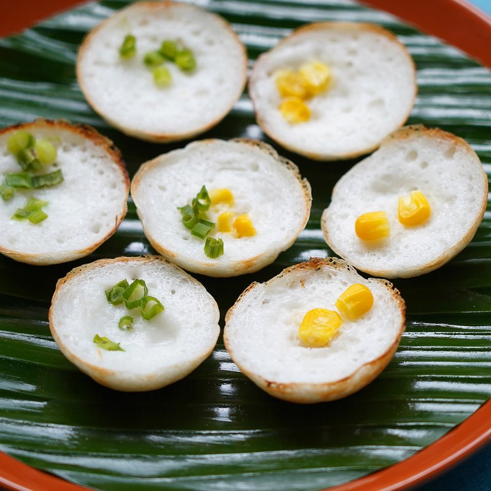

# Khanom Krok

*Thailand's coconut-cream dimples: rice-flour batter and pure coconut cream griddled into crisp-bottomed, custard-topped half-spheres.*

**Serves:** 4 (makes ~24 half-spheres / 12 paired snacks)

**Prep Time:** 15 minutes (plus 2 hour batter rest)

**Cook Time:** 25 minutes

## Overview
Two batters. The first (the base) is rice flour, palm sugar, salt, coconut milk and a small amount of mung-bean flour; rests 2 hours so the rice flour hydrates. The second (the top) is just coconut cream, salt and a pinch of rice flour. A khanom krok pan (or an aebleskiver pan, or a takoyaki pan) is heated; each dimple is brushed with oil; the base batter goes in three-quarters; covered briefly to set; the top coconut-cream batter spoons over to fill; covered again; the half-spheres release when the bottom is golden and the tops are barely jiggling. Two are paired together and served on a small banana-leaf square.

## Ingredients

### Base batter
- 150 g rice flour
- 1 tablespoon mung-bean flour (or substitute cornflour)
- 60 g palm sugar (chopped - or 50 g caster sugar)
- ½ teaspoon salt
- 250 ml coconut milk
- 80 ml water (more if needed)

### Top batter (coconut cream)
- 200 ml coconut cream (the thick layer from the top of a tin of coconut milk; OR the cream from a fresh coconut)
- 1 tablespoon rice flour
- ½ teaspoon salt
- ½ teaspoon sugar

### Optional add-ins (sprinkled between the two halves)
- 2 spring onions (finely chopped)
- 50 g sweetcorn kernels (drained)
- 50 g cooked pumpkin (small dice)
- 1 tablespoon toasted black sesame seeds

### For cooking
- 3 tablespoons sunflower or coconut oil
- A khanom krok pan (sold at Thai shops), OR an aebleskiver / takoyaki pan, OR a small non-stick pan with deep dimples

## Method

### Stage 1 - Base batter
1. In a wide bowl, whisk rice flour, mung-bean flour, palm sugar and salt.
1. Pour in the coconut milk, whisking smoothly to dissolve.
1. Add 80 ml water; whisk to a thin pourable batter (like single cream).
1. Rest 2 hours at room temperature - this lets the rice flour hydrate and gives a smoother texture.

### Stage 2 - Top batter
1. In a separate small bowl, whisk coconut cream, rice flour, salt and sugar until smooth.
1. Should be thicker than the base batter - like double cream.

### Stage 3 - Heat the pan
1. Place the pan over medium-low heat.
1. Brush each dimple with a tiny bit of oil using a pastry brush.
1. Heat 2 minutes.

### Stage 4 - Pour the base batter
1. Whisk the rested base batter (it settles).
1. Pour into each dimple until three-quarters full.
1. Cover with a lid (use a saucepan lid or foil if your pan doesn't have one).
1. Cook 90 seconds - the edges should set and the base should be just colouring.

### Stage 5 - Add the top
1. Lift the lid.
1. Spoon the top coconut-cream batter into each dimple until full to the rim.
1. Optional: scatter a pinch of spring onion or corn / pumpkin on top of half the dimples.
1. Cover again.
1. Cook 2-3 minutes - the bottoms should be deep golden, the tops just-set (jiggling slightly).

### Stage 6 - Lift out
1. Use a small spoon or skewer to lift each half-sphere out of its dimple.
1. Place two halves together (tops facing each other) - like a sphere or a coconut clamshell.
1. Set on a plate.

### Stage 7 - Repeat
1. Re-oil the dimples; repeat with remaining batter.

### Stage 8 - Serve
1. Eat warm, within 15 minutes of cooking.
1. Serve with sliced banana on the side if eating as a sweet snack, or alone as an in-between-meal.

## Notes
- **The pan is the challenge:** A proper khanom krok pan has perfectly sized dimples (about 4 cm diameter, 2 cm deep). Aebleskiver or takoyaki pans are widely available substitutes; cake-pop pans don't work (too deep, wrong shape). Without a dimpled pan, scale this recipe up and bake the batter in a 12-hole mini-muffin tin at 180°C 15 minutes (won't have the same crisp base, but the flavour is identical).
- **Two batters, two layers:** The base batter is thinner and sweeter; the top is thicker, saltier, and almost custard. Both layers are needed - the contrast is the dish.
- **Crisp base = right cook:** The signature texture is a crisp bottom and a tender just-set top. If your bottoms come out pale, increase heat slightly; if the tops are still wet, cover for longer.

## Storage
- Best within 30 minutes.
- Don't reheat - they go rubbery. Eat fresh.
- Both batters can be made ahead 4 hours; cook just before serving.
