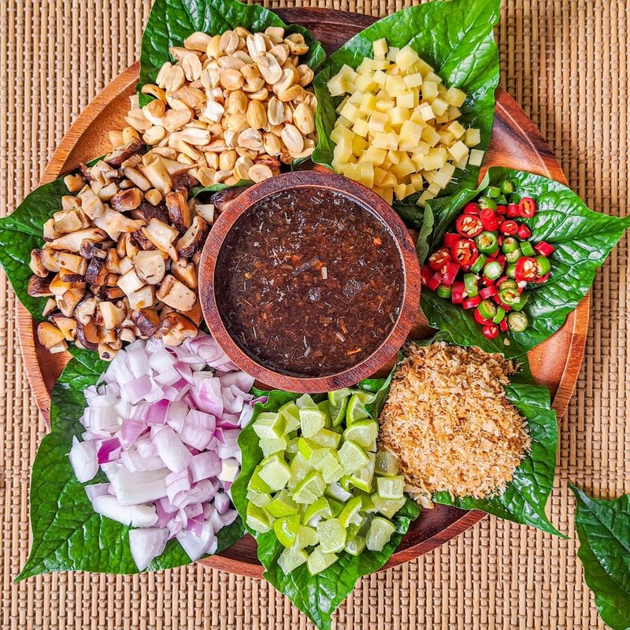

# Miang Kham

*Thailand's one-bite parcel: diced lime, ginger, shallot, dried shrimp, peanuts and coconut wrapped in a betel leaf with palm-sugar sauce.*

**Serves:** 4

**Prep Time:** 25 minutes

**Cook Time:** 15 minutes (for the sauce)

## Overview
Miang kham is Thailand's one-bite party trick, a tiny parcel of diced lime (peel and all), ginger, shallot, dried shrimp, peanuts, chilli and toasted coconut wrapped in a betel leaf with a quarter-teaspoon of dark sweet-sour sauce dropped on top, popped into the mouth and eaten whole so every flavour hits at once. The point is that single explosive bite where seven or eight things meet on the tongue, so all the layering is designed for one go; splitting into multiple bites defeats it. The sauce is the technical heart: palm sugar reduced with water, chopped dried shrimp, fish sauce, tamarind, grated ginger and finely chopped shallots into a glossy dark amber syrup that coats the back of a spoon. Toasted shredded coconut, diced lime with the peel on (the bitter note that lifts the dish), ginger, shallot, chilli and crushed peanuts arrange in small mounds around the betel leaves. Each diner builds their own: leaf, pinch of each filling, drop of sauce, fold, one bite.

## Ingredients

### Sauce
- 100 g palm sugar (chopped fine; or 80 g brown sugar)
- 60 ml water
- 50 g dried shrimp (rinsed and chopped fine)
- 3 tablespoons fish sauce
- 2 tablespoons tamarind paste
- 3 cm fresh ginger (grated)
- 2 shallots (small, very finely chopped)
- 1 red chilli (small, chopped, optional)

### Fillings (arrayed in small piles)
- 1 lime (whole - diced into tiny 3 mm cubes, skin and all)
- 3 cm fresh ginger (finely diced)
- 1 shallot (medium, finely diced)
- 80 g unsalted roasted peanuts (lightly crushed)
- 40 g dried shrimp (rinsed; can be left whole or coarsely chopped)
- 80 g shredded coconut (toasted in a dry pan 4 minutes until golden)
- 2-3 Thai bird's-eye chillies (small, sliced thin)
- A handful of young betel leaves

## Method

### Stage 1 - Toast the coconut
1. Place shredded coconut in a dry frying pan over medium heat.
1. Stir constantly for 3-4 minutes until evenly golden brown and fragrant - coconut goes from gold to burnt in 30 seconds, so don't walk away.
1. Tip onto a plate to cool.

### Stage 2 - Make the sauce
1. In a small saucepan, combine palm sugar and water.
1. Heat gently until the sugar dissolves.
1. Add the chopped dried shrimp, fish sauce, tamarind paste, grated ginger and finely chopped shallots.
1. Simmer 8-10 minutes, stirring, until reduced to a thick glossy dark amber syrup that coats the back of a spoon.
1. Add the chopped chilli (if using).
1. Cool - the sauce thickens further as it cools.
1. Taste; balance with extra fish sauce (saltiness), tamarind (sourness) or palm sugar (sweetness).

### Stage 3 - Prep the fillings
1. **Lime**: cut the whole lime into tiny dice - keep the peel ON; this is the bitter element. Aim for 3 mm cubes.
1. **Ginger**: dice 3 mm.
1. **Shallot**: dice 3 mm.
1. **Peanuts**: crush lightly in a mortar or with the side of a knife.
1. **Dried shrimp**: rinse briefly; leave whole or chop coarsely.
1. **Chillies**: slice into thin rounds.

### Stage 4 - Arrange
1. Place the betel leaves in the centre of a wide platter, slightly overlapping.
1. Around them, arrange small piles of each filling: lime cubes, ginger, shallot, peanuts, dried shrimp, coconut, chilli.
1. Place the sauce in a small bowl with a tiny spoon.

### Stage 5 - Eat
1. Each diner takes a betel leaf.
1. Layer a tiny pinch of each filling onto the leaf (4-5 mm pile total).
1. Drop a quarter-teaspoon of sauce on top.
1. Fold the leaf around the filling.
1. Eat in one bite - chew slowly to get all the flavours at once.

## Notes
- **Eat in one bite:** Miang kham is designed for a single explosive mouthful. Splitting into multiple bites defeats the dish; eat all the layered flavours simultaneously.
- **Lime PEEL is the bitter:** The peel of a fresh lime, diced fine, is what gives miang kham its faint pleasant bitterness. Don't peel the lime first - it's the whole fruit going in.
- **Betel leaf substitutes:** Real cha plu betel leaves give the most authentic taste (faintly aniseed-peppery), but they're hard to find outside Asian shops. Cos lettuce or perilla leaves work; spinach leaves are the closest non-leafy substitute.

## Storage
- The sauce keeps refrigerated 2 weeks in a sealed jar - and is excellent over grilled meats or vegetables.
- Toasted coconut keeps 1 week airtight at room temperature.
- All fillings best on the day; lime and shallot oxidise overnight.
