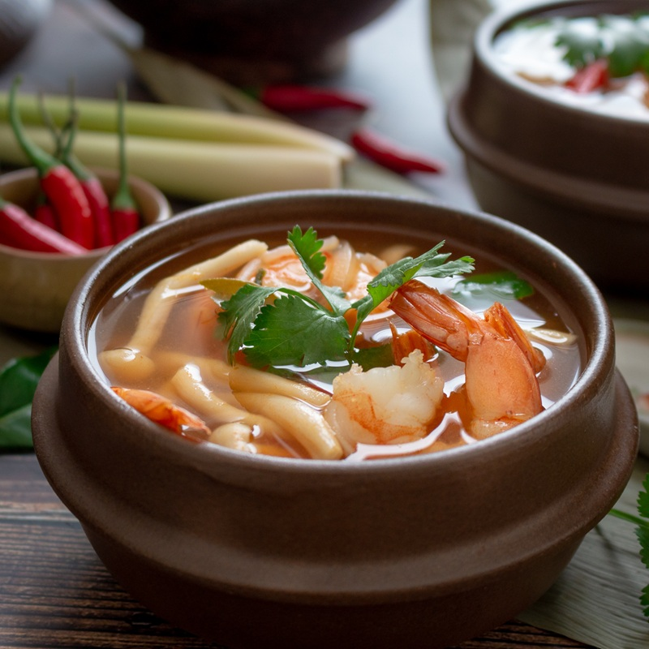

# Hot and Sour Prawn Soup

*Thailand's hot-and-sour prawn soup: lemongrass, galangal, kaffir lime, lime juice, fish sauce and chilli broth with whole prawns.*

**Serves:** 4 - 6

**Prep Time:** 15 minutes

**Cook Time:** 30 minutes

## Overview
This is Thai hot-and-sour prawn soup in its clear, broth-forward form (no coconut milk, unlike tom kha), built around a stock made from the prawn heads and shells themselves and brightened with lemongrass, galangal, kaffir lime, lime juice, fish sauce and chilli. The four Thai notes (hot, sour, salty and faintly sweet) all show in the bowl, and the broth tastes much deeper than the 30-minute cook time suggests because of the prawn-shell stock. Peel and devein the prawns, keep the tails on and reserve every head and shell. Heat oil in a stockpot, drop in the shells and heads and cook for five minutes till they turn bright orange, then add a bruised lemongrass stalk, sliced galangal and two litres of water, bring to the boil and immediately reduce to a gentle simmer for 20 minutes. Strain back into the same pan through a fine sieve, discarding the spent shells. Pound the remaining lemongrass to a paste in a mortar with sliced chilli, then add to the stock with finely shredded lime leaves, fish sauce, spring onions and quartered mushrooms, simmer two minutes. Add the prawns and cook three minutes till tender (don't overcook or they turn rubbery), then off the heat with lime juice and chilli paste to taste. Garnish with fresh coriander leaves and serve immediately in deep bowls.

## Ingredients

### Protein
- 350 grams raw medium prawns (whole)

### Fat
- 1 tablespoon oil

### Aromatics
- 3 lemongrass stems (white part only)
- 3 thin slices fresh galangal
- 3 - 5 fresh red chillies (small)
- 5 lime leaves (finely shredded)

### Vegetables
- 2 spring onions (sliced)
- 70 grams button mushrooms (quartered)

### Seasonings
- 2 tablespoons fish sauce
- 3 tablespoons lime juice
- 1 - 2 tablespoons chilli paste

### Garnish
- coriander leaves (to garnish)

## Method

### Stage 1 - Prepare stock
1. Peel and de-vein the prawns, leaving the tails intact and reserving the heads and shells.
1. Heat the oil in a large stockpot and add the prawn heads and shells. Cook for 5 minutes, or until the shells turn bright orange.
1. Bruise 1 stem of the lemongrass with the back of a knife.
1. Add to the pan with the galangal and 2 litres of water.
1. Bring to the boil, then immediately reduce the heat to low and simmer for 20 minutes.
1. Strain back into the same pan through a chinois or fine-meshed conical sieve, discarding the shells and heads.

### Stage 2 - Cook soup
1. Finely slice the chillies and remaining lemongrass. 
1. Add the lemon grass to a mortar and pestle, and pound until it has reached the consistency of a paste.
1. Add the lemongrass paste and chillies to the stock with the lime leaves, fish sauce, spring onion and mushrooms.
1. Cook gently for 2 minutes.
1. Add the prawns and cook for 3 minutes, or until the prawns are tender.

### Stage 3 - Finish and serve
1. Add the lime juice and chilli paste.
1. Garnish with the coriander leaves and serve immediately.

## Notes
- **Sourness:** Adjust lime juice to taste for desired tanginess.
- **Heat:** Start with fewer chillies and chilli paste; add more for extra spice.
- **Prawns:** Use fresh prawns for best flavor; cook just until pink to avoid toughness.

## Serving
Serve hot, garnished with fresh coriander leaves.

## Storage
- Best served immediately; can be refrigerated for 1 day. Reheat gently without boiling.
