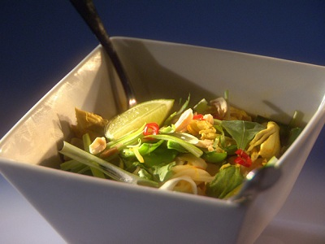

# Khao Soi (Northern Thai Curry Noodle Soup)

*Northern Thailand's coconut curry noodle soup: egg noodles in a turmeric-and-curry coconut broth with chicken.*

**Serves:** 4

**Prep Time:** 15 minutes

**Cook Time:** 50 minutes

## Overview
Khao soi is the signature dish of Chiang Mai and the whole north of Thailand, the Burmese-Yunnanese coconut curry noodle soup that turns up at every street cart and restaurant in the city, chicken simmered in a turmeric-and-curry coconut broth, ladled over soft egg noodles and crowned with a tangled handful of crisp-fried noodles for the textural contrast. The dish straddles cultures, you can taste the Burmese in the coconut curry and the Chinese-Yunnanese in the noodles. Cook thin egg noodles in salted boiling water for three or four minutes till soft, drain and set aside. Pan-fry chicken breasts in peanut oil for five minutes a side till cooked through, lift out and keep warm. Soften sliced onion in the same pan for eight minutes till golden, add chopped chilli, ginger and curry powder for two minutes till the spice blooms, then pour in chicken stock and simmer 20 minutes to build the broth. Slice the chicken thin on the diagonal, add coconut milk to the broth and simmer 10 minutes more, then add pak choy for the last three minutes and stir in torn basil leaves at the end. Divide the noodles between deep bowls, lay slices of chicken across the top, ladle the curry broth over and finish with fresh herbs and (if you can find them) a tangled handful of crisp fried noodles across the top.

## Ingredients

### Noodles
- 175 grams thin egg noodles

### Fat
- 2 tablespoons peanut oil

### Protein
- 2 boneless, skinless chicken breast

### Vegetables
- 1 onion (sliced)
- 300 grams pak choy (cut into long strips)

### Aromatics
- 1 fresh red chilli (small, de-seeded and finely chopped)
- 1 tablespoon fresh ginger (finely chopped)

### Seasonings
- 2 tablespoons [Curry Powder](../../indian/Spice-Mixes/curry-powder.md)
- 750 ml chicken stock
- 800 ml coconut milk
- 20 grams basil (torn)

## Method

### Stage 1 - Prepare noodles and chicken
1. Cook the noodles in a large pan of salted boiling water for 3 - 4 minutes, or until soft. Drain well and set aside.
1. Heat the oil in a saucepan and add the chicken. Cook on each side for 5 minutes, or until cooked through. Remove the chicken and keep warm.

### Stage 2 - Cook soup
1. Put the onion in the pan and cook over a low heat for 8 minutes, stirring occasionally until softened but not browned.
1. Add the chilli, ginger and curry powder and cook for a further 2 minutes.
1. Add the chicken stock and bring to the boil.
1. Reduce the heat and simmer for 20 minutes.
1. Thinly slice the chicken diagonally.
1. Add the coconut milk to the saucepan and simmer for 10 minutes.
1. Add the pak choy and cook for 3 minutes, then stir in the basil.

### Stage 3 - Assemble and serve
1. To serve, divide the noodles among four deep serving bowls. Add slices of chicken and ladle in the soup.
1. Serve immediately.

## Notes
- **Curry powder:** Use a good quality Thai curry powder for authentic flavor; adjust heat level with more or less chilli.
- **Coconut milk:** Full-fat coconut milk provides richness; shake well before using.
- **Pak choy:** Add at the end to keep it crisp and fresh.

## Serving
Serve hot in deep bowls.

## Storage
- Best served immediately; soup can be refrigerated for 2 days. Reheat gently and add fresh basil before serving.
