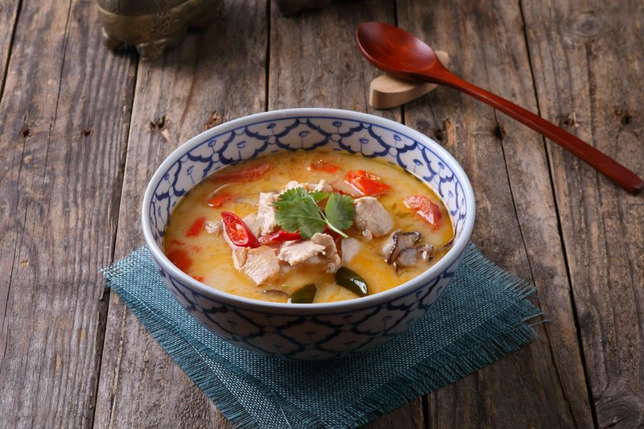

# Tom Kha Gai Soup (Chicken, Galangal and Coconut Soup)

*Thailand's tom kha gai: chicken and mushrooms in a galangal-and-coconut milk broth with lemongrass, kaffir lime and lime juice.*

**Serves:** 4-6

**Prep Time:** 15 minutes

**Cook Time:** 5 minutes

**Prep time:** 10 mins

**Cooking time:** 20 mins

## Overview
Tom kha gai is Thailand's chicken-and-galangal coconut soup, the cooler creamier sibling to tom yum: a bowl of poached chicken and mushrooms swimming in a fragrant coconut broth perfumed with lemongrass, galangal, kaffir lime and coriander stalks. The broth carries the dish here. The protein is interchangeable (prawns for tom kha goong, meaty white fish for a Sunday version, or tofu for a vegan bowl), but the build of the broth is non-negotiable. Chicken stock infuses for ten minutes with bashed lemongrass, sliced galangal, kaffir lime leaves and coriander stalks before the chicken goes in; coconut milk and palm sugar follow, then mushrooms, fish sauce and a spoon of roasted Thai chilli oil to dial the heat. Finished off the heat with lime juice and spring onions. Ladled into deep bowls: as a starter, or poured over rice noodles for a satisfying light main.

## Ingredients
### Aromatics
- 1 stalk lemongrass (white part only with thick outer layer removed), bruised and cut into about 6 slices
- 3 lime leaves, stalks removed and leaves thinly sliced
- 1 thumb-sized piece of galangal, bruised and sliced into 7 pieces
- 10 coriander (fresh coriander) stalks, finely chopped

### Protein
- 250g (9oz) skinless chicken thigh fillets, cut into bite-size pieces

### Dairy
- 400ml (1 ¾ cups) tinned (canned) thick coconut milk

### Vegetables
- 8 mushrooms, quartered (or halved)
- 3 spring onions (scallions), roughly chopped

### Seasonings
- 500ml (2 cups) water or Thai chicken stock
- 2 tbsp palm sugar (or to taste)
- 70ml (¼ cup) Thai fish sauce*
- 2 tbsp roasted Thai chilli oil with some of the goop at the bottom (preferably Thai, if shop-bought, but Chinese is fine), or Thai red curry paste to taste
- 80ml (⅓ cup) lime juice

## Method

### Stage 1 - Prepare broth
1. Pour the stock into a large saucepan and bring to a boil over a high heat.
1. Add the lemongrass, lime leaves, galangal and coriander (fresh coriander) stalks.
1. Simmer for about 10 minutes to allow the aromatic ingredients to flavour the stock.

### Stage 2 - Cook chicken
1. Add the chicken and simmer for about 5 minutes, or until the chicken is just cooked through.
1. Pour in the coconut milk and add sugar to taste.

### Stage 3 - Add seasonings and vegetables
1. Add the mushrooms, fish sauce and the chilli oil along with some of the goop at the bottom.
1. Alternatively, add Thai red curry paste if preferred.
1. Keep tasting as you go.

### Stage 4 - Finish and serve
1. Add the lime juice to taste and the chopped spring onions (scallions).
1. Simmer for another minute or so.
1. Ladle into bowls and enjoy.

## Notes
* Many Thai fish sauces contain gluten but there are gluten-free brands available.

## Serving
- Serve hot as a starter or main.

## Storage
- Refrigerate leftovers in airtight container for up to 2 days.
- Reheat gently; coconut milk may separate.
