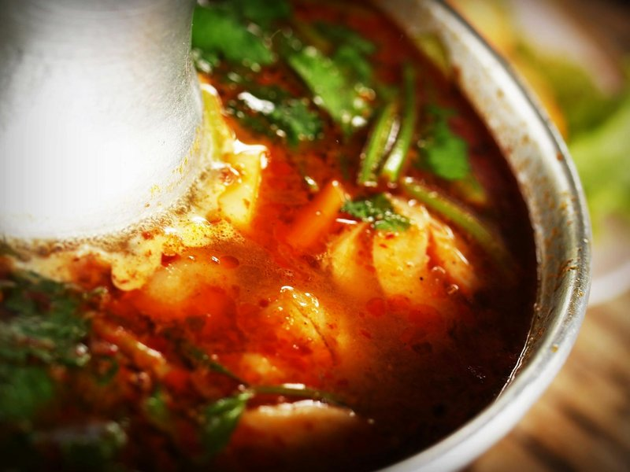

# Tom Yum Gai Soup (Hot and Sour Chicken Soup)

*Thailand's tom yum gai: chicken in a hot-and-sour broth of lemongrass, galangal, kaffir lime, fish sauce and chilli.*

**Serves:** 4-6

**Prep Time:** 10 minutes

**Cook Time:** 20 minutes

## Overview
Tom yum gai is the chicken cousin to the prawn-led tom yum goong, the same hot-and-sour Thai broth tradition built on lemongrass, galangal, kaffir lime, fish sauce and chilli, but with sliced chicken poached through and a touch more vegetable bulk. Gai is the Thai word for chicken; swap in prawn stock and prawns for tom yum goong, or skip the meat altogether for a vegetarian version with tofu. The character of this version is spicy-savoury-tart rather than sweet; the natural sweetness comes from fried shallots and tomatoes rather than added sugar, though you can taste and adjust at the end if you want. Heat oil in a saucepan and fry chopped shallots for a minute till just starting to colour, then add chicken stock or water with bashed lemongrass, finely sliced kaffir lime leaves, sliced galangal and chopped garlic, bring to the boil and simmer 10 minutes so the aromatics infuse. Stir in bite-sized chicken pieces and tamarind paste, cook 5 minutes till the chicken is just done, then add quartered mushrooms, a spoon of nam prik pao chilli jam, roasted Thai chilli oil, fish sauce, smashed green bird's-eye chillies and a generous handful of chopped coriander. Taste and balance the four Thai notes (the dish should be sharp, hot, savoury with the faintest lift from the tomato), then add quartered tomatoes and roughly chopped spring onions and any extra vegetables (cabbage, beansprouts) you fancy. Ladle into deep bowls and serve as a starter, or pour over cooked noodles for a light main.

## Ingredients
### Fat
- 2 tbsp rapeseed (canola) oil

### Aromatics
- 2 shallots, finely chopped
- 1 lemongrass stalk, smashed and cut into about 5 pieces
- 8 lime leaves, stalks removed and leaves thinly sliced
- 2 ½cm (1in) piece of galangal, thinly sliced
- 3 garlic cloves, roughly chopped

### Protein
- 250g (9oz) chicken breast, cut into bite-size pieces

### Vegetables
- 8 mushrooms, quartered
- 2 tomatoes, quartered
- 3 spring onions (scallions), roughly chopped
- Handful of chopped or sliced vegetables, such as cabbage, bean sprouts, carrots (optional)

### Seasonings
- 1 tbsp tamarind paste
- 1 tbsp chilli jam (nam prik pao)
- 1 tbsp roasted Thai chilli oil with some of the goop at the bottom
- 3-4 tbsp Thai fish sauce*
- 3 green bird’s eye chillies, smashed and cut lengthwise
- 1 small handful of coriander (fresh coriander), roughly chopped
- 2 tsp palm sugar (or white sugar, optional and to taste)

## Method

### Stage 1 - Prepare aromatics
1. Heat the oil in a large saucepan over a medium-high heat until shimmering hot.
1. Add the shallots and fry for about a minute.
1. Add the stock or water, lemongrass, lime leaves, galangal and garlic and bring to a boil.
1. Reduce the heat and simmer this aromatic liquid for about 10 minutes.

### Stage 2 - Cook chicken
1. Stir in the chicken and continue cooking until the chicken is cooked through (about 5 minutes).
1. Add the tamarind paste and stir well.

### Stage 3 - Add seasonings and vegetables
1. Stir in the mushrooms, chilli jam, chilli oil, fish sauce, green bird’s eye chillies and coriander (fresh coriander).
1. Taste and adjust seasoning as desired; add sugar if wanted.
1. Add the quartered tomatoes and let them cook through in the hot stock.
1. Add the spring onions (scallions) and any other vegetables.

### Stage 4 - Serve
1. Ladle the soup into bowls and enjoy.

## Notes
* Many Thai fish sauces contain gluten but there are gluten-free brands available.

## Serving
- Serve hot as a starter or light main.

## Storage
- Refrigerate leftovers in airtight container for up to 2 days.
- Reheat gently; flavors intensify.
