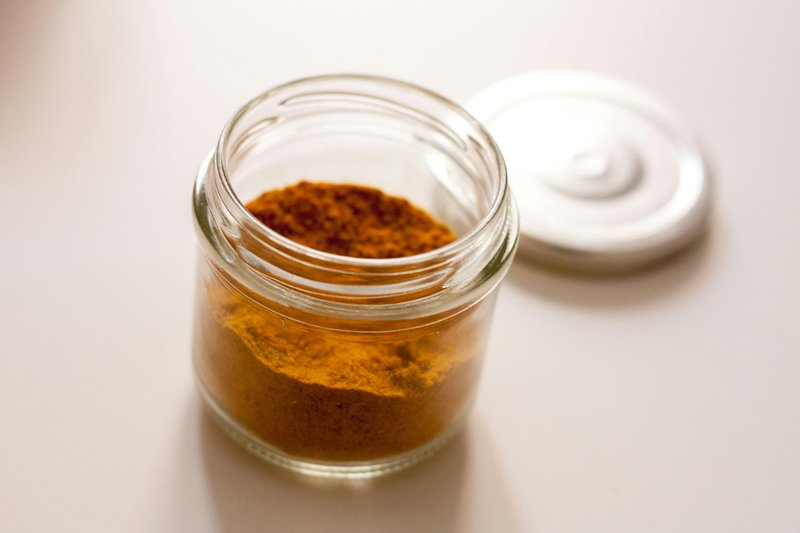

# Thai Curry Powder

*A Thai-style curry powder: turmeric, coriander, cumin, fennel and chilli with a touch of cinnamon and star anise.*

**Makes:** about 145g (1 ¼ cups)

**Prep Time:** 8 minutes

**Cook Time:** 2 minutes

## Overview
Thai curry powder is the spice-mix shortcut that shows up in yellow curry, dipping sauces and a handful of stir-fries; the Indian influence on Thai cooking comes through in the turmeric, coriander, cumin and cinnamon, while fennel, star anise, fenugreek, cassia leaves and Kashmiri chillies tilt the mix back toward South-East Asia. Keep a small jar of it in the pantry alongside the curry pastes; it lifts a quick weeknight stir-fry the way a Thai brand jar never quite does. Toast all the whole spices (coriander, cumin, peppercorns, fennel, mustard, cinnamon, cassia leaves, fenugreek, star anise, cardamom and dried Kashmiri chillies if using) in a dry frying pan over medium-high heat, moving them around constantly so they roast evenly, till they're warm to the touch and intensely fragrant but not yet smoking. Burnt spices turn bitter and ruin the whole jar, so pull them the moment they smell properly toasted. Tip onto a plate to cool, then grind to a fine powder in a spice grinder or with patience in a mortar. Stir in the ground turmeric, optional hot chilli powder, garlic powder and onion powder till evenly mixed. Store in an airtight jar in a cool dark cupboard and use within two months while the volatile aromatics are still vivid; the powder fades noticeably after that.

## Ingredients
### Whole spices
- 3 tbsp coriander seeds
- 3 tbsp cumin seeds
- 2 tbsp black peppercorns
- 1 tbsp fennel seeds
- 1 tbsp black mustard seeds
- 6cm (2 ½in) piece of cinnamon stick or cassia bark
- 2 Indian bay leaves (cassia leaves)
- 1 tsp fenugreek seeds
- 2 star anise
- 7 cardamom pods, lightly bruised
- 4 Kashmiri dried red chillies (optional)

### Ground spices
- 1 tbsp ground turmeric
- 1 tbsp hot chilli powder (optional)
- ½ tsp garlic powder
- 1 tsp dried onion powder

## Method

### Stage 1 - Roast spices
1. Roast all the whole spices, including the dried red chillies (if using), in a dry frying pan over a medium-high heat until warm to the touch and fragrant but not yet smoking.
1. Move the spices around in the pan so that they roast evenly.
1. Be very careful not to burn the spices or they will turn bitter.

### Stage 2 - Grind and combine
1. Tip the warm spices onto a plate and leave to cool.
1. Grind to a fine powder in a spice grinder or pestle and mortar.
1. Add the turmeric, chilli powder (if using), garlic powder and onion powder and stir to combine.

## Notes
- Use within 2 months for best flavor.

## Serving
- Use in Thai curries or as a general spice mix.

## Storage
- Store in an air-tight container in a cool, dark place.
