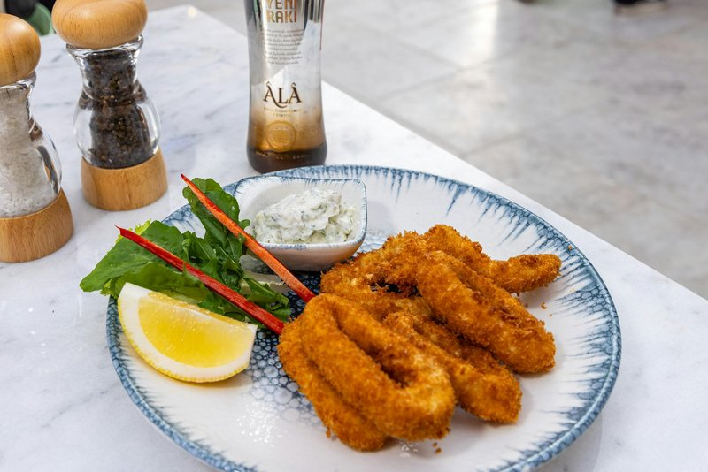

# Salt and Pepper Fried Calamari

*Salt and pepper squid: calamari rings dredged in cornflour with white pepper and salt, deep-fried light and crisp.*

**Serves:** 4

**Prep Time:** 5 minutes

**Cook Time:** 8 minutes

## Overview
Salt and pepper calamari is the crisp-fried squid starter that turns up at Thai restaurants and Chinese takeaways equally: calamari rings dredged in seasoned cornflour and dropped into screaming-hot oil so they crisp before the squid has a chance to toughen. The defining technique is the overnight milk soak: whole tubes and tentacles sit submerged in full-fat milk for at least twelve hours, the milk acting as a natural tenderiser that gives the squid the right yielding bite. A fresh egg-and-milk wash with slit red spur chillies follows the next day, then a coating of plain flour, cornflour, salt and red chilli powder. Oil temperature is the deciding factor: 190 °C, in small batches so it doesn't drop; too cool gives soggy oily calamari, too hot scorches the coating before the squid cooks. Finished with flaky salt and freshly ground black pepper while still hot, eaten immediately with sweet chilli sauce.

## Ingredients

### Protein
- 900g (2lb) small squid tubes and tentacles, cleaned (see note)

### Marinade
- 500ml (2 cups) full-fat (whole) milk, plus more if needed
- 2 eggs

### Aromatics
- 6 red spur chillies, slit lengthways

### Coating
- 120g (1 cup) plain (all-purpose) flour
- 120g (1 cup) cornflour (cornstarch)
- 1 tsp salt
- 1 tbsp red chilli powder

### Fat
- Rapeseed (canola) oil, for deep-frying

### Seasoning
- Flaky sea salt
- Freshly ground black pepper

### Serving
- Sweet chilli sauce, to serve

## Method

### Stage 1 - Marinate
1. Place the whole squid tubes and tentacles in a bowl and pour over 250ml (1 cup) of the milk. Milk is a natural tenderizer, which gives the squid a perfect texture when fried, so be sure the squid is completely covered; add a little more if necessary.
2. Cover the bowl with cling film (plastic wrap) and place in the fridge overnight to marinate.

### Stage 2 - Prepare
1. When ready to cook, drain the squid, discarding the milk, which will have turned pink due to the colouring of the tentacles.
2. Add the remaining 250ml (1 cup) of milk to the bowl and whisk in the eggs until smooth.
3. Return the squid to the bowl along with the spur chillies.
4. Mix both flours together on a large plate with the salt and chilli powder.

### Stage 3 - Fry
1. Now heat about 750ml (3 cups) of oil in a wok and heat to 190°C (375°F) over a medium-high heat. If the oil is not hot enough, your calamari will become oily and soggy instead of deliciously crispy.
2. It is important to work in batches so as not to overcrowd the pan.
3. Dip the squid and chillies into the flour mixture, ensuring each piece is coated evenly, then fry for about 1 minute, or until golden brown.
4. Transfer the calamari and chillies to a paper towel to soak up the excess oil and repeat until all of the squid and chillies are cooked.
5. Season with salt and pepper to taste and serve with sweet chilli sauce.

## Notes
I purchase my squid already cleaned, which is of course the easiest option. If you can only get uncleaned squid, cleaning them isn’t difficult. Pull the head from the tube body and remove and discard the long stiff cartilage from the tube. Then cut the head and ink sac away from the tentacles and discard. Peel the thin membrane from the tube and you’re ready to go.

## Serving
- Serve with sweet chilli sauce.

## Storage
- Best served immediately.
