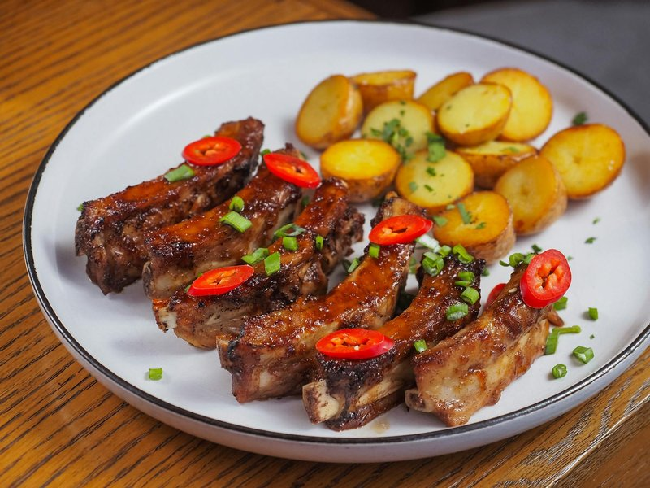

# Garlicky Salt and Pepper Pork Ribs

*Garlicky salt and pepper pork ribs: ribs marinated in soy and Shaoxing, dredged in cornflour.*

**Serves:** 2-4

**Prep Time:** 10 minutes

**Cook Time:** 20 minutes

## Overview
Garlicky salt and pepper pork ribs are the Thai version of the Chinese-restaurant favourite, baby back ribs cut into small pieces, marinated in soy, oyster sauce and rice vinegar with crushed garlic and a heavy hand of black pepper, then dredged in cornflour and slow-deep-fried at a low temperature so the meat goes shreddingly tender under a crisp coating. The slow-fry is the technical move that separates these from generic fried ribs; high-heat frying browns the outside before the meat cooks through, so the oil sits at a modest 160°C for the full 20 minutes. Whisk rice wine vinegar, light soy sauce, oyster sauce, roasted chilli flakes, minced garlic, freshly ground black pepper and salt in a wide bowl, taste and adjust the four notes till it sits sharp and pungent. Add the small rib pieces and mix with your hands so every piece is coated, then marinate at least a few hours and ideally overnight for the deepest flavour. Just before frying, dust the ribs in cornflour and toss to coat. Heat 5 cm of oil in a wok or deep pan to 160°C, lower the ribs in carefully and fry for a full 15 to 20 minutes, watching for the moment they turn deep crispy brown and feel tender when pierced; if the meat starts to look like it's burning, lift it out early. Drain on kitchen paper and serve immediately as the starter to a Thai meal, with nam jim jaew or sweet chilli sauce alongside for dipping.

## Ingredients

### Protein
- 1 rack of pork baby back ribs, cut into small 2 ½cm (1in) pieces

### Marinade
- 125ml (½ cup) rice wine vinegar
- 2 tbsp light soy sauce (gluten-free brands are available)
- 1 tbsp oyster sauce (gluten-free brands are available)
- 1 tsp roasted chilli flakes
- 6 garlic cloves, minced
- 2 tsp freshly ground black pepper
- 2 tsp salt

### Coating
- 7 tbsp cornflour (cornstarch)

### Fat
- Rapeseed (canola) oil, for deep-frying

### Serving
- Your choice of dipping sauce

## Method

### Stage 1 - Marinate
1. Put all the ingredients up to and including the salt in a bowl and whisk together.
2. Taste and adjust the ingredients to your preferences.
3. Add the pork ribs and mix well with your hands to combine.
4. Although you could fry these immediately, leaving them to marinate for a few hours or overnight will improve the flavour.

### Stage 2 - Coat
1. Just before you are ready to cook, add the cornflour (cornstarch) to the bowl and mix well to ensure the ribs are equally coated all over.

### Stage 3 - Fry
1. Pour about 5cm (2in) rapeseed (canola) oil into a wok or frying pan.
2. Heat to about 160°C (320°F).
3. You need to fry the pork for about 20 minutes, so it is important not to let it get too hot.
4. When hot, add the pork to the oil and fry for 15-20 minutes, depending on how meaty your ribs are.
5. The meat should turn a crispy brown and be really tender.
6. When frying like this, use your eyes! If the meat looks like it is burning, remove it from the oil.
7. Transfer to a plate lined with paper towels to soak up any excess oil.
8. Serve immediately with the dipping sauce of your choice.

## Notes
- Adjust marinade to taste.

## Serving
Serve immediately with nam jim jaew or sweet chilli sauce.

## Storage
- Best served immediately.
