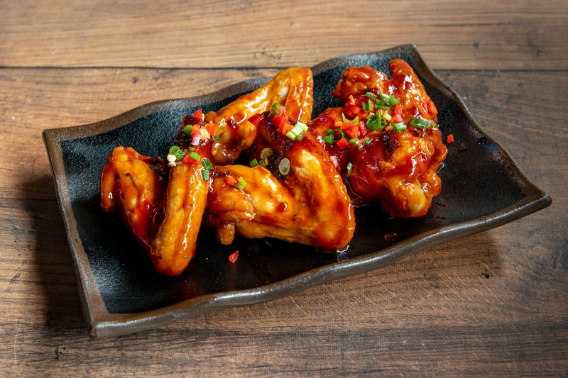

# Sweet and Crispy Chicken Wings

*Thailand's sweet crispy chicken wings: wings marinated in fish sauce and rice flour, deep-fried till the skin shatters.*

**Makes:** 12

**Prep Time:** 10 minutes

**Cook Time:** 15 minutes

## Overview
Sweet and crispy chicken wings (peek gai tod) are the sticky lacquered starter you find at Thai restaurants and takeaways across the country, wings simmered in a caramel-and-fish-sauce sauce with peppercorn-shallot-ginger paste, then finished in a hot oven so the skin crisps under the glaze. Palm sugar is what gives the dish its deep colour and caramel-coconut depth; white sugar or honey work in a pinch but the result is lighter and less Thai. Cut whole chicken wings at the joints into drumettes and flats, reserving the bony wing tips for stock. Pound peppercorns, sliced shallots and chopped ginger in a mortar (or pulse in a small processor) to a coarse paste. In a wide saucepan, dissolve palm sugar in a splash of water over medium heat, then keep simmering till the syrup turns light brown and starts to caramelise (don't let it scorch or the whole batch goes bitter). Off the heat, carefully add fish sauce a little at a time (it spatters), then the chicken and the peppercorn paste, stir to coat, cover and simmer 8 to 10 minutes till the chicken is cooked through and lacquered in the golden syrup. Transfer to a parchment-lined tray, brush each wing with more of the syrupy sauce, and bake at 230°C for 10 minutes till the skin crisps. Plate with extra sauce drizzled across, then scatter chopped spring onions, sliced red chilli and (if you can spare the time, and you should) crispy fried garlic which lifts the whole dish.

## Ingredients

### Protein
- 12 chicken wings, bony ends cut off

### Aromatics
- 3 generous tbsp black peppercorns
- 150g (1 cup) shallots, peeled and thinly sliced
- 2 tbsp finely chopped ginger
- 3 spring onions (scallions), roughly chopped, to garnish
- 1 red spur chilli, thinly sliced, to garnish
- 3 tbsp crispy fried garlic , to garnish (optional)

### Seasoning
- 150ml (⅔ cup) Thai fish sauce*

### Sweeteners
- 135g (⅔ cup) granulated sugar or finely chopped palm sugar

## Method

### Stage 1 - Prepare Wings
1. When you purchase whole chicken wings and lay them out, you will see that there are three parts to them: two meaty pieces and then the wing tip that has very little, if any, meat on it. Place your finger over the first joint and you will feel a small ridge. Take a sharp knife and slice through that ridge. Move to the second joint and do the same. Keep those meaty wing pieces for this recipe and use the wing tips in stocks.

### Stage 2 - Make Paste
1. Place the peppercorns, shallots and ginger in a pestle and mortar or food processor and pound or blend into a coarse paste. Set aside.

### Stage 3 - Cook Sauce
1. Put the sugar into a saucepan with 70ml (¼ cup) of water and place over a medium heat.
2. Bring to a simmer so that the sugar dissolves into the water, and continue simmering over a low heat until the sugar is light brown in colour and beginning to caramelize and become syrupy. Be really careful not to burn the sugar or you will have to start all over again.
3. Once you have a nice syrup, remove from the heat and very carefully add the fish sauce. Do this slowly so that it doesn’t splatter when you add it.
4. Add the chicken and the peppercorn, ginger and shallot paste and stir well to combine.
5. Place back over a low heat, cover the pan and simmer for 8-10 minutes, or until the chicken is cooked through. The chicken will take on the delicious golden colour of the syrup mixture.

### Stage 4 - Bake
1. Preheat the oven to 230°C (455°F/Gas 8) and line a baking tray with parchment paper.
2. Using tongs or a slotted spoon, transfer the chicken wings to the lined baking tray.
3. Brush each wing with a little more of the syrup, making sure that each has a bit of the paste on top.
4. Bake in the oven for 10 minutes, or until the chicken is beginning to get crispy.
5. Transfer the wings to a serving plate and drizzle with a little more of the sauce.
6. Garnish with the spring onions, red chilli slices and crispy fried garlic (if using).

## Notes
* Many Thai fish sauces contain gluten but there are gluten-free brands available.

## Serving
Serve hot.

## Storage
- Best served immediately; can be refrigerated for 1 day.
