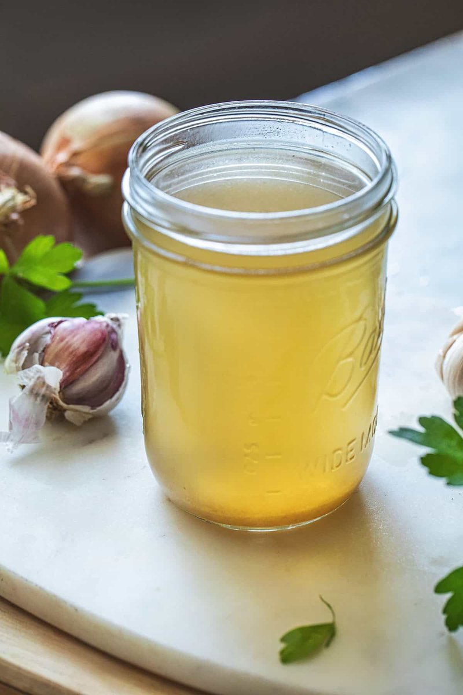

# Thai Chicken Stock

*Thailand's chicken stock: chicken bones simmered with lemongrass, galangal, kaffir lime leaves and fresh coriander root.*

**Makes:** approx. 1 ½ litres (6 cups)

**Prep Time:** 5 minutes

**Cook Time:** 2 hours

## Overview
This is the Thai chicken stock that gives soups, curries and braises the right backbone: chicken bones simmered slow with lemongrass, galangal, kaffir lime leaves, smashed garlic and fresh coriander roots. The Asian aromatics are what separate this from a Western stock; using a French-style mirepoix or a stock cube under a Thai curry gives a muddled result no matter how good the rest of the recipe is. The bones simmer slowly with the foam skimmed off till the liquid runs clear; aromatics (coriander stalks, onion, garlic, sliced bashed galangal, bruised lemongrass, white peppercorns) join for the two-hour cook. Strained, cooled quickly in an ice bath and stored in portioned tubs: three days in the fridge or months in the freezer. Adding pork bones alongside the chicken gives a richer Thai-Chinese hybrid stock that's worth trying once.

## Ingredients
### Protein
- 1 ½kg (3lb 5oz) meaty chicken bones

### Aromatics
- 10 coriander (fresh coriander) stalks
- 1 onion (large), roughly chopped
- 10 garlic cloves, smashed
- 2 ½cm (1in) piece of galangal, thinly sliced and lightly smashed
- 1 whole lemongrass stalk, bruised

### Seasonings
- 1 tsp white peppercorns (or black peppercorns if you must)

## Method

### Stage 1 - Prepare stock
1. Add the chicken bones to a large saucepan and cover with 2 litres (8 cups) of water.
1. Bring to a simmer, skimming off any foam that floats to the top.

### Stage 2 - Add ingredients
1. Once foam is skimmed, add the remaining ingredients.
1. Allow to simmer for about 2 hours.

### Stage 3 - Strain
1. Strain through a fine sieve.

## Notes
- You could add more water and a few pork bones to this stock for a delicious chicken and pork stock, popular in Thai cooking.
- This can be used whenever chicken stock is called for in a recipe.

## Serving
- Use as base for Thai dishes.

## Storage
- Refrigerate up to 3 days or freeze for months.
- Cool quickly in ice bath before storing.
