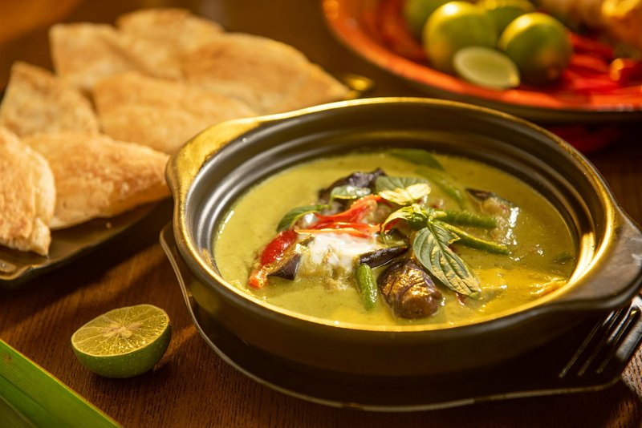

# Thai Beef Massaman Curry

*Thailand's massaman beef: beef simmered slow in a coconut-milk curry with potato, peanuts, cinnamon and tamarind.*

**Serves:** 4

**Prep Time:** 10 minutes

**Cook Time:** 2 hours

## Overview
Massaman is the southern Thai curry that travelled from Persia by way of the Muslim-Thai communities of the deep south, slow-simmered beef in a coconut sauce perfumed with cinnamon, cardamom, cloves and roasted peanuts. The Persian roots show in the whole-spice warmth that other Thai curries don't have, and the dish takes its time: two hours of gentle simmering for the beef alone is non-negotiable. Place stewing beef in a saucepan with cold water and simmer for an hour and a half to two hours, topping up the water as needed, until a chunk falls apart easily under a spoon; add quartered potatoes for the last 20 minutes till fork-tender. In a wide pan, heat oil and soften red onion with a handful of roasted peanuts for three minutes, then stir in the massaman curry paste till deeply aromatic. Pour in thick coconut milk with a tablespoon of palm sugar and a teaspoon of tamarind paste, then return the beef and potatoes with a cup of the beef cooking liquid and three tablespoons of fish sauce. Simmer ten minutes till the sauce thickens to a clinging gloss, tasting and balancing the sweet-sour-salty notes that mark massaman from the brighter green and red curries. Garnish with Thai holy basil and serve over jasmine rice, or just on its own with sticky rice for tearing and dipping.

## Ingredients
### Protein
- 700 g (1 lb 9 oz) stewing beef

### Vegetables
- 2 potatoes, peeled and cut into bite-size pieces
- ½ red onion, quartered

### Fat and nuts
- 2 tbsp rapeseed (canola) oil
- Handful of roasted peanuts

### Paste and sweeteners
- 1 batch massaman curry paste
- 1 tbsp palm sugar

### Dairy and acid
- 400 ml (1 ¾ cups) thick coconut milk
- 1 tsp tamarind paste

### Seasoning
- 3 tbsp Thai fish sauce
- Salt, to taste

### Garnish
- Thai holy basil

## Method

### Stage 1 - Cook beef
1. Place beef in saucepan; add 500 ml (2 cups) water.
1. Simmer 1 ½-2 hours until tender, adding water to cover as needed.
1. When almost tender, add potatoes; cook until fork tender.

### Stage 2 - Prepare curry base
1. Heat oil in wok or large frying pan over medium-high heat.
1. Add onion and peanuts; fry 3 mins.
1. Add curry paste; stir to combine.

### Stage 3 - Combine and simmer
1. Add coconut milk, sugar, tamarind paste, beef, potatoes, 250 ml (1 cup) cooking liquid, and fish sauce.
1. Simmer 10 mins to thicken.

### Stage 4 - Season and serve
1. Taste; adjust salt.
1. Garnish with holy basil.

## Notes
- Many Thai fish sauces contain gluten; use gluten-free brands.
- Low and slow cooking for tender beef.
- Persian-influenced spices: cinnamon, cardamom, cloves.

## Serving
- Serve with rice or as is.
- Garnish with basil.

## Storage
- Refrigerate 2-3 days in airtight container.
- Reheat gently; add water if thick.
- Freeze up to 2 months.
