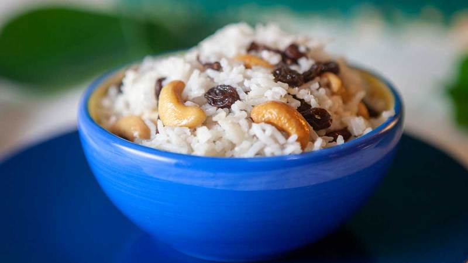

# Dresil

*Tibet's Losar sweet rice: hot basmati glossed with butter, fattened with cashews and softened raisins, lightly sweetened. Eaten with sweet tea.*

**Serves:** 4-6

**Prep Time:** 5 minutes

**Cook Time:** 25 minutes (basmati) or 45 minutes (with droma)

## Overview
A sweet rice that's about generosity rather than complexity: hot basmati glossed with melted butter, fattened with cashews, sweetened just a little with sugar and softened raisins, and (in the traditional version) studded with droma, small starchy wild roots harvested in central Tibet that look a bit like miniature sweet potatoes and taste vaguely chestnut-like. Without droma the dish is still recognisably dresil, just simpler. Yak butter is the real-thing fat, tangier and stronger than supermarket butter; ghee is the closest accessible substitute. The sweetness is restrained, Tibetan sweets in general aren't very sweet by Western standards, which is part of why dresil eats well alongside salty butter tea. Smell is warm butter and toasted nuts. Easy to make: it's essentially a stir-through. The first thing eaten on the first morning of Losar (Tibetan New Year) in many Central Tibetan households, with each family member taking a small bowl as part of the day-one rituals, and a quiet dish despite being a celebration food.

## Ingredients

### Base
- 400 g (2 cups) basmati rice
- 700 ml (3 ½ cups) water
- 80 g (6 tablespoons) butter (salted or unsalted)
- 70 g (½ cup) unsalted cashews
- 150 g (1 cup) raisins
- 50 g (¼ cup) caster sugar (optional, to taste)

### Optional traditional addition
- 150 g (1 cup) droma (Tibetan dried root)
- 800 ml-1 litre water (for boiling droma)

## Method

### Stage 1 - Rice
1. Rinse the basmati under cold water until the water runs clear.
1. Combine the rice with 700 ml water in a heavy pan; bring to a boil; cover; reduce to the lowest simmer.
1. Cook 12 minutes; rest off heat covered another 5 minutes.

### Stage 2 - Droma (optional)
1. Soak the droma in cold water 30 minutes; rinse to remove soil.
1. Bring 1 litre of water to the boil; add the droma.
1. Boil 35-40 minutes until softened but not mushy.
1. Drain and rinse again with cold water.

### Stage 3 - Combine
1. Melt the butter in a wide warm bowl.
1. Fold in the cashews, raisins and sugar.
1. Tip in the hot rice; mix gently so the butter coats every grain.
1. Fold in the cooked droma (if using).
1. Taste; adjust sugar.

### Stage 4 - Serve
1. Spoon into small bowls.
1. Serve with sweet tea or Tibetan salty butter tea (po cha).

## Notes
- **Droma is hard to find outside the Himalaya:** plenty of Tibetan families abroad make dresil without it. The dish is still recognisably dresil. If you can find droma at a Tibetan grocer or online, fold it in.
- **Yak butter for the full thing:** the traditional preparation uses yak butter, which is tangier and stronger. Regular butter works; ghee is closer than supermarket butter.
- **Sugar quantity is taste-based:** Tibetan sweets are generally less sweet than Western desserts. Start with the suggested ¼ cup and add more only if you want it.

## Storage
- Best within a few hours.
- Keeps 2 days refrigerated; reheat gently.
- Don't freeze - the rice texture suffers.
