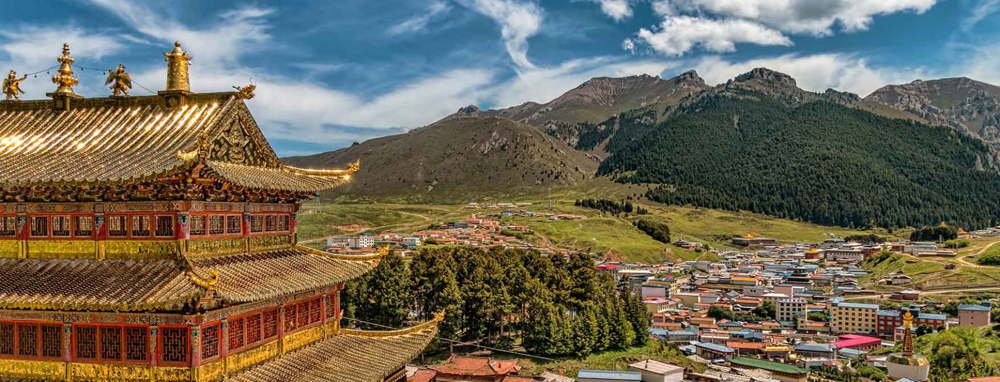

# Tibetan Cuisine

High-altitude cooking shaped by yaks, barley, butter tea (po cha) and a short growing season. Tsampa (roasted barley flour) is the staple; momos (steamed or fried dumplings) the celebrated dish; sepen tomato hot sauce and butter tea are at every table. Sweet plates like dresil (butter-and-raisin rice for Losar New Year) bookend the savoury staples. The fierce ema datshi style of cheese-and-chilli stew bridges Tibetan and Bhutanese kitchens.
