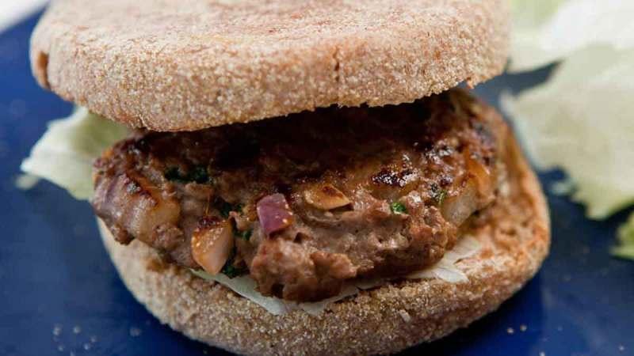

# Tibetan Momo Burger

*A modern fusion: Tibetan momo flavours pressed into a beef burger. Ground beef seasoned with soy, garlic and ginger, grilled and served on a soft bun.*

**Serves:** 4

**Prep Time:** 15 minutes

**Cook Time:** 10 minutes

## Overview
A burger that eats with a Himalayan accent rather than a Western one. The seasoning is essentially momo filling: soy sauce, grated ginger, grated garlic, spring onion, white onion, ground Sichuan pepper (emma), salt, black pepper. No tomato, no smoked paprika, no Cajun spice, the flavour is clean, savoury, faintly numbing on the back of the tongue from the emma. Lighter and more delicate than a typical beef burger; the mince is loose because it isn't bound with breadcrumb or egg, so the patty stays juicy on the inside even when the surface chars. Smell: ginger and soy hitting hot iron. Easy weeknight cooking, the only meaningful step is letting the seasoned mince rest for 15 minutes (or longer) so the soy and aromatics permeate. The dish was created by the YoWangdu kitchen as a fusion that fits the momo flavour into the Western lunch format; sepen (Tibetan tomato hot sauce) on top is how it goes from good to actually Tibetan.

## Ingredients

### Patties
- 500 g grass-fed beef mince (or chicken mince)
- 1 small white onion (very finely chopped)
- 2 spring onions (finely chopped, whites and greens)
- 4 garlic cloves (grated)
- 25 g fresh ginger (grated)
- 2 tablespoons light soy sauce (low-sodium)
- 1 teaspoon ground Sichuan pepper (emma) - optional
- ½ teaspoon salt
- ½ teaspoon ground black pepper

### To build
- 4 whole-wheat English muffins (or burger buns)
- 3 tablespoons light mayonnaise
- 1 white onion (thinly sliced into rings)
- Shredded iceberg or romaine lettuce
- Tibetan sepen hot sauce (optional, see [sepen.md](side-dishes/sepen.md))

## Method

### Stage 1 - Mix and rest
1. Combine the mince, chopped white onion, spring onion, garlic, ginger, soy sauce, Sichuan pepper, salt and black pepper in a wide bowl.
1. Mix with clean hands 1-2 minutes until tacky and uniform.
1. Cover and refrigerate at least 15 minutes (longer is fine; up to overnight).

### Stage 2 - Shape
1. Divide the mix into 4 equal portions.
1. Form each into a slim patty about 1.5 cm thick (it'll plump on the grill).

### Stage 3 - Cook
1. **Grill or BBQ:** preheat to medium-high. Grill 4 minutes per side for medium.
1. **Pan:** heat a heavy pan dry over medium-high; lay the patties in. Cook 4 minutes per side, pressing gently with a spatula for contact.

### Stage 4 - Build
1. Split and toast the English muffins.
1. Spread mayo on both cut sides.
1. Bottom: a few onion rings, then shredded lettuce, then the patty.
1. Optional: a small spoon of sepen on top of the patty for heat.
1. Top muffin. Serve immediately.

## Notes
- **Momo seasoning is subtle:** the dish reads as "beef burger with a Himalayan accent". Don't expect a chilli-fire profile - the heat comes from sepen on the side if at all.
- **Chicken mince works:** cook through (75°C internal). The lighter meat reads as more momo-like to some palates.
- **Whole-wheat muffin or brioche:** the wheaty muffin gives a hearty bite; brioche is sweeter and softer. Both work.

## Storage
- Raw seasoned mince keeps 2 days refrigerated; shape and cook from there.
- Cooked patties keep 3 days refrigerated; reheat briefly in a hot pan.
