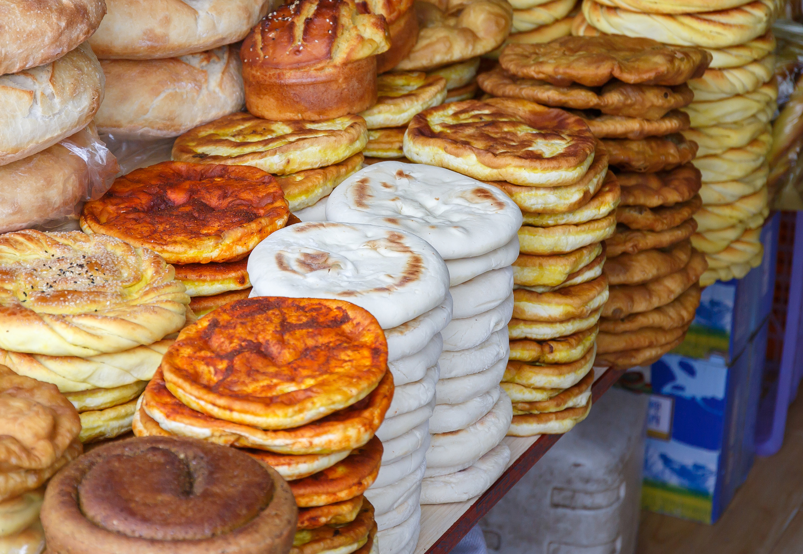

# Sha Balep

*Tibet's beef-stuffed flatbread: a thin disc of wheat-flour dough wrapped around a seasoned mince of beef (or yak), onion, garlic, ginger and Sichuan peppercorns, sealed and pan-fried in oil till the bread crisps golden and the meat steams through. The everyday Tibetan filled bread eaten with butter tea or sweet chai.*

**Serves:** 4 (8 sha balep)

**Prep Time:** 35 minutes (plus 30 minutes resting)

**Cook Time:** 30 minutes

## Overview
Sha balep (literally "meat bread" in Tibetan; sha = meat, balep = bread) is Tibet's everyday filled flatbread, sold from every momo-and-bread stall in Lhasa, Shigatse and the Tibetan diaspora cities of Dharamsala and Kathmandu: a thin disc of wheat-flour dough wrapped around a seasoned minced-meat filling (traditionally yak, more commonly beef or lamb outside Tibet), folded into half-moons or sealed into round pouches and pan-fried till both sides go deeply golden and crisp and the meat steams through inside. Sits between a momo (the steamed Tibetan dumpling) and a Chinese green-onion pancake; heavier and more substantial than either, properly the working-person's breakfast or the herder's lunch on a cold high-plateau morning. The dough is simple and unyeasted; just flour, salt, water and a splash of oil. The filling is Tibetan-seasoned: onion, garlic, ginger, Sichuan peppercorns, green chillies, soy and salt. Indian spices (cumin, coriander) miss the flavour profile. Pan-fry in moderate oil, not deep-fry; 2 to 3 tablespoons in a hot pan, four minutes per side.

## Ingredients

### Dough
- 500 g plain flour
- 1 teaspoon fine sea salt
- 280 ml warm water
- 2 tablespoons vegetable oil

### Filling
- 500 g minced beef (or minced yak if available; or minced lamb)
- 1 large onion (very finely chopped)
- 6 garlic cloves (finely crushed)
- 1 thumb (3 cm) fresh ginger (finely grated)
- 4 spring onions (white and pale green parts finely sliced)
- 2 fresh green chillies (finely chopped)
- 1 teaspoon ground Sichuan peppercorns (the traditional Tibetan spice; or substitute with black pepper + a small pinch of coriander seeds toasted)
- 2 tablespoons light soy sauce
- 1 tablespoon dark soy sauce
- 1 teaspoon fine sea salt
- 1 teaspoon ground black pepper
- 1 tablespoon toasted sesame oil
- 2 tablespoons fresh coriander (finely chopped)

### Frying
- 4 tablespoons vegetable oil (or yak butter if available)

### To serve
- Tibetan chilli sauce (or any chilli-soy dipping sauce)
- Butter tea (the traditional Tibetan accompaniment) or sweet milky chai
- Fresh coriander leaves
- Sliced cucumber (optional, to balance richness)

## Method

### Stage 1 - Make the dough
1. In a wide bowl, whisk together the flour and salt.
2. Add the warm water and oil; stir to combine.
3. Knead for 5-7 minutes on a lightly floured surface till smooth and elastic.
4. Cover with cling film or a damp cloth; rest 30 minutes at room temperature.

### Stage 2 - Make the filling
1. In a wide bowl, combine the minced meat, finely chopped onion, crushed garlic, grated ginger, sliced spring onions, chopped chillies, Sichuan peppercorns, light soy, dark soy, salt, black pepper and sesame oil.
2. Mix thoroughly with a wooden spoon or hands for 2-3 minutes till the mixture is properly combined and slightly sticky.
3. Stir in the chopped coriander.
4. Refrigerate till needed.

### Stage 3 - Divide the dough and filling
1. Divide the rested dough into 8 equal pieces (about 100 g each).
2. Divide the filling into 8 equal portions (about 70-75 g each).
3. Roll each dough piece into a ball; keep covered with a damp cloth.

### Stage 4 - Shape the sha balep
1. Working one at a time, flatten one dough ball with your hand.
2. Roll out on a lightly floured surface into a circle about 18 cm across and 3 mm thick.
3. Place one portion of filling in the centre of the circle; spread it slightly into a flatter shape, leaving a 3 cm clean border around the edge.
4. Fold the dough over the filling to make a half-moon shape; press out any air bubbles.
5. Pinch the curved edge firmly to seal.
6. For the round-pouch version (alternative shape): place the filling in the centre, gather the edges of the dough up around the filling, pinch together at the top to seal, and then flatten the pouch gently into a thick disc.
7. Repeat with the remaining dough and filling. You should have 8 sha balep.

### Stage 5 - Pan-fry
1. Heat 2 tablespoons of the vegetable oil in a wide heavy frying pan (with a lid) over medium heat till shimmering.
2. Place 3-4 sha balep in the pan (work in 2 batches; don't crowd).
3. Cook 3-4 minutes on the first side till deeply golden.
4. Flip carefully with a spatula.
5. Cook the second side 3-4 minutes till also deeply golden.
6. Cover the pan with the lid; reduce heat to low; cook 5 more minutes covered to steam the filling through. (The covered steaming step ensures the meat is properly cooked through inside.)
7. Lift out; drain briefly on kitchen paper.
8. Add the remaining oil; cook the second batch.

### Stage 6 - Serve immediately
1. Place 2 sha balep on each plate.
2. Provide a small bowl of Tibetan chilli sauce or chilli-soy dipping sauce.
3. Serve with butter tea or sweet milky chai.
4. Eat with the hands; cut through with a knife if you prefer.

## Notes
- **Yak meat is traditional; beef and lamb are the substitutes:** real Tibetan sha balep uses yak meat (often dried-yak-meat rehydrated, sometimes fresh). Yak is rare outside Tibet and Mongolia; beef and lamb are the everyday substitutes and the dish is properly Tibetan with either.
- **Sichuan peppercorns are essential:** the traditional Tibetan flavour profile includes Sichuan peppercorns (the slightly numbing-hot pepper of the eastern plateau). Black pepper works in a pinch but the flavour is different.
- **Cover and steam the filling through:** the most common error is not steaming the filling through; the outside crisps quickly but the meat inside remains raw. The 5-minute covered steaming after browning is essential.
- **Don't overcrowd the pan:** 3-4 sha balep at a time gives proper crisping; more and they steam each other rather than crisping.
- **Eat immediately:** sha balep is best fresh and hot; the dough toughens as it cools.

## Variations
**Sha balep with cheese:** add 100 g of crumbled feta or fresh Tibetan cheese (chhurpi if available) to the filling; gives a richer creamier version.
**Vegetable sha balep:** swap the meat for 400 g of cooked drained chopped greens (kale, mustard greens, or spinach) mixed with 200 g of crumbled firm tofu and the same seasonings; gives a vegetarian version.
**Curry sha balep:** add 1 tablespoon of curry powder to the filling; gives a more Indo-Tibetan diaspora style common in Dharamsala.
**Steamed sha balep (sha momo):** instead of pan-frying, steam the dumplings for 20 minutes; closer to traditional momo but with the sha balep shape.

## Serving
With Tibetan butter tea (suja; black tea churned with yak butter and salt; very Tibetan, properly an acquired taste) or sweet milky chai. With a small bowl of chilli sauce for dipping. As breakfast, lunch or dinner; sha balep can be any meal.

## Storage
- Best eaten warm; the dough toughens as it cools.
- Keeps refrigerated 3 days; reheat in a hot dry pan for 2 minutes per side till the outside crisps again, or in a hot oven (180°C / 350°F) for 6-8 minutes.
- Don't microwave; the dough goes rubbery.
- Freezes 2 months cooked or uncooked. For uncooked: shape, freeze flat on a tray, transfer to a bag. Cook from frozen at lower heat (medium-low) for 5 minutes per side, then cover and steam for 7 minutes.
- The filling alone keeps refrigerated 2 days; use within or freeze.
